# IOLN Annual Landsat Mosaics of India — Algorithm Theoretical Basis Document

- Document identifier: **IOLN-ATBD-MOS-002**
- Document version: **2.0** (this document describes product version 2; the first digit of the document version always matches the product version)
- Date: 2 September 2026
- Comments and questions to: mdmadhu@gmail.com

This document, the work it describes and the code behind it were produced with assistance from Claude Code.

---

## Product Summary

This document describes the **IOLN annual Landsat mosaics of India, version 2**. A mosaic is one finished satellite image of one part of India for one year. The mosaics are built from the whole Landsat archive (the United States' civil land-observing satellites, flying since the 1970s). The product is made by the India Open LandCover Network (IOLN). It follows on from the legacy product (version 1), the earlier India mosaic series described in Section 3.7.

India is divided into grid cells: fixed map rectangles, each 1° of latitude tall and 1.5° of longitude wide. For every cell and every year, the pipeline (the chain of processing steps) gathers every usable observation (one reading of one pixel from one satellite pass) from that year. It removes cloud and cloud shadow with three cloud checks, each using different evidence: the flag mask (the cloud flags shipped with every Landsat scene), the temperature check (a cloud is much colder than the ground it hides) and the brightness cut (cloud that slipped past the flags is bright in blue). It then corrects the observations that remain, so that hills, viewing angle and differences between satellites do not show up as ground change. Finally it summarises them into one image. We never claim the result is cloud-free. It is **cloud-controlled**: cloud is held down and measured, and the image itself reports how much evidence sits under every pixel.

Each image contains **117 layers** (also called bands; each layer holds one kind of number for every pixel). They tell three kinds of story:

- **what the ground looked like** that year (the typical-value layers: the median, or middle value, of reflectance (the share of sunlight the ground bounces back), of surface temperature, and of the standard vegetation, water and built-surface indices (an index is a number worked out from several bands to bring out one feature, such as greenness));
- **how it changed through the year** (wet-season and dry-season layers, and the signed difference between them);
- **how sure we are** (spread layers, and counts of the observations actually used).

- **Coverage:** all of India, in 283 grid cells.
- **Years:** phenological years (each running 1 April to 31 March, following the crop calendar rather than the calendar year) from 1986 to 2025 — 40 years, with new years added each April. From here on we call them pheno years.
- **Pixel size:** 30 m in name (nominal: the images sit on a fixed latitude–longitude grid, so the true pixel width varies slightly with latitude).
- **Format:** images hosted in Google Earth Engine (Google's online platform for satellite data), each carrying 26 descriptive properties (short labels attached to the image that record what it is and how it was built).

Three things every user must know, even in a hurry. First, **decode before use**: every layer is stored as a scaled whole number. We call that the stored value; the real reflectance or index it stands for is the true value. Apply the simple decoding formula (carried on the collection itself, and given in Section 7 and Appendix B) before treating any value as a reflectance or an index. Second, **check the count layers**: early years in cloudy regions can rest on very few observations, and the count layers say exactly how many. Third, **never feed the bookkeeping layers to a classifier** (a program that sorts pixels into land-cover classes): the last eight layers are quality records, not measurements.

If you plan to compare one year with another (the most common use), read the closing passage of Section 9 first. It names the periods where the satellite record is weakest, and gives a practical rule for how small a change is too small to trust.

No formal licence is published yet. An open licence is intended. Who will hold it is still to be settled. Academic use with citation is expected. Until the licence is settled, contact the address in Section 1. How to cite the product is set out in Section 12.

---

## How to Read This Document

Few readers need all of it. Three paths cover most needs.

- **If you want to use the mosaics** — read the product summary, then Section 6 (what each layer is), Section 7 (how to decode the stored numbers), Section 10 (known limitations), and keep Appendix B (the one-page decoding card) beside you.
- **If you want to check the methods** — read Section 3 (product overview), Section 5 (the algorithm, step by step in processing order), Section 8 (uncertainty), Section 9 (verification), and Section 10 (limitations).
- **If you want to re-run the pipeline** — read Section 4 (every input and where it lives) and Section 11 (the reproduction contract: what you need to rebuild the product).

> [!note] Common uses — where to start
> - **Vegetation trend over years** → `ndvi_median`, with `ndvi_mad` and `usable_count` beside it (Section 6, Section 8).
> - **Seasonality** → the `_wet`, `_dry` and `_swing` layers (Section 5.8).
> - **Water** → `mndwi_median` and `ndfi_median`, watching for the refusal codes (a code that says "no answer here" instead of a made-up number; Section 5.9).
> - **Built and bare surfaces** → `bci_median` and `ibi_median`; NDBI is available as the negative of the stored `ndmi` layers (Section 6).

Terms are defined in plain words in Section 2, and every technical term is also explained in brackets where it first appears in each chapter. Open questions about the product are gathered in one place only: Section 13, the open-issues and maturity register. No other part of this document holds an unsettled decision.

---

## 1. Document Control

### 1.1 Version coupling to the code

The first digit of this document's version always matches the product version: any document 2.x describes product version 2. The binding rule (the exact rule that decides which images this document covers) is:

> This revision (2.0) describes the pipeline at the commit that repository tag v2.0.0 names. Every image carries `git_commit`; an image is described by this document iff (that is, exactly when) its `git_commit` is an ancestor of that tag within product version 2.

The tag itself is the authority on which commit that is, so no copy of the code's identifier is kept here where it could fall out of step. Read it with `git rev-parse v2.0.0` in the published repository.

In plain words: every image records exactly which code built it, in the `git_commit` property (a short code that identifies one exact state of the software). If that code belongs to the line of software leading to the tagged version 2 release, this document describes that image. If it does not, this document makes no claim about it.

### 1.2 Change log

Each revision of this document is recorded here with five fields:

- **revision** — the document version number;
- **date** — when the revision was published;
- **sections touched** — which sections changed;
- **nature** — one of *editorial* (wording only), *clarification* (same facts, said better), or *algorithmic* (the described pipeline changed). An *algorithmic* entry is allowed **only** when `product_version` changes too, because the pipeline for a given product version is frozen (never changed once released).
- **code tag** — the repository tag the revision describes.

Entries:

- **Revision 2.0** — 2 September 2026 — all sections — initial release for product version 2 — tag v2.0.0.

Sometimes images are rebuilt within a version to fix a build fault, without changing the recipe. Those rebuilds are recorded here as errata entries (corrections; the rebuild policy is in Section 12). The affected images can be told apart by their `built_utc` and `git_commit` properties.

### 1.3 Maintenance and contact

This document and the product are maintained by the India Open LandCover Network through the product contact: **mdmadhu@gmail.com** (the same address carried in the `contact` property of every image). Errata and revisions are announced as change-log entries in this document and in the code repository (the online store that holds the code). There is no separate mailing list.

What to expect from support: this is a research product maintained by a small network, not an operational service. Questions and error reports are welcome at the contact address. They are answered on a best-effort basis, with no guaranteed response time.

---

## 2. Definitions, Acronyms and Notation

This glossary sits at the front because many readers of this document are not remote-sensing specialists. Every acronym used anywhere in the document appears here. If you meet one that is not here, that is a mistake in the document; please report it.

One further rule holds throughout: **one name for each concept**. A satellite overflight is always a *pass*; a single pixel-level reading is always an *observation*; the map rectangles are always *grid cells*. Where older names exist (in property names, or in other people's documents), the glossary entry says so.

- **6S** — "Second Simulation of the Satellite Signal in the Solar Spectrum": a well-established physics model of how sunlight travels through the atmosphere. This product uses 6S results worked out in advance (see *LUT*) to set how strongly to correct for terrain under the actual atmosphere of each pass.
- **Archive gap** — a cell-year (one grid cell in one year) for which the public Landsat archive holds no usable data. Gaps are left as gaps: never estimated from nearby values, never padded, never borrowed from neighbouring years.
- **Aspect** — the compass direction a slope faces. Stored here not as an angle but as two numbers, the sine and cosine of that direction, each multiplied down by the sine of the slope so that flat ground reads near zero (Section 6).
- **ATBD** — Algorithm Theoretical Basis Document: this document. It explains what the product is, how it is made, and what its limits are.
- **BCI** — Biophysical Composition Index: a spectral index (a number worked out from several bands) that separates built and bare surfaces from vegetation and water.
- **Bookkeeping bands** — the last eight layers of each image (`usable_count`, `tir_count`, `snow_count`, `quarters_present`, `q1_count`–`q4_count`): counts of the evidence under each pixel. They are quality records only, and must never be used as classifier inputs.
- **BRDF** — Bidirectional Reflectance Distribution Function. Most ground surfaces look brighter or darker depending on where the sun is and where the sensor is looking from. The pipeline's correction for sun and viewing angles (BRDF) moves all observations to one standard set of angles (Section 5.5).
- **Brightness cut** — the third of the three cloud checks: within one pixel's set of observations for the year, observations that are much brighter in blue than the pixel's own year are dropped before compositing, because unflagged cloud is bright (Section 5.2).
- **c-factor** — the published method (Roy et al. 2016) used here for the BRDF adjustment.
- **Cautious default** — the design rule that when a check cannot run for lack of evidence, the flagged observation is dropped (its cloud flag is upheld); the cautious choice. Here: when a year holds too few clear thermal readings, the temperature check cannot overrule a cloud flag, so every flag stands. Unflagged observations of the same pixel are still kept.
- **Cell** — see *grid cell*.
- **Collection 2 (C2)** — the USGS's current re-processing of the whole Landsat archive, so that every scene is positioned the same way and reports surface reflectance in the same way. All image input to this product is Collection 2.
- **Compositing** — the step that summarises a year's observations into one value for each pixel and each layer. The finished product is a *mosaic*; compositing is the step, never the product.
- **DEM** — Digital Elevation Model: a grid of ground heights. The DEM used here, GLO-30, is strictly a *DSM* (Digital Surface Model): it records the top surface the radar saw, including tree canopies and buildings.
- **DOI** — Digital Object Identifier: a permanent web reference for a dataset or publication.
- **Dry season / wet season** — defined for each pixel from that pixel's own greenness record within the year, not from calendar months (Section 5.8).
- **Earth Engine (EE)** — Google Earth Engine, the cloud platform that hosts the input catalogues, runs the pipeline, and serves the finished mosaics.
- **Endmember** — a reference spectrum (the pattern of reflectance across the bands) for a pure surface type (green vegetation, dry vegetation, soil and cloud), used to split each pixel into shares of those types (see *SMA*).
- **ETM+** — Enhanced Thematic Mapper Plus: the imaging instrument on Landsat 7.
- **EVI2** — Enhanced Vegetation Index, two-band form: a greenness index less likely than NDVI to flatten out (saturate) over dense canopy.
- **Git commit** — a short code that identifies one exact state of the software repository. Every image records the commit that built it.
- **GLO-30** — the Copernicus 30 m global elevation dataset (ESA), the height source for all terrain layers and corrections.
- **Grid cell** — one fixed map rectangle of 1° latitude by 1.5° longitude, named from the international 1:250,000 map-sheet system (for example `NC-43-X-D`). The product has 283 of them. Never called a "tile" in this document.
- **GSW** — Global Surface Water: the European Commission Joint Research Centre's monthly mapping of where open water has been observed (see *JRC*).
- **HAND** — Height Above Nearest Drainage: how far each pixel sits above the nearest stream channel. It is a strong sign of where water can stand. Concept from Rennò et al. (2008).
- **IBI** — Index-based Built-up Index: a spectral index that brings out built surfaces.
- **Int16** — the 16-bit signed whole-number format in which all layers except position are stored (values −32,768 to 32,767). It is the reason every layer needs a decoding formula.
- **IOLN** — India Open LandCover Network: the network that produces this product.
- **JRC** — the European Commission's Joint Research Centre, producer of the Global Surface Water dataset.
- **Landsat 5 / 7 / 8 / 9 (L5, L7, L8, L9)** — the four Landsat satellites whose data feed this product, carrying respectively the TM, ETM+, and (L8/L9) OLI and TIRS instruments.
- **Legacy product (version 1)** — the MapBiomas-style India mosaic series that came before this one. Version 2 is an evolution of it; the differences are set out in Section 3.7.
- **Level-1 / Level-2** — the USGS's two processing levels for a Landsat scene. Level-1 is the picture much as the satellite took it, with only its geometry fixed; Level-2 is the same picture after the effect of the atmosphere has been removed, giving surface reflectance and surface temperature. The product reads its pixel values from Level-2 and its sun and viewing angles from Level-1 (Section 4.1).
- **LUT** — Look-Up Table: a table of model results worked out in advance and read at run time, instead of re-running the model each time. Here: tables of 6S atmosphere results, indexed by haze, moisture, elevation and sun angle.
- **MAD** — Median Absolute Deviation: the median absolute deviation, a robust measure of spread: the typical distance of the observations from their middle value (robust means a few odd values do not throw it off). The `_mad` layers store it raw; multiplying by 1.4826 puts it on the scale of a standard deviation. Always called *spread (MAD)* in this document, never loosely "standard deviation".
- **MERRA-2** — NASA's global atmospheric reanalysis (a physics-model reconstruction of past weather): the source of haze (aerosol optical thickness) and moisture (column water vapour) for each pass.
- **MNDWI** — Modified Normalised Difference Water Index: a spectral index that brings out open water.
- **Mosaic** — the product noun: one finished annual image of one grid cell. The step that builds it is *compositing*.
- **NDBI** — Normalised Difference Built-up Index. Not stored as its own layer: NDBI is exactly the negative of NDMI, so decode `ndmi` and change the sign.
- **NDFI** — Normalised Difference Fraction Index (Souza et al. 2005): an index built from the unmixed fractions, sensitive to forest degradation.
- **NDMI** — Normalised Difference Moisture Index: a spectral index that tracks vegetation moisture.
- **NDVI** — Normalised Difference Vegetation Index: the standard greenness index.
- **No-data marker (−999)** — a reserved marker value, −999, stored in `ndfi_swing` where no real wet/dry pair exists. Distinct from the *refusal codes*; −999 is the only no-data marker in the product.
- **Observation** — one usable reading of one pass over one pixel, after masking (a masked pixel is hidden and left out of every calculation). The unit the counts count.
- **OLI** — Operational Land Imager: the reflective-band instrument on Landsat 8 and 9, and the standard that all older sensors are adjusted to match.
- **Pass** — one satellite overflight of a grid cell on one date. A pass may span several catalogue scenes, which the pipeline merges (Section 5.7). The image property `n_scenes`, despite its name, counts distinct passes.
- **Phenological year (pheno year)** — the product's year, running 1 April to 31 March and named for its start year ("pheno year 2005" is April 2005 – March 2006). Chosen so that India's monsoon-driven growing season is not split across two products.
- **QA_PIXEL** — the quality flag layer, one value for each pixel, shipped with every Collection 2 scene, recording the USGS cloud, shadow, snow and cirrus assessments. The first of the product's three cloud checks (the flag mask).
- **Refusal code** — a code that says "no answer here" instead of a made-up number. The pipeline writes it where the ground state makes an index meaningless: −10 (water) and −20 (snow) in the `ndfi` level and spread layers. Where both apply, water wins.
- **Reserved value** — the family term for any stored value that is a message rather than a measurement: the refusal codes and the no-data marker (−999).
- **RMA** — Reduced Major Axis regression: a line-fitting method suited to cases where both measurements being compared carry error. Used for the in-house sensor harmonisation (putting all the satellites on a common footing; Section 5.6).
- **Scene** — the USGS catalogue's fixed publishing unit: one framed image from one pass over one position of the reference grid (see *WRS-2*). Used only when referring to the catalogue's own units; the working unit of this pipeline is the *pass*.
- **SCS+C** — Sun-Canopy-Sensor correction with a C term: the published terrain-correction family (Soenen et al. 2005) this pipeline uses. The C term is worked out from the physics of the atmosphere rather than fitted to the data (Section 5.4).
- **SLC-off** — the state of Landsat 7 after May 2003, when its Scan Line Corrector failed, leaving wedge-shaped unscanned stripes in every scene.
- **SMA** — Spectral Mixture Analysis, also called spectral unmixing: splitting each pixel's colour into shares of green vegetation, dry vegetation, soil and cloud, with shade as what is left over (1 minus the sum of the other shares), by treating the pixel's spectrum as a mix of endmember spectra (Section 5.9). The cloud share is solved for and then discarded.
- **Spread (MAD)** — see *MAD*.
- **Stored value / true value** — the two sides of every decoding formula: the whole number as stored in the file, and the physical quantity it stands for. All decode formulas in this document are written as *true value = f(stored value)*.
- **Surface reflectance (SR)** — the share of sunlight a ground surface reflects, estimated after removing the effect of the atmosphere; the physical quantity behind the six reflectance layers.
- **Swing** — the signed seasonal difference: wet-season median minus dry-season median. Negative values are correct behaviour, not errors. Never called "range" in this document (the word "range" is reserved for the legal range of stored values).
- **Tasselled cap (tcb, tcg, tcw)** — a standard set of three weighted band combinations summarising brightness, greenness and wetness.
- **Temperature check** — the second of the three cloud checks, developed in-house. Each flagged observation's surface temperature is compared with that pixel's usual clear-sky temperature for the same year; a cloud is much colder than the ground it hides. A flagged observation that really is cold is confirmed as cloud; a warm one can have its false cloud flag lifted (Section 5.2). In the code this check is called the *witness*.
- **Three cloud checks** — the flag mask (*QA_PIXEL*), the *temperature check* and the *brightness cut*: the first two are applied together, the third after them (Section 5.2).
- **Tier 1 / Tier 2** — the USGS's positioning quality grades for Landsat scenes. Only Tier 1 (well-positioned) scenes enter this product.
- **TIRS / tir** — the Thermal Infrared Sensor (Landsat 8/9), and the product's thermal layer family (`tir_*`), storing land surface temperature.
- **TM** — Thematic Mapper: the imaging instrument on Landsat 5.
- **USGS** — the United States Geological Survey, producer and distributor of the Landsat archive.
- **WRS-2** — Worldwide Reference System 2: the fixed grid of paths (orbits) and rows into which Landsat scenes are framed.

### Notation

Equations in Section 5 are numbered (Eq. 1, Eq. 2, …). Each formula is defined exactly once and cited by number everywhere else, including the decoding properties of Section 7. Layer names appear in code face (`ndvi_median`); image properties likewise (`usable_count`). Code is referred to by module and function (for example `pipeline/sma.py`, function `get_fractions`), never by line number. Every symbol used in the equations of Section 5 is listed in Appendix C.

---

## 3. Product Overview

### 3.1 What, where, when, at what resolution

The product is a set of yearly, cloud-controlled satellite mosaics (finished summary images) of India, built only from the Landsat archive. One image is made for each grid cell for each phenological year (1 April to 31 March, following the crop calendar rather than the calendar year). Each image has 117 layers and 26 descriptive properties. Every value is stored as a scaled whole number on a fixed latitude–longitude grid at a pixel size of 30 m in name (nominal). Because the grid is defined in degrees, the true pixel width changes with latitude across India's span of 8–37°N. The product is delivered as a Google Earth Engine image collection; access details are in Section 12.

- **Extent:** India, in 283 grid cells.
- **Time span:** pheno years 1986 to 2025, which is 40 years. New years are added each April under the frozen recipe (the fixed method, not changed between years; policy in Section 12).
- **Sensors:** Landsat 5, 7, 8 and 9.
- **Product version:** 2. The product before it is version 1 (Section 3.7).

### 3.2 The phenological year

India's plant growth follows the monsoon, not January. A product based on the calendar year would cut the growing season in half and put the year boundary in the middle of the farming cycle. So the product uses a phenological year that runs from 1 April to 31 March. It is named for the year it starts in: pheno year 2005 runs from April 2005 to March 2006. India grows two main crops: the kharif crop (the monsoon crop, greenest around September–October) and the rabi crop (the winter crop, greenest around January–February). The pheno year keeps the whole monsoon green-up, both crops, and the dry season inside one product year.

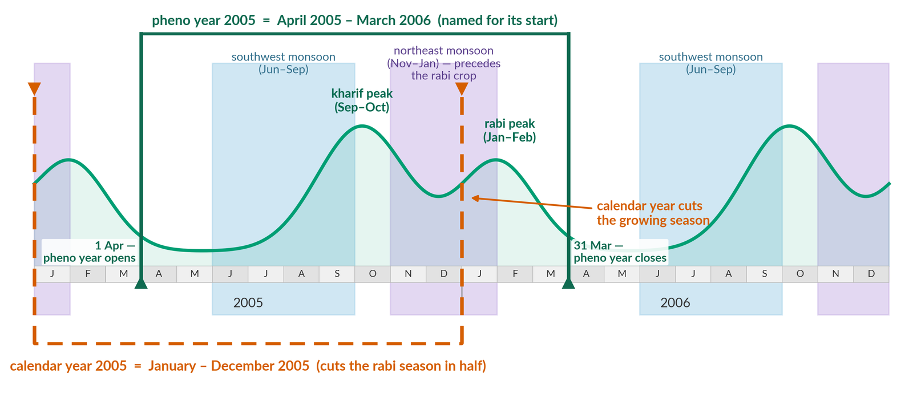

*Figure 1 — A drawn calendar covering two years. The curve shows India's two crop seasons: the kharif crop, greenest in September–October, and the rabi crop, greenest in January–February. Shading marks the two rainy seasons: the southwest monsoon (June–September) and the northeast monsoon (November–January, the rains that come before the rabi crop). Two boxes show the two possible ways to define a product year: the calendar year (dashed orange box, January–December) and the phenological year (solid green box, April–March, following the crop calendar rather than the calendar year). The curve is a sketch, not measured data, and the timing of the peaks varies across India. This is why each mosaic runs April to March. A calendar year cuts straight through the rabi crop. The pheno year opens on 1 April, in the dry pause between crops, so both green-ups fall inside it whole.*

### 3.3 Grid organisation

The 283 grid cells come from the international 1:250,000 map-sheet system. Each cell is 1° of latitude by 1.5° of longitude, and is named like `NC-43-X-D`. The grid covers all Indian territory, including the island cells of Lakshadweep and the Andaman and Nicobar chain.

The southernmost Nicobar cell, `NC-46-Y-D`, is included by an explicit project decision, even though its early archive is thin. Its own count layers show plainly how much data it has. That is the product's general policy: no cell is dropped for having a weak archive, and no weak archive is hidden.

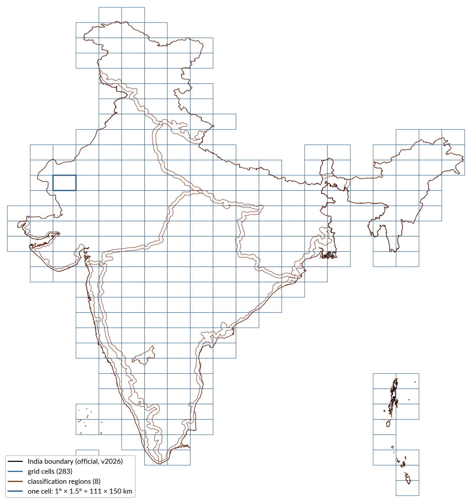

*Figure 2 — The 283 grid cells in which the product is built and delivered, drawn over the official India boundary. One cell is outlined to show its size: 1° × 1.5° (about 111 × 150 km). The grid is the project's list of cells, and the boundary is the official v2026 version. Every mosaic is made and shipped one cell at a time, so this grid is the unit that everything else in this document works in. A year-by-year count of the satellite images under these cells is in [the scene-wise yearly Landsat archive for India](https://docs.google.com/presentation/d/1OGqrMILOUu3V8GLBg4hCMwo6IlLuz-jStgwoyNVt0kU/edit), and [an interactive coverage explorer (Earth Engine)](https://code.earthengine.google.co.in/1acbd4ea18bf4e5c206451f7c02328b7) shows usable pixels and quarter-by-quarter coverage for any cell and year.*

### 3.4 Sensors and eras

Four satellites feed the product, in overlapping windows:

- **Landsat 5 (TM):** from the start of the series through 2011.
- **Landsat 7 (ETM+):** 1999 to 2021. In May 2003 its scan-line corrector failed (known as SLC-off). Since then every scene has stripes of missing data; Section 5.3 says how these are filled. The window closes at 2021 because the satellite's orbit then drifted, changing its sun angles steadily, always in the same direction (reasoning in Section 5.1).
- **Landsat 8 (OLI/TIRS):** 2013 onward.
- **Landsat 9 (OLI/TIRS):** 2021 onward.

So the satellite fleet changes in 1999 (Landsat 7 joins Landsat 5), 2003 (Landsat 7's scan-line fault), 2013 (Landsat 8 joins), 2021 (Landsat 9 joins) and 2022 (Landsat 7 withdrawn); these windows are fixed in `config.SENSOR_YEARS`. Every image records which sensors contributed (`sensors_used`) and how many passes were used (`n_scenes`; despite its name, it counts passes). A change of satellite must not show up as a jump in a year-to-year series, so the record is tested for flatness at the joins. The test (Section 9.3) was run at 2003 and 2013, and at 2017. In the shipped recipe nothing changes in 2017. The year is a boundary kept from an earlier design of the product, in which a second satellite source, since dropped, would have entered then. So it serves as a control year. The same test was also run at 2000, when the atmosphere input changes character (Section 10 L11). The results are in Section 9, with practical advice for anyone comparing years across a join.

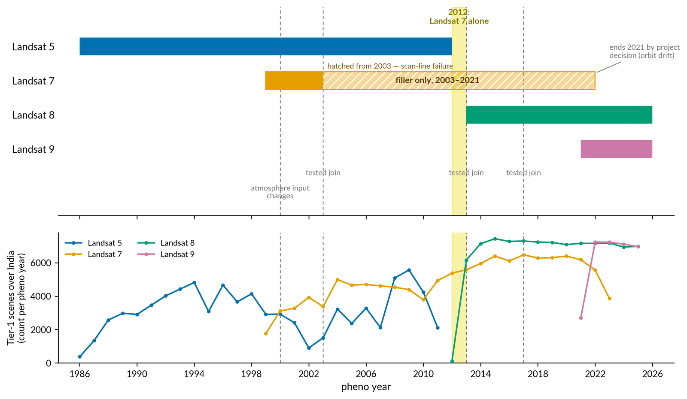

*Figure 3 — Top: the years each Landsat satellite feeds the product, 1986–2025. Landsat 7 is hatched from 2003, when its scan mechanism broke and it was kept only as a gap filler, and it stops at 2021 by project decision. Dashed lines mark the three tested changes of satellite (2003, 2013, 2017) and the 2000 change in the atmosphere data used for correction. 2012 is the only year that rests on Landsat 7 alone. Bottom: how many best-quality (Tier-1) scenes each satellite actually captured over India in each pheno year (April to March), counted afresh from the satellite catalogue. A fuller count is in [the scene-wise yearly Landsat archive for India](https://docs.google.com/presentation/d/1OGqrMILOUu3V8GLBg4hCMwo6IlLuz-jStgwoyNVt0kU/edit). Together the two panels show which satellite carries each period, and how thin the record is where one satellite hands over to the next.*

### 3.5 Why the series starts in 1986, and how gaps are handled

The Landsat 5 archive is said to begin in 1984, but a checked search found **zero usable Tier-1 scenes over India for 1984 and 1985** (Tier 1 means the best-quality, well-positioned scenes). So the series starts with pheno year 1986, the first year the public archive can actually support.

Within the series, the archive is uneven. Some cell-years are thin: in the worst early cases a pixel's whole year rests on one or two observations. A few island and border cells sit under a single satellite track with an almost empty archive before 2000.

The product handles this the same way everywhere, and openly: **gaps in the archive are never interpolated (filled in by estimating between known values), padded, or borrowed from neighbouring years**. A cell-year with no usable data is simply absent. A thin cell-year ships with its thinness declared in the count layers. Section 10 names the thinnest cells with numbers, and gives measured guidance on how low a count is too low.

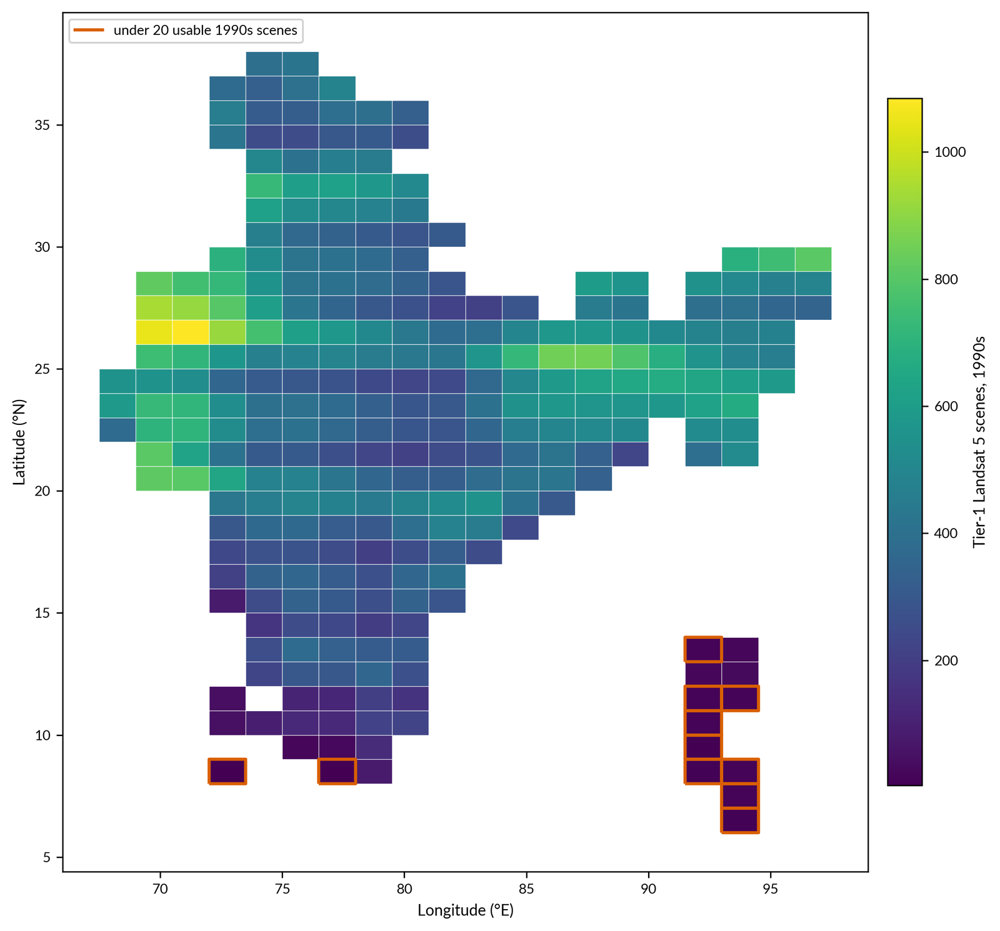

*Figure 4 — A map of how many Landsat 5 scenes exist for each grid cell across the 1990s (April 1990 – March 2000). The counts come straight from the catalogue of the best-quality (Tier-1) Collection-2 archive. It matters because a mosaic can only be as good as the images beneath it. The eleven island cells have just 3–15 scenes for the whole decade, against a national median of 395, so their early mosaics are built on almost nothing.*

### 3.6 Heritage and novelty

The product comes from the MapBiomas countries-mosaics approach (the mosaic method behind the MapBiomas land-cover mapping programmes). To keep credit and responsibility clear, here is exactly what is inherited and what is new.

**Inherited from the MapBiomas countries-mosaics design:**

- the core idea: one mosaic for each grid cell and each year (in version 1, one for each satellite), built in Earth Engine from the Landsat archive;
- the 1:250,000 map-sheet grid and its cell naming;
- the band-family design: yearly medians, seasonal medians, and spread layers for each year, over a shared set of reflectance bands, fractions and indices;
- the endmember values (the reference colours of pure green vegetation, dry vegetation, soil and cloud) used for spectral unmixing (splitting each pixel's colour into shares of those four parts, with shade as what is left over), inherited unchanged (their origin, and the recorded decision to keep them, are in Section 5.9).

**New in this product (developed in-house, with the full mathematics in Section 5 because there is no published precedent to cite):**

- the C term of the terrain correction (the term that sets how strongly a slope is corrected) worked out from atmospheric physics, using 6S tables, rather than fitted to the data (Section 5.4);
- the temperature check: each cloud flag is checked against the same year's clear-sky temperature record (Section 5.2);
- the brightness cut: within each pixel's year, observations that are much brighter than the pixel's own darkest observations are dropped (Section 5.2);
- sensor harmonisation (putting all the satellites on a common footing) as a whole: the legacy codebase (the code behind version 1) contains **no sensor harmonisation and no bandpass adjustment of any kind** (a bandpass adjustment corrects for the slightly different colour filters, or bandpasses, of different satellites). This product's Landsat 5→7 transform is derived in-house from India's own data (Section 5.6), and the 7→8 step applies published coefficients (the fixed numbers in the conversion formula);
- the signed seasonal swing layers (Section 5.8);
- the refusal codes (a code that says 'no answer here' instead of a made-up number) for water and snow in the NDFI family (Section 5.9);
- the `ndfi_mad` spread layer: version 1 already ships a spread layer for NDFI (a standard deviation), so what is new is the robust form and the tamed observation-by-observation NDFI that feeds it (Section 5.9);
- the phenological year (1 April to 31 March) as the product year, in place of the calendar year (Section 3.2). The wet/dry split itself — each pixel's own NDVI (greenness) record, 25th and 75th percentiles — is inherited from version 1 and kept (Section 5.8).

One claim, stated here once and not repeated: **no code is copied or imported from the legacy MapBiomas codebase: every function in this pipeline was written afresh, though the compositing step re-implements the legacy design (above) and the endmember numbers are carried over as data. This pipeline is a separate implementation of that design, not a modification of the MapBiomas India mosaic script.** The copy of that script held with this project is a working snapshot rather than a runnable file: its cell list is commented out and only one year is switched on. The statements made here describe its code as written; they are not the result of running it.

### 3.7 Relationship to the legacy product

The legacy product (version 1) is the MapBiomas-style series of India mosaics that came before this one. The main differences:

- the version 1 mosaics are **not terrain-corrected** (they carry a slope layer from the ALOS elevation model, but the reflectance itself is not corrected); version 2 corrects every observation for terrain lighting and viewing angle (Section 5.4–5.5);
- version 1 keeps each satellite as a separate image for each cell and year, and nothing in its code combines them; version 2 blends all sensors into one image after harmonisation;
- the version 1 mosaics apply **no sensor harmonisation**; version 2 places all sensors on a common basis (Section 5.6);
- version 1 masks with the archive's own cloud and cloud-shadow flags only (two bits of the QA_PIXEL word; a brightness-based cloud score and a shadow projection are computed in its code but never applied; it also sets aside whole scenes reported at 80% cloud or more, and trims scene edges with a fixed footprint mask); version 2 uses the three cloud checks (the flag mask, the temperature check, the brightness cut) (Section 5.2);
- both versions split each pixel's year into wet and dry from that pixel's own greenness record (the same 25th/75th-percentile rule); the difference is the year itself — version 1 uses the calendar year (1 January to 31 December), version 2 the phenological year (1 April to 31 March), so one crop cycle is not cut in half (Section 3.2, Section 5.8);
- version 1's spread layers are standard deviations; version 2 stores a robust spread, the MAD (the median absolute deviation: the typical distance of the observations from their middle value). The conversion for comparing the two is in Section 8.3.

The two products were compared numerically on a 38-year series for one cell (both products hold 38 years there, with different first years) and on a 700-point set of sites whose surface does not change; the method and results are in Section 9.

---

## 4. Input Data

> [!important] Provenance rule (binding)
> Every input is either a public catalogue dataset or a precomputed asset in ONE folder — `projects/mapbiomas-india/assets/mosaic_v2_inputs` — nothing else. (Provenance means where each input comes from.)

This section lists every input and where it comes from. Register 1 (a register is simply a formal list) covers the public catalogue datasets, each with its version, DOI (a permanent identifier for a dataset or paper) and licence. Register 2 covers the precomputed assets (data prepared in advance and stored) in the one folder, each with the script that rebuilds it. A last register lists inputs that were considered and dropped, with the evidence.

### 4.1 Register 1 — public catalogue datasets

**Landsat Collection 2 Level-2, Tier 1** — the image input. (Level-1 is the picture much as the satellite took it, with only its geometry fixed; Level-2 is the same picture after the effect of the atmosphere has been removed.)

- Catalogue: `LANDSAT/LT05/C02/T1_L2`, `LANDSAT/LE07/C02/T1_L2`, `LANDSAT/LC08/C02/T1_L2`, `LANDSAT/LC09/C02/T1_L2`.
- Role: surface reflectance (how much sunlight the ground reflects; the six optical layers, optical meaning visible and infrared light), land surface temperature (the thermal layers), and the quality flags for each pixel (`QA_PIXEL`) that form the first of the three cloud checks.
- Version: Collection 2 (the USGS's current uniform reprocessing of the whole archive). Only Tier 1 scenes (the well-positioned ones) are used.
- DOIs: Landsat 4–5 TM Level-2 10.5066/P9IAXOVV; Landsat 7 ETM+ Level-2 10.5066/P9C7I13B; Landsat 8–9 OLI/TIRS Level-2 10.5066/P9OGBGM6.
- Licence: United States public domain (US Government work); no restrictions. Courtesy attribution to USGS is given.

**Landsat Collection 2 Level-1 metadata** — the input for sun and viewing angles. (Metadata is the descriptive information shipped with each scene.)

- Catalogue: `LANDSAT/LT05/C02/T1`, `LANDSAT/LE07/C02/T1`, `LANDSAT/LC08/C02/T1`, `LANDSAT/LC09/C02/T1`.
- Role: the sun and viewing angles for each pass, read alongside each Level-2 scene for the terrain correction and for the correction for sun and viewing angles (BRDF). No pixel values are taken from Level 1.
- Version, DOI, licence: as the Level-2 entry above (same collection, same terms).

**MERRA-2** — the atmosphere input.

- Catalogue: `NASA/GSFC/MERRA/aer/2` (aerosols: the haze particles in the air) and `NASA/GSFC/MERRA/slv/2` (single-level meteorology: weather variables near the ground).
- Role: haze (aerosol optical thickness) and moisture (column water vapour) at the time and place of each pass. These two values pick the row of the 6S tables used to work out the terrain correction's C term (Section 5.4).
- Version: MERRA-2 (NASA GMAO reanalysis: a model-based reconstruction of past weather from observations).
- DOIs: 10.5067/KLICLTZ8EM9D (aerosol collection); 10.5067/VJAFPLI1CSIV (single-level collection).
- Licence: NASA open data; no restrictions.

**Copernicus GLO-30 DEM** — the height input.

- Catalogue: `COPERNICUS/DEM/GLO30_2024_1`.
- Role: the source of every terrain quantity — elevation, slope, aspect, illumination terms and HAND (height above the nearest drainage: how high a pixel sits above the nearest stream) — through the precomputed terrain sheet in Register 2. Reading the catalogue directly is only a fallback (a backup used when the main source is unavailable); production reads the terrain sheet.
- Version: GLO-30, 2024_1 release. Note it is a surface model (DSM): it records the top surface the radar saw, including tree canopies and buildings (what this means for the product is in Section 10).
- DOI: 10.5270/ESA-c5d3d65.
- Licence: free use under ESA's Copernicus DEM terms, **with mandatory attribution**. The required credit names the European Union, ESA, and the underlying Airbus/DLR WorldDEM data. These attribution terms are binding, and the product honours them wherever it credits its inputs.

**JRC Global Surface Water** — the water-history input.

- Catalogue: `JRC/GSW1_4/MonthlyHistory`, extended by `projects/JRC/GSW1_5/...` for 2022–2024.
- Role: monthly open-water observations, from which the water refusal code is derived over a window of three pheno years (Section 5.9).
- Version: v1.4 monthly history plus the v1.5 extension.
- DOI (defining publication): 10.1038/nature20584 (Pekel et al. 2016).
- Licence: open, with attribution to EC JRC/Google.

**Other public assets (with warnings):**

- **The 1:250,000 grid** — `projects/mapbiomas-workspace/AUXILIAR/cim-world-1-250000`: the source of the cell shapes. Hosted by a third party. Anonymous read access is checked at publication, and a snapshot of the India cells is kept in the repository (`data/vectors/grid_cells_india.geojson`) as a fallback.
- **Community HAND asset** — `users/gena/global-hand/hand-100`: **fallback only**. The HAND idea is published (Rennò et al. 2008), but this particular asset is community-hosted, with no version number and no DOI. It could change or vanish without notice. That is exactly why production never reads it: the `hand` layer comes from the project's own terrain sheet (Register 2). The fallback exists only so that a fresh setup can get started.

### 4.2 Register 2 — precomputed assets in `mosaic_v2_inputs`

All the assets below live in the one folder named in the rule at the top of this section. They will be public-read at publication, and each can be rebuilt from the public catalogues by the named script. None holds anything an outsider could not make again.

- **`boundary`** — the official India boundary vector (outline): used to list the cells, and as the extent for the script that builds the clear-sky temperature record (Section 5.2). Rebuild: `scripts/upload_vectors.py`; snapshot in `data/vectors/`.
- **`regions`** — the authoritative map of the classification regions (the zones India is divided into for the land-cover classification that uses these mosaics). In the build it has one job: the union of these regions is the fixed extent to which every mosaic is clipped, the same in every year. Rebuild: `scripts/upload_vectors.py`; snapshot in `data/vectors/`.
- **`regions_mask`** — the regions painted as a raster (a pixel image), the preferred read at build time. Rebuild: `pipeline/build.py`, function `export_region_mask`.
- **`terrain`** — the terrain sheet derived from GLO-30: elevation, slope, the two aspect numbers (scaled down on gentle slopes), smoothed versions of these, and HAND (height above the nearest stream). Carries its own description. Rebuild: `scripts/export_terrain_asset.py`.
- **`terrain_illum`** — the lighting terms for each pixel, read by the terrain correction. Rebuild: `scripts/export_terrain_illum_asset.py`.
- **`lut_oli` / `lut_etm` / `lut_tm` / `lut_v1_spare`** — the 6S atmosphere tables (one for each sensor family, plus a coarser spare). Each has 26,680 rows across six bands, indexed by haze (aerosol optical thickness 0.05–1.0), column water vapour (1–5 g/cm²), elevation (0–5,500 m) and sun zenith angle (the sun's angle down from straight overhead, 10–80°). They describe only the atmosphere, nothing cell-specific, so one table serves every cell. Production reads these cloud assets first; the CSV files in the repository at `data/lut/` are an exact copy kept as a fallback, and print a clear warning when used. Rebuild: `scripts/build_6s_correction_tables.py` (with `--upload`).
- **`witness_stats/INDIA_1986 … INDIA_2025`** — forty clear-sky temperature records, one for each year (`witness` is the code's name for this record, and it appears in several function and constant names). They feed both the temperature check (Section 5.2) and the thermal output layers (Section 5.11). Years 1984–85 are not needed: the archive holds zero scenes for them. Rebuild: `pipeline/build.py`, function `export_witness_stats`.
- **`overpass_conditions/INDIA_<year>`** — one small table for each year, one row for each pass over India (sensor, pass key, date, sun angle, haze, moisture). With it, the build reads a year's atmosphere in one query instead of querying MERRA-2 live. Rebuild: `scripts/export_overpass_conditions.py`. Where a year's table is absent, the pipeline computes the same rows live from MERRA-2 and prints a clear warning. The result is identical, because the live computation runs the same code on the same MERRA-2 inputs that built the table.

### 4.3 Considered and dropped

Inputs and input-level methods that were tested and rejected, with one line of evidence each:

- **HLS (Harmonized Landsat and Sentinel-2)** — dropped when the input set was rebuilt as pure Collection 2 (a recorded project decision): it covers only recent years, and mixing it in would have split the series between two sources processed in different ways.
- **TDOM (temporal dark-object masking: a published cloud-shadow method that looks for unusually dark readings over several years)** — replaced by the temperature check, which judges each observation against the *same year's* clear-sky temperature record instead of statistics over many years; Section 5.2 cites it and explains the difference.
- **Spectral cloud score** (a cloud test based on colour and brightness alone) — rejected because cloud scoring based on brightness fails over bright dry ground. A cloud test built into the unmixing step (it treats a pixel as cloud when it is too bright for any mix of the reference colours) is still in the code but switched off, for exactly this reason: it mistakes Thar sand and salt crust for cloud.
- **Tier 2 scenes** — excluded: the pipeline accepts Tier-1 positioning without lining scenes up against each other, and Tier 2's looser positioning would break that assumption (Section 5.1).
- **Landsat 5→7 brightness offset** — a blind test on pairs of passes, run in August 2026 (blind: the tester did not know which version was which), found no offset that reliably improved agreement, so none is applied; only the sensor harmonisation of Section 5.6 (putting the satellites on a common footing) runs.
- **Multi-year epochs (blocks of several years)** — blending several thin early years into one mosaic was ruled out (a recorded project decision): the product is one mosaic for each year only, and missing years stay as gaps in the archive.
- **TM→ETM+ refit** — an attempt in August 2026 to re-derive the Landsat 5→7 transform fitted better on the data it was fitted to, but failed on data kept back for testing across regions. The gain was overfitting (matching noise rather than the real pattern), and the original coefficients (the fixed numbers in the conversion formula) are kept (Section 5.6).

---

---

## 5. The Algorithm, in Processing Order

This chapter describes how one mosaic image is built. Everything below happens once for each grid cell and each phenological year (1 April to 31 March). The order is fixed. It is stated once, here, and not repeated:

1. **Scene selection** — gather every usable satellite image for the cell and year (Section 5.1).
2. **Masking** — hide cloud, cloud shadow and saturated pixels (pixels where the sensor's reading hit its maximum) in each observation, so that they are left out of every later calculation (that is what masking means), using the archive's own cloud flags and the temperature check together (Section 5.2, the first two of the three cloud checks).
3. **Landsat 7 enlistment** — decide, pixel by pixel and quarter by quarter, whether the striped Landsat 7 observations are needed (Section 5.3).
4. **Topographic correction** — remove the lighting effect of hillsides (Section 5.4).
5. **Sunlight-and-view correction (BRDF)** — remove the brightness effect of the sun and viewing angles (Section 5.5).
6. **Sensor harmonisation** — put every satellite's reflectance on one common footing (Section 5.6).
7. **Pass assembly** — merge the frames of each satellite overflight into one observation (Section 5.7).
8. **Brightness cut** — drop unflagged bright cloud from each pixel's set of observations for the year (Section 5.2, the third cloud check; applied here, before any statistic is computed).
9. **Derivation for each observation** — spectral unmixing (splitting each pixel's colour into shares of green vegetation, dry vegetation, soil and cloud, with shade as what is left over) and the set of indices on each remaining observation (Section 5.9, scene level).
10. **Compositing** — reduce each pixel's observations to annual and seasonal statistics (Section 5.8), then derive the unmixing family and its refusal codes (a code that says "no answer here" instead of a made-up number) from the composite (the summarised image; Section 5.9, composite level).
11. **Assembly and export** — terrain, position and bookkeeping bands, thermal from the clear-sky temperature record (Section 5.11), storing as whole numbers, the fixed band order, the extent mask (the fixed map of where the product exists: the union of the classification regions of Section 4.2, the same in every year), the property set, export (Section 5.10).

The sequence is enforced in one place: `pipeline/build.py`, function `build_mosaic`. A commissioned flow figure (Figure 5) draws it end to end. The three cloud checks appear as filters in a row: what one check misses, the next is built to catch.

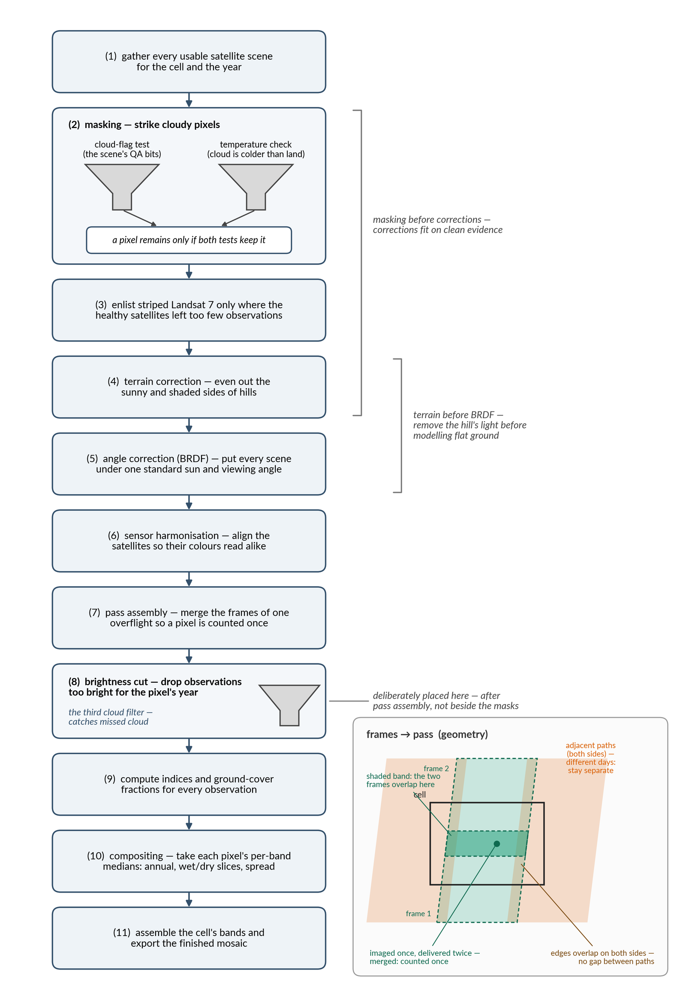

*Figure 5 — The eleven steps of the processing chain, in the fixed order they run, each described in plain words. The three cloud checks are drawn as funnels: two masking tests at step 2, and the brightness cut at step 8 (observations much brighter in blue than the pixel's own year are dropped, because unflagged cloud is bright), after the frames from each satellite pass have been merged. The order is the one fixed in the build code (pipeline/build.py, function build_mosaic). The inset shows why merging comes first. Frames from one pass overlap (shaded band), so a place imaged once would otherwise be counted twice. The neighbouring tracks on either side overlap at their edges with no gap, but they are flown on different days, so they stay separate.*

Two ordering choices are deliberate. First, masking runs before any correction of the measured brightness. So every correction is fitted to, and applied on, cloud-free data. Second, topographic correction runs **before** the BRDF adjustment and the sensor harmonisation. That is the order the physics demands. A hillside changes how much light reaches the ground, so the terrain effect must be removed before a model that assumes flat ground is applied. Section 5.5 gives the fuller reasoning.

---

### 5.1 Scene selection

**What this step does, and why.** The mosaic for one cell and year is built from every usable image the Landsat archive holds for that place and time. This step defines "usable": which satellites, which dates, which catalogue tier, and the one whole-scene filter applied before any pixel-level work begins. The guiding rule is that selection is generous and pixel-level masking is strict. A scene is thrown out whole only when it can contribute almost nothing.

**The filter chain.** For each satellite flying in the year, the pipeline (`pipeline/sources.py`, function `era_a_collection`; "era A" is the code's name for the Landsat Collection 2 input, left over from a design in which a second input, since dropped, was "era B") queries the public Landsat Collection 2, Tier 1, Level-2 catalogue (Crawford et al., 2023). This holds surface reflectance and surface temperature, and it is the archive's highest processing tier (its most fully corrected level). It applies, in order:

- **Date**: the phenological year, 1 April of the labelled year to 31 March of the next.
- **Place**: any scene that overlaps the grid cell, with a 100 m margin added (the export margin).
- **Scene cloud ceiling**: scenes whose catalogue `CLOUD_COVER` is 95% or more are excluded (`config.SCENE_CLOUD_MAX`). This saves computing time; it is not a quality filter. It removes only near-total overcast, where almost no pixel could pass the masks anyway. It cannot starve monsoon cells: a monsoon scene that is 60–90% cloud still passes the ceiling and contributes its clear part. All real cloud filtering happens pixel by pixel in Section 5.2.
- **Angle join**: Level-2 products (atmosphere removed) carry no pixel-level maps of viewing angles. Each scene is therefore paired with its Level-1 counterpart (the same scene before atmospheric correction), matched exactly on the catalogue's scene identifier, to obtain the four angle bands the corrections need. A scene whose Level-1 counterpart is missing is dropped rather than failing the build.

**Sensors and years.** Landsat 5 serves 1984–2011, Landsat 7 serves 1999–2021, Landsat 8 from 2013 and Landsat 9 from 2021 (`config.SENSOR_YEARS`). Landsat 7's window ends at pheno year 2021 on purpose. In April 2022 the satellite was moved to a lower orbit for disposal. Its overpass time drifted, and its sun angles changed steadily, always in the same direction. Late Landsat 7 therefore does not measure brightness on the same footing as the mission that came before it. Within 2003–2021, Landsat 7's part is further governed by the enlistment rule of Section 5.3.

**Why a phenological year.** India's farming year has two green peaks: the kharif crop (the monsoon crop), peaking around September–October, and the rabi crop (the winter crop), around January–February. Their timing differs between, say, Kerala and Punjab. A composite (a summary image) built on the calendar year cuts the rabi season in half. The 1 April boundary sits in the dry trough between the two cycles, so no growing season is ever split across two product years. (Figure 1, in Section 3, draws the year.)

**Zero-scene years.** Where a cell-year has no usable scene at all, no image is built. The export driver counts candidate scenes first and skips the year with a named log entry (`pipeline/build.py`, function `export`). The missing image is an archive gap. It is never interpolated (estimated from its neighbours), padded, or borrowed from a neighbouring year.

**Assumptions.**

- Collection 2 Tier 1 positioning (how precisely each pixel is placed on the ground) is accepted as published (Crawford et al., 2023); no extra alignment between dates is done. Every later statistic compares the same pixel across dates, so this assumption is essential. It is stated here so that it is not hidden.
- The catalogue `CLOUD_COVER` value is trusted only for the 95% pre-filter. It is a whole-scene estimate and plays no part in pixel-level decisions.

**Evidence.**

- **The series starts at pheno year 1986.** The archive holds zero Tier 1 scenes over India for 1984–85 (checked against the catalogue). Landsat 5 was flying, but usable, orderly coverage of India was not yet being collected and kept at Tier 1 quality.
- **Archive depth by era.** The archive is thin early and deep late. Across the 1990s the median cell holds 395 Tier 1 Landsat 5 scenes. Eleven cells hold fewer than 20 for the whole decade, almost all islands and coastal slivers: NC-43-Y-C with 3, NC-43-Z-D and NC-46-Y-B with 4, NC-46-Y-D with 9, and NB-46-X-C, NB-46-X-A, NC-46-Z-C, NC-46-X-A, NC-46-V-B, NC-46-V-D, ND-46-Y-B with 10–15. Their pre-2000 mosaics rest on almost nothing, and Section 10 names them.
- **What reaches a pixel.** In the checked wet-Ghats cell (NC-43-X-D, all 38 years), the median number of usable observations for each pixel is about 15 a year after 2013, about 6 in 2000–2012, and 1–2 before 2000. In that early era, a typical pixel's year rests on one observation in one quarter. These are numbers from one very cloudy cell; drier regions run higher. The counts for each pixel (Section 6, bookkeeping bands) show this everywhere.

---

### 5.2 Masking — the three cloud checks

**What this step does, and why.** Cloud is the largest source of error in any composite (summary image) built from optical (visible and infrared) images, and no single test catches all of it. The archive's own cloud flags miss some cloud and wrongly flag some ground. Temperature tells cloud from land only when the cloud is cold. Brightness tells them apart only when the sky was mostly clear. The mosaic therefore uses three checks: the flag mask, the temperature check and the brightness cut. Each reads evidence the others cannot, and each covers a weakness of the others. The product is never claimed to be **cloud-free**. It is cloud-controlled, and the observation counts for each pixel show where control is weakest.

The production rule (`pipeline/masking.py`, function `apply_mask`) is strict: **an observation is kept only if the QA-bit mask and the temperature check both keep it**. One rule applies across the whole archive; there is no split by era. The brightness cut then acts on whatever both masks let through.

#### Check one — the QA-bit mask

Every Collection 2 pixel carries a quality word (`QA_PIXEL`: one stored number that packs together a set of on/off switches, called bits, each answering one yes-or-no question) written by the CFMask cloud-detection algorithm (Zhu and Woodcock, 2012; its accuracy measured by Foga et al., 2017). It holds single flag bits for fill, dilated cloud (cloud with a safety margin added around it), cirrus (thin, high, see-through cloud), cloud, cloud shadow, snow and water, plus two-bit confidence fields (values 0–3; 2 means medium, 3 high) for cloud, shadow, snow and cirrus (`config.QA_BITS`, `config.QA_CONF`).

The QA-bit mask (`pipeline/masking.py`, function `plain_qa_mask`) removes a pixel where any of the following holds, and keeps it otherwise:

- the **fill** bit is set (no data);
- the **cloud** bit is set. This is the firm flag only; medium-confidence cloud is deliberately left to the temperature check;
- the **cloud-shadow** bit is set **and** the pixel is actually dark, meaning the sum of near-infrared and shortwave-infrared-1 reflectance is below 0.40 (`config.SHADOW_DARK_SUM`). The shadow flag fires too often on water and dense forest, so it is upheld only where the physical sign of shadow, darkness, is present;
- **cirrus** at high confidence only (`config.PLAIN_QA_CIRRUS_MIN`). No independent test can confirm a see-through cloud, and obeying medium-confidence cirrus removed pixels aggressively with no way to check that it was right;
- any **optical band in use is saturated** (the sensor's reading hit its maximum), read from the saturation word (a second such set of switches, one for each band, saying whether that band's reading hit its maximum) with a set of switches specific to each sensor (`config.RADSAT_BITS`). This way a saturated thermal band, or a band the product does not use, cannot veto a good optical pixel.

Three choices are stated openly here. First, **snow is kept by design**. Snow and ice are a target land-cover class, and what separates permanent ice from seasonal cover is how often a pixel is snow. So a snow observation count ships instead of the flag being obeyed, and the temperature check's snow rescue, described below, handles snow wrongly flagged as cloud. Second, the **dilated-cloud flag is not obeyed** in this mask. Dilation deletes a buffer of clear pixels around every cloud. Under the product's rule of losing no usable data, cloud edges are left to the temperature check and the brightness cut. (The stricter mask that builds the clear-sky temperature record the temperature check reads, function `qa_pixel_mask`, does obey dilation and the confidence fields. The reference must be cleaner than the data it judges.) Third, **medium-confidence cloud is not obeyed blindly**. That is the temperature check's job, next.

#### Check two — the temperature check

The temperature check removes an observation that carries a medium-or-higher-confidence cloud flag whenever that observation is unusually **cold** for the pixel. Each observation's surface temperature is compared with that pixel's usual clear-sky temperature for the same year; a cloud is much colder than the ground it hides. The physics is simple. Cloud tops are cold, and the ground, seen clear, has a repeatable temperature at each pixel. A hesitant flag plus independent physical evidence is treated as proof; a hesitant flag alone is not.

**The clear-sky temperature record.** For each phenological year (1 April to 31 March), one national image (30 m, 1986–2025) stores three things for each pixel: the median and the MAD (the median absolute deviation, a robust measure of spread: the typical distance of the observations from their middle value) of surface temperature over the observations the strict QA-bit clear-sky mask keeps, together with their count (`pipeline/build.py`, function `export_witness_stats_national`). The reference is the **same phenological year** as the mosaic, not a multi-year average. The check always judges an observation against how the ground actually ran that year. A median and a MAD are used because a middle value cannot be dragged by the few clouds that sneak through "clear".

**The rule, written out.** Let $T$ be the observation's surface temperature (kelvin), $\tilde{T}$ and $\mathrm{MAD}$ the pixel's clear-sky median and spread for that year, and $n$ the number of clear observations behind them. Define the standard score (how many spreads the observation sits from the median) The score is a plain number with no units and can take any value. A negative score means the observation is colder than that pixel's usual clear reading, a positive one warmer; a score of −2 means twice the pixel's usual spread below its usual temperature. It is a working number inside the check: it is never stored, and no band carries it. Where a pixel's clear temperatures happen to be all alike the spread is zero, the score comes out as zero, and the cold test cannot fire on its own; the absolute cold limits below still apply.

$$z \;=\; \frac{T - \tilde{T}}{1.4826 \times \mathrm{MAD}} \tag{Eq. 1}$$

(the 1.4826 factor puts the MAD on the scale the cut-off values (thresholds) were tuned on; Rousseeuw and Croux, 1993). A medium-or-higher-confidence cloud flag is **upheld**, and the observation removed, exactly when

$$T < 303.0\,\mathrm{K} \;\;\text{and}\;\; \Big[\, n < 8 \;\;\text{or}\;\; z < -1.0 \;\;\text{or}\;\; T < \min\big(285.0\,\mathrm{K},\; \tilde{T} - 15.0\,\mathrm{K}\big) \Big] \tag{Eq. 2}$$

(`pipeline/masking.py`, function `witness_mask`; constants `WITNESS_CLOUD_CEIL`, `WITNESS_MIN_OBS`, `WITNESS_Z_THRESH`, `WITNESS_COLD_FLOOR`, `WITNESS_FLOOR_DROP` in `config.py`; the code calls the temperature check the *witness*). Read it term by term. Above 303.0 K (about 30°C) the flag is never upheld: no real cloud top is that warm, and this ceiling is what rescues 315 K (about 42°C) rooftops wrongly flagged as cloud. Below the ceiling, the observation is removed if it is unusually cold for that pixel: the score counts spread-widths, so $z < -1.0$ means the reading sits more than one of the pixel's own spreads below its usual clear-sky middle value. It is also removed if it is cold in absolute terms, at cloud-top temperatures. For that test the rule takes two candidate limits, 285.0 K (about 12°C) and 15.0 K below the pixel's own clear median, and uses whichever of the two is lower; an observation colder than that limit is removed. Finally, it is removed if the history is too thin to judge. Where the year's clear-sky temperature record holds fewer than 8 observations, the check cannot run, and the cautious default applies: every medium-confidence cloud flag is upheld, and each flagged observation is dropped (masked: hidden and left out of every calculation). Unflagged observations of the same pixel are still kept. An observation with no temperature reading at all gets the same cautious default.

The cautious default matters most early in the archive. Measured across the 40 yearly clear-sky temperature records, the share of India's land whose record holds fewer than 8 observations is, by era median: **56.6%** in 1986–1999 (worst year 1997, 59.2%), **10.1%** in 2000–2012, **0.6%** in 2013–2025. The bias this causes runs one way, and a recorded project decision accepted it: early composites are cleaner but thinner over most of the country. Section 10 lists this as a limitation, under strictness that depends on era.

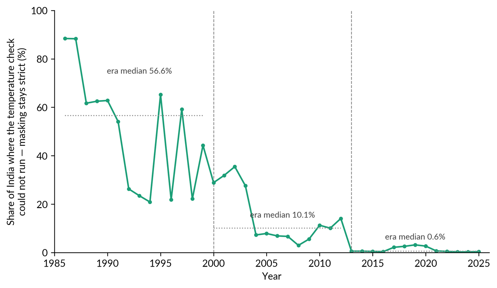

*Figure 6 — The share of India's land, for each year from 1986 to 2025, where cloud masking stays at its strictest because the temperature check could not run. The cloud flags sometimes mark bright but warm ground, such as salt flats or rooftops, as cloud. The temperature check gives those pixels back: each observation's surface temperature is compared with that pixel's usual clear-sky temperature for the same year, and a cloud is much colder than the ground it hides. Where a pixel has fewer than 8 clear temperature readings in the year, the check has too little to go on. It is not run, and every cloud flag stands: the cautious default. The line is measured from the archive's own temperature records. Dotted lines mark the middle value for each satellite era (56.6%, 10.1% and 0.6%), with the eras divided at 2000 and 2013. It matters because in the early years more than half the country is in this strict state. Those mosaics keep the flags' mistakes over bright ground, so they are cleaner but built from fewer observations, and the reader should expect that strictness to vary by era.*

Two extra rules complete the temperature check. The first is the **snow rescue**. A flagged pixel that looks like surface snow is kept. "Looks like snow" means a snow index above 0.4 (the snow index formula is exactly the same as MNDWI, Eq. 20) and shortwave-infrared-1 reflectance below 0.12 (snow is dark there; cloud is bright). But it is kept only where it is *not* unusually cold against its own history ($T \ge \tilde{T} - 15.0$ K, with $n \ge 8$). Surface snow shares the ground's clear-day temperature; an ice-topped cloud is far colder than the same pixel's usual clear reading. That is the only test that told them apart. A height cut-off is useless, because the leak *is* the snow zone. Thin history again gets the cautious default: no rescue. The second extra rule: the temperature check applies the same darkness test to shadow flags, and the same high-only rule to cirrus, as the QA-bit mask.

**Precedent, and the lack of it.** There is no published method to cite for a pixel-by-pixel, same-year temperature check that acts only on flagged pixels; hence the full detail above. The nearest published relative is temporal dark-outlier masking, TDOM (Housman et al., 2018; Chastain et al., 2019), which finds cloud **shadow** as unusually *dark* infrared readings against several years of data. The temperature check differs in every working respect. It reads *temperature*, not darkness. It judges against the *same* phenological year, not several years. And it acts only to decide an existing cloud flag, never on its own. TDOM itself was tested for this product and retired (Section 4, the register of methods considered and dropped).

**Why two masks together.** The answer is measured, not assumed. On a cell where cloud was shown to slip past the flags (NH-46-Z-D, pheno year 2022), the QA-bit mask alone left 0.79 cloud-like observations for each pixel. The temperature check alone left 1.45, nearly twice as many, because the temperature check lets warm cloud through. **Both together left 0.55.** The two blind spots do not overlap: the flags miss hesitantly-flagged cold cloud, and the temperature check misses firmly-flagged warm cloud. Figure 7 draws this as a 2×2 grid, cloud temperature against flag confidence, with each mask catching the corner the other misses. Using both wins or ties every measure tested, at a cost of 3–6% of observations, most of them cloud anyway. On a pheno-2015 cross-check, the both-together rule gave the lowest share of cloudy medians of the three options tested: 0.0235 against 0.0242 and 0.0302.

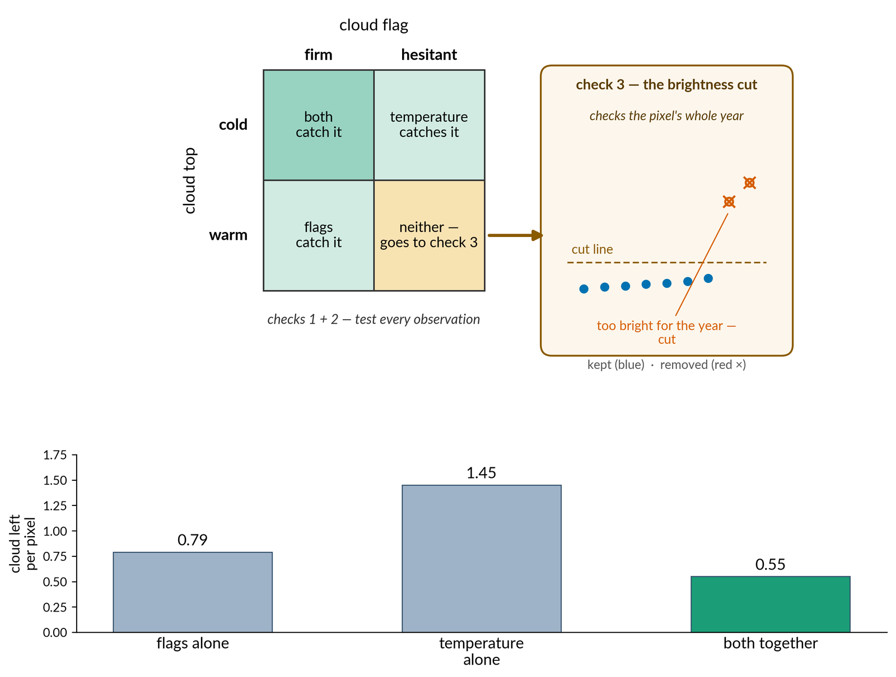

*Figure 7 — The three cloud checks and what each one catches. The 2×2 grid sorts cloud by how cold its top is (cold or warm) and by how sure the cloud flag is (firm or hesitant). The flags catch firmly flagged cloud. The temperature check catches cold cloud even when its flag is hesitant: it compares each observation's surface temperature with that pixel's usual clear-sky temperature for the same year, and a cloud is much colder than the ground it hides. Warm cloud with a hesitant flag slips past both. The side panel ('check 3') shows the third check, the brightness cut: observations much brighter in blue than the pixel's own year are dropped, because unflagged cloud is bright. The bars below were measured in cell NH-46-Z-D, pheno year 2022, a cell where cloud was shown to slip past the flags: the flags alone left 0.79 cloud-like observations per pixel, the temperature check alone 1.45, and both together 0.55. The product needs all three checks because each one's blind spot is covered by another.*

#### Check three — the brightness cut

Some cloud carries no flag at any confidence and has a warm top. It is invisible to both masks. It is, however, **bright**, and each pixel's own year gives a standard to judge brightness against. Observations that are much brighter in blue than the pixel's own year are dropped, because unflagged cloud is bright. After the masks (and after pass assembly), the pixel's set of blue reflectance observations for the year is examined, and

$$\text{exclude observation } i \;\text{ where }\; \rho^{\mathrm{blue}}_i \;>\; P_{25} + 0.03, \tag{Eq. 3}$$

where $P_{25}$ is the 25th percentile of the pixel's own blue observations (the value that a quarter of them fall below). The rule is **active only if** two conditions hold. The year's observations must show signs of contamination: $P_{75} - P_{25} > 0.03$. And enough observations must remain after the cut: at least $\min\!\big(5,\; \lceil n/2 \rceil\big)$, where the upward brackets $\lceil\,\cdot\,\rceil$ mean round up to the next whole number — five observations, or half the year's observations rounded up, whichever is fewer, five being the point above which a middle value is comfortably steady, and never fewer than 2. Otherwise the cut **stands aside** and the observations are left as they are (`pipeline/compositing.py`, function `cloud_trim`; constants `CLOUD_TRIM_DELTA`, `CLOUD_TRIM_SPREAD`, `CLOUD_TRIM_MAX_FLOOR`). The cut can decline to help; it can never do harm.

The cut rests on one stated assumption: **the darkest quarter of the pixel's observations (the bottom 25% of the sorted list) is clean**. Because the anchor is the 25th percentile, the rule still finds the clean core when up to roughly three-quarters of the observations are contaminated, far beyond the point where a median alone has failed. The cut works on the bright side only: its rule (Eq. 3) drops observations above a line, and there is no line below. Cloud shadow is *dark* contamination, and a bright-side cut cannot see it, so shadow stays the masks' job alone. The division of labour is exact. The two masks judge each observation on outside evidence (flags, temperature), so they work at any contamination level and protect the cut's clean-quarter assumption. The cut catches unflagged bright cloud the masks cannot see. The reading compared with the line is the blue one, but what is dropped is the whole observation: its readings in every band leave the pixel's year together. Both 0.03 figures are in reflectance on the 0-to-1 scale, so each is three parts in a hundred, and they are two separate settings that happen to share a value — the first is how far above the dark quarter an observation may sit, the second is how spread out the year must be before the cut acts at all. Nothing is written to a band here: the only trace the cut leaves is the difference between the annual counts, taken before it, and the quarterly counts, taken after.

The cut runs before *every* statistic, including the quarterly bands. A thin quarter whose only observation was cloud therefore reads as a real gap, left empty, not as a cloudy value. The annual observation counts are captured before the cut and the quarterly counts after; the two count meanings are defined side by side in Section 5.8.

#### The edge-case catalogue

Each check exists because of a real, observed failure, not a hypothetical one. The cases are numbered here, and Section 10 points back to this section.

- **Case 1 — Hesitantly-flagged cold cloud enters the median.** NH-46-Z-D (Aalo, in Arunachal Pradesh, in the far north-east), observation of 29 July 2022. Bright monsoon cloud (blue reflectance 0.82, near-infrared 0.79) carried only a medium-confidence flag. The firm bit ignored it, and the observation brightened the annual median. *Caught by the temperature check*: it was far colder than the pixel's clear-sky temperature record.
- **Case 2 — Warm cloud let through by the temperature check.** The temperature check upholds a flag only where the pixel is cold; low warm cloud is let through and kept. Measured on the same cell: the temperature check on its own kept nearly twice the cloud-like observations of the flags alone (1.45 against 0.79 for each pixel). *Caught by the QA-bit mask*, hence the rule that both must agree.
- **Case 3 — The median lands on cloud in persistently cloudy country.** In monsoon Aalo, the Western Ghats and the north-eastern hills, more than half of a pixel's remaining observations can be cloud even after both masks. The median, the middle value, then *is* a cloudy observation, though each observation passed its checks on its own. *Caught by the brightness cut*, which anchors on the darkest 25% of the pixel's own blue record.
- **Case 4 — Unflagged warm bright cloud.** Observation of 18 March 2023 (blue 0.67): no flag at any confidence, warm top, invisible to both masks. *Caught by the brightness cut* (far brighter than the clean core).
- **Case 5 — Cloud shadow darkens the record.** Shadow is dark, and a bright-side cut cannot see it. *Caught by the masks' shadow test*: the shadow flag is upheld only where the pixel really is dark.
- **Case 6 — Winter snow mistaken for cloud.** In Himalayan winter scenes, bright, cold surface snow is routinely flagged as cloud, and simple masking deletes whole snow seasons. *Handled by the temperature check's snow rescue*: surface snow shares the ground's clear-day temperature, while a cloud top is far colder than the same pixel's usual clear reading. Measured: the temperature check kept fewer false "snow" observations than the flags while keeping genuine snow.
- **Case 7 — Years with no clean core.** Where nearly every observation is cloudy (the worst monsoon pixels), the cut's anchor would itself be cloud. The minimum number of observations that must remain makes the cut *stand aside* rather than set its line from cloud, and the contamination is shown by the counts for each pixel rather than hidden. This is the accepted remaining limitation: warm, unflagged cloud in a year with no clean core passes all three checks.

**Evidence for the three checks together.** Beyond the comparison above, a working brightness score was computed: the share of valid land pixels whose annual blue median exceeds reflectance 0.10, a stand-in for cloud getting into the composite. On the verification cell NC-43-X-D across all 38 years, that share has a median of **0.06%**, and stays at or below 0.5% every year from 1999 onward. The real worst cases are the thin early years, where one or two observations for each pixel mean a cloudy one can *be* the median: 9.5% in 1991 (the legacy product, version 1: 23.5%), 3.5% in 1987, 3.4% in 1995, 2.3% in 1994.

Two limits travel with the score. It detects cloud by brightness, as the masks partly do, so cloud that fools both is invisible to it. The independent grade is the visual sample of 16 masked scene pairs, audited by the project lead, reported in Section 9. And the shares are computed over each product's own valid pixels, which flatters whichever product masks more away in thin years.

> [!example] Follow one pixel — the Aalo pixel, NH-46-Z-D, pheno year 2022
> The pixel starts with every observation the archive holds. The QA-bit mask alone would have kept the 29 July 2022 monsoon cloud (blue 0.82), because its flag was only medium-confidence. The temperature check removes it: the observation is far colder than this pixel's own clear-sky temperature record for the year. The 18 March 2023 observation (blue 0.67, warm, unflagged) passes both masks. It is the brightness cut, later in the chain, that removes it: the pixel's clean darkest 25% sits far darker. What remains is what the compositing step sees in Section 5.8.

One note for reading Figure 8. A few of its cloud observations have blue reflectance above 1, more than all the sunlight. That is not a data error: Collection 2's valid range for reflectance runs up to 1.6 (Section 5.8), and bright cloud can exceed 1 because the atmospheric correction was built for ground, not for cloud tops.

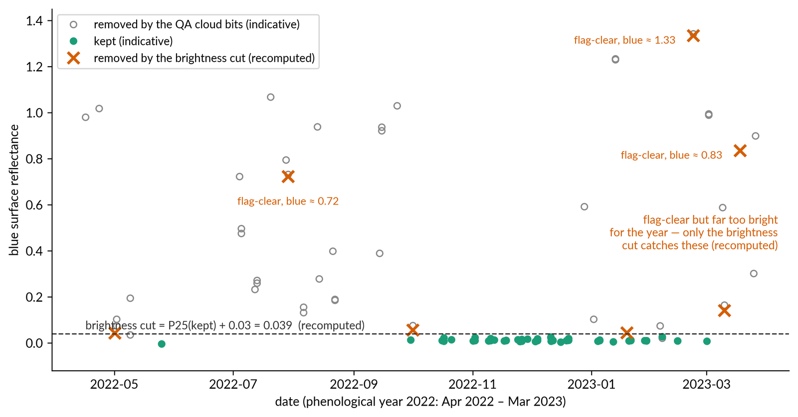

*Figure 8 — Every satellite observation of one pixel across one year. The pixel is at 95.5806°E, 28.3510°N in cell NH-46-Z-D, the same cell as the worked Aalo example above, and it is cloudy through the monsoon. Each point is one Landsat 7, 8 or 9 observation's blue reflectance (how much blue light the surface sends back) in the pheno year 2022 (April 2022 to March 2023). All 96 values were pulled again from the satellite archive, and the colours were worked out afresh here from the archive's cloud flags (the QA cloud bits) and a rebuilt cut line (the value a quarter of the way up the kept observations, plus 0.03 = 0.039). The colours are therefore a close illustration, not the product's own record. Grey open circles were flagged as cloud. Teal points passed every check. Orange crosses were not flagged; only the brightness cut, which drops observations much brighter in blue than the pixel's own year, would remove them. Three of them (blue 0.72–1.33) are plainly bright cloud, far above the tight dark cluster of clean readings. Cloud the flags miss entirely is still caught, because the brightness cut compares each observation with the rest of that pixel's year.*

---

### 5.3 Landsat 7 after the scan-line failure

**What this step does, and why.** In May 2003 Landsat 7's scan-line corrector failed (Markham et al., 2004; USGS SLC-off documentation). Every later scene loses about a fifth of its pixels in wedge-shaped stripes whose position is fixed relative to the ground. Used without care, striped Landsat 7 prints that pattern onto every statistic. It is not random noise but a pattern on the map, exactly what a classifier reads as landscape. Not used at all, the years 2003–2012 thin badly and 2012 vanishes. This step is the middle path: **the clean satellites always count; the striped one only plugs seasonal holes.**

**What is deliberately not done.** Published gap-fillers rebuild the missing pixels by estimation, either from neighbouring similar pixels (Chen et al., 2011, cited as **not used**) or from other dates (the USGS phase-2 gap-filled products, also not used). This mosaic never invents an observation. No value in the product is ever made up, estimated across a stripe, or copied from another place or date. The stripes are instead filled the way any thin spot is filled: by *real observations from other passes* entering the annual statistics.

**The enlistment rule** (`pipeline/sources.py`, function `apply_sensor_fill`; a recorded project decision). The rule runs after masking, so that "thin" means *usable* observations, not raw ones. The collection is split into the clean satellites (everything except Landsat 7) and the filler (Landsat 7). Then, for each pixel and each quarter of the phenological year (three months, starting 1 April):

- count the distinct clean **passes** that supplied a usable observation of that pixel in that quarter (passes, not frames, so a pixel in the overlap of two frames from the same pass counts once; see Section 5.7);
- if that count is below 3 (`config.SENSOR_FILL_MIN_OBS`; a median needs three observations to shrug off one bad one), Landsat 7's observations from that quarter are enlisted for that pixel; otherwise they are dropped.

The quarter is the coarsest block that still protects the quarterly bands and the wet/dry split. Coarser blocks hide empty quarters; finer ones enlist stripes for statistics the product does not make. The table of which pixel-quarters qualify is computed on a fixed 600 m national grid (`config.SENSOR_FILL_COUNT_SCALE`). Coverage is set by cloud and weather, which are smooth over kilometres, so the coarse grid makes the decision cheap without changing it.

**Behaviour at the edges, which follows from the rule itself.** Pheno year 2012 has no clean satellite at all, so every pixel-quarter is thin and all of Landsat 7 serves. Composites from a single satellite do not stripe: the gaps become plain thin coverage, not disagreement between satellites. Regions Landsat 5 never covered behave the same way. Years 2013–2016 apply the identical rule with Landsat 8 as the clean satellite and Landsat 7, in its bridging years, as filler. Years before 2003 pass through untouched; healthy Landsat 7 needs no policing. From 2017 to 2021 the same rule continues with Landsat 8 (and, in 2021, Landsat 9) as the clean satellites and Landsat 7 as filler. From pheno year 2022 Landsat 7 is withdrawn from the pool entirely, and the rule is idle. **Where neither the clean satellites nor Landsat 7 observed a pixel-quarter, nothing is filled**: the gap stands, and the quarterly counts show it. The precedent is the best-available-pixel family of methods (Griffiths et al., 2013; White et al., 2014), which scores SLC-off (striped) Landsat 7 down so it is used only where nothing better exists. This rule is the same judgement made firm and applied quarter by quarter.

**Why the fill cannot import cloud or change from another date.** Enlisted observations are ordinary masked observations of the same pixel, from the same quarter of the same year. They pass all three cloud checks like any other observation, and they enter the compositing step as votes in a median. No value is transplanted, so nothing can carry cloud, or another date's land state, into a pixel that did not observe it.

**Evidence.** On NC-43-X-D pheno year 2012 (a Landsat 7-only year), the stripe zones of the year's least-cloudy scene were reconstructed, and the finished mosaic was compared inside against outside those zones over dense forest. Inside the former stripes: one fewer usable observation for each pixel (7 against 8, exactly the expected loss), and median offsets of −17.9 stored units in blue, −66.5 in near-infrared, +33 in NDVI (0.2–0.7% reflectance; a stored unit is the whole number as written in the file, and one stored unit here is 0.0001 reflectance, Eq. 16), with NDVI spread lower by 80 stored units (slightly smoother, fewer observations). The fill leaves small, measured marks: not invisible, not disfiguring. Limits of the test: one reference scene, one year, one cover class. Section 10 carries the numbers.

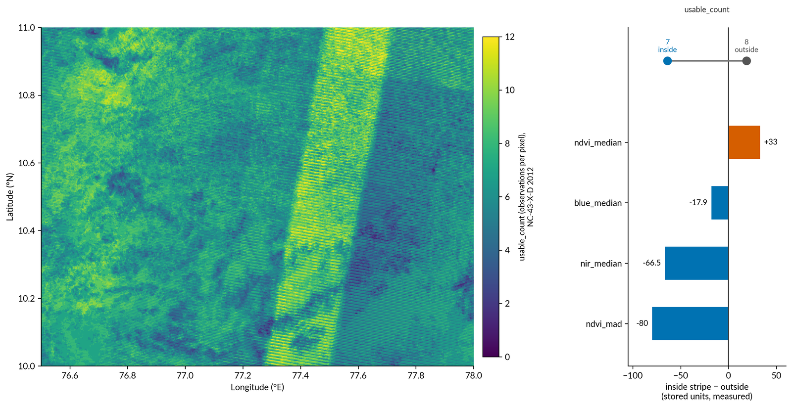

*Figure 9 — Left: a map of usable_count (the number of observations behind each pixel) for cell NC-43-X-D in 2012, shown on a 0–12 colour scale. Faint diagonal stripes run across it. Right: how much the stripes change the stored values, drawn for each affected band as the value inside a stripe minus the value outside, with the observation counts (7 inside, 8 outside) shown above. The map is the finished mosaic's own count band. The differences were measured between forest pixels inside and outside the stripe zones, which were rebuilt from their known pattern. The stripes follow the gaps left by Landsat 7's broken scan mechanism, in the one year when that satellite carried the whole load. It shows what the Landsat 7 gaps cost: inside a former gap a pixel rests on one observation fewer, and that shifts the stored medians by tens of stored units (blue −17.9, near-infrared −66.5, NDVI +33; NDVI spread −80). The effect is small but real, and it is measured here so that users know about it.*

---

### 5.4 Topographic correction

**What this step does, and why.** A hillside facing the sun looks bright; the same vegetation on the shaded side looks dark. Left uncorrected, every statistic in a mountain cell describes lighting as much as land, and a classifier learns which way slopes face instead of what covers them. This step removes the hill's *lighting*, not the hill: slope, aspect (the compass direction a slope faces) and elevation remain in the product as terrain bands. It works out how much light each pixel's tilt takes away or adds, and divides that out. A slope facing away from the sun, which looks too dark, is brightened back; a slope facing the sun, which looks too bright, is dimmed. The correction runs on **every** cell, flat ones included, where it changes almost nothing. There is no terrain switch, so there are no seams at cell borders and no ambiguity in the `corrections` property.

**Illumination geometry.** For each pass, with sun zenith angle $\theta_s$ (the sun's angle down from straight overhead) and sun azimuth $\phi_s$ (its compass direction), both from the scene metadata (the descriptive information shipped with the scene), and each pixel's slope $\sigma$ and aspect $\phi_t$ from the elevation model, the local illumination angle $i$ (the angle between the sun and a line standing straight out of the tilted surface) satisfies

$$\cos i \;=\; \cos\theta_s \cos\sigma \;+\; \sin\theta_s \sin\sigma \cos(\phi_s - \phi_t). \tag{Eq. 4}$$

In code this is worked out in a mathematically identical form: a weighted sum of three stored terrain quantities, with weights that are constant across a scene. A plain weighted sum has one useful property: when Earth Engine computes it at a coarser pixel size, the coarse value is the exact average of the fine ones, which the cosine formula would not give (`pipeline/terrain.py`, functions `_illum_terrain_linear` and `_perscene_ic`). The elevation model is lightly smoothed, radius one pixel, for the correction geometry only; the exported terrain bands stay raw.

**The correction model** is SCS+C: sun–canopy–sensor geometry (Gu and Gillespie, 1998), with an added term $C$ that keeps weakly-lit slopes from being brightened too much (Soenen et al., 2005; the $C$ idea from Teillet et al., 1982). The factor, exactly as coded (`pipeline/topo_physics.py`, function `apply_physics`), is

$$\rho_{\mathrm{corr}} \;=\; \rho \cdot \frac{\cos\sigma\,\cos\theta_s + C}{\max(\cos i,\; 0.05) \;+\; V_d\, C}, \qquad V_d = \frac{1 + \cos\sigma}{2}, \tag{Eq. 5}$$

where $V_d$ is the sky-view fraction: the share of the sky dome a tilted pixel actually sees (Dozier and Frew, 1990). It scales the diffuse term (the scattered skylight) in the denominator: a steep slope receives less skylight, and the correction allows for it. The floor of 0.05 on $\cos i$ (`config.PHYS_IC_FLOOR`) prevents division blow-ups where the sun skims the surface. The whole factor is bounded to **0.25–4** (`config.CORRECTION_FACTOR_MIN/MAX`) through a soft cap: unchanged up to a knee at 75% of the way to each limit, then bent gradually toward it (`pipeline/terrain.py`, function `_cap_factor`). This gives the same worst-case bound as a hard cut-off (a clamp), with no sharp edge on the darkest faces. What Eq. 4 produces is the cosine of that angle, a plain number from −1 to 1, not a value in degrees. It reads 1 where the sun strikes the surface square on, falls towards 0 as the sun grazes it, and goes negative where the slope faces away from the sun altogether. All five angles in Eq. 4 are in degrees, so any code that evaluates it must convert to radians first, as the pipeline does. What comes out is reflectance again, on the same 0-to-1 scale as went in, so it stays comparable with an uncorrected reading. The fraction is a multiplier: above 1 on a slope facing away from the sun, which is brightened back; below 1 on a slope facing the sun, which is dimmed; and close to 1 on flat ground, which is why the step can run everywhere and change almost nothing there. The halving in $V_d$ is what makes the number come out right at the two extremes: flat ground has $\cos\sigma = 1$ and sees the whole sky, so $V_d = 1$; a vertical face has $\cos\sigma = 0$ and sees half the sky, so $V_d = 0.5$. The corrected value replaces the original for every later step, starting with Section 5.5. No band stores it on its own.

**The physics C.** In Teillet's original method, $C$ is fitted for each scene: brightness is plotted against $\cos i$ (how directly the sun strikes each pixel), a straight line is fitted, and $C$ is the fitted line's offset divided by its steepness. Fitted versions (estimators) were built, tested and retired for this product: they failed on haze, and on the confusion that arises when shaded slopes carry different land cover from sunlit ones (documented in the project record). Production instead computes $C$ from physics. There is no published method to cite for this construction, hence the full detail. For each band,

$$C \;=\; \frac{E_{\mathrm{dif}}}{E_{\mathrm{dir}}}, \tag{Eq. 6}$$

the ratio of diffuse to direct sunlight reaching the ground (scattered skylight divided by the direct beam), taken from precomputed tables of 6S, a radiative-transfer model that simulates how sunlight passes through the atmosphere (6S: Vermote et al., 1997; vector-code validation: Kotchenova et al., 2006). This is the physical quantity the fitted $C$ approximates. If the extra term in the fitted line stands for skylight, which reaches a pixel however it is tilted, then the fitted line's offset divided by its steepness is the same thing as skylight divided by direct sunlight. Computing it from radiative transfer replaces a fit made for each scene, with all its failure modes, by a fixed table read. Being a ratio of two energies, $C$ is a plain number with no units, and it is never negative. It is small where the air is clear and the light arrives mostly as direct sunshine, and larger where haze scatters more of it, which is why blue carries the largest values (Figure 10). The larger $C$ is, the more gently the correction acts, because a pixel lit mainly by skylight barely cares which way it faces.

**The tables.** One table for each sensor family (TM, ETM+, OLI; their colour filters differ), 26,680 rows each, spanning four axes (nodes are the fixed points along each axis):

- sun zenith: 10° to 80° in 2.5° steps (29 nodes);
- elevation: 0 to 5,500 m in 250 m steps (23 nodes);
- aerosol optical thickness (how much haze is in the air): 8 nodes at 0.05, 0.10, 0.15, 0.20, 0.30, 0.45, 0.70, 1.00;
- column water vapour (the moisture in the column of air above the pixel): 1 to 5 g cm⁻² in steps of 1 (5 nodes).

For each pass, the pipeline reads the pass's sun zenith from scene metadata. It reads aerosol optical thickness and water vapour from MERRA-2, the NASA atmospheric reanalysis (a model-based reconstruction of past weather from observations; Gelaro et al., 2017), at the pass hour, averaged over the area the scene covers (strictly, the first frame's area; later frames of the same pass share its value). It reads between the table's nodes in straight-line fashion along the sun-zenith, aerosol and water-vapour axes (beyond the axis ends, the end value is held). It then reads the resulting curve of C against elevation **pixel by pixel**, at each pixel's own elevation from the Copernicus GLO-30 elevation model (ESA, 2021) (`pipeline/topo_physics.py`, functions `pass_table`, `profiles_for`, `apply_physics`). Where MERRA-2 has no value for the hour, long-term typical values of 0.15 (aerosol) and 2.0 g cm⁻² (water vapour) are used, and the pass is counted in the build log. Above 5,500 m the table's top row holds (the value is held there rather than extended). That covers 0.99% of India's land, 32,406 km², essentially glacier and rock; Section 10 carries the sentence.

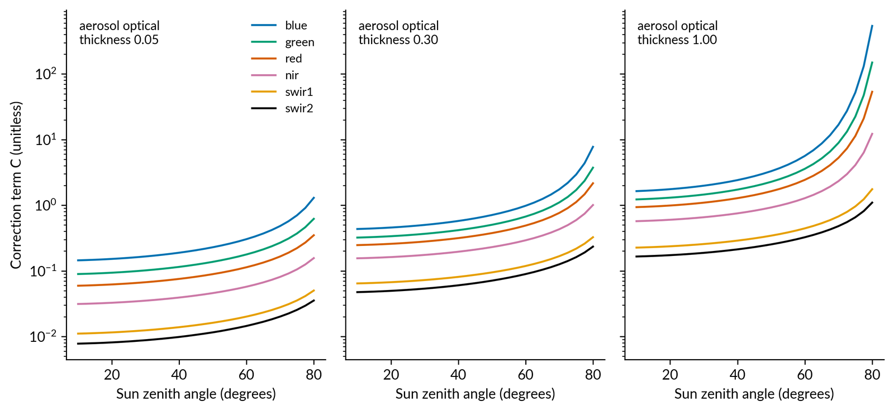

*Figure 10 — The strength of the terrain correction, C, for each optical band, plotted against sun angle at three levels of aerosol (haze in the air). The terrain correction evens out the lighting difference between slopes facing the sun and slopes facing away from it. The curves are read straight from the product's table of computed light paths through the atmosphere (the radiative-transfer look-up table: Landsat 8/9 sensor, the sea-level grid point, water vapour at the 2.0 g/cm² grid point). The blue band sits highest because most of its light reaches the ground as scattered sky light rather than direct sunshine. That is why the correction must be held back most for blue when it is applied to hillsides.*

**Every band is corrected, including blue.** Two things need saying here. First, under the earlier *fitted* estimators, the decision was to leave blue uncorrected: haze flattens blue's response to illumination, and that made the fitted $C$ meaningless roughly half the time. That decision applies only to fitted estimators, which are now used only as laboratory comparisons. The physics $C$ is read from a table and cannot flip sign, so blue is corrected like every other band, uniformly (`config.TOPO_UNCORRECTED_BANDS` is empty). Second, a finding from the project's terrain analysis (August 2026) is stated plainly, because a reader might expect otherwise. In the shipped record, how strongly a pixel is corrected depends mainly on which satellite pass observed it (each pass has its own sun angle and its own atmosphere), and not smoothly on the season. This is neither a fault nor a surprise: the correction is made pass by pass by design. It does mean that two passes a few days apart can be corrected by different amounts. **A pass missing from the conditions table ships uncorrected, and says so**: the build prints the unmatched passes rather than guessing a correction (function `apply_physics`). A pixel whose red reflectance is zero or negative (a bad reading from the atmospheric correction) also keeps its raw value.

**Assumptions.**

- The surface is treated as Lambertian (equally bright from all directions) within the factor bound; the 0.25–4 bound is the admission that the model is not trusted outside it.
- GLO-30 is adequate as the terrain model at 30 m (it is a surface model with a limited date range; both points are listed as a limitation in Section 10 L12).
- MERRA-2's roughly 50 km cells stand for the atmosphere over a whole Landsat scene at pass time; because one scene-wide mean is used, there are no seams within a pass.
- The 5,500 m table ceiling, with values held at the top row above it, is acceptable over the 0.99% of land above it.

**Evidence.**

- **Why nothing damps the correction.** Every remedy on the correction side for the extreme-shade tail (the darkest, most deeply shaded pixels) was tested and rejected. Strength multipliers set band by band made each band flatter on its own but broke the relationship between band pairs, printing false terrain patterns (artefacts) into NDVI. Factor ceilings set band by band did the same over a smaller area. Damping that depends on illumination was safe for NDVI but swapped the bright tail for dark patches, a sideways move. In the extreme-shade tail the model genuinely fails, and no multiplier can pick the truth.
- **The south–north yardstick.** On finished NC-43-X-D 2019 mosaics, dense forest only, steep faces (15–40°): the legacy product (version 1), which has no terrain correction, reads sun-facing faces brighter than shaded ones in near-infrared by 288 stored units in its Landsat 8 image and 416 in its Landsat 7 image (one stored unit is 0.0001 reflectance, Eq. 16). That is the raw terrain signature. The corrected product reads −160. The signature is removed and **overshot**: the difference changes sign, though the reversed difference is smaller than the signature it replaced (160 stored units is about 1.6% absolute reflectance, about 6% relative). This is the known, accepted near-infrared over-correction in steep wet terrain. The closing decision accepted it as a known leftover error (a residual), and any future band-by-band remedy belongs in the $C$ tables themselves, never in multipliers applied afterwards. Drift across slope bins (groups of slope steepness) on the same test: −5.5% from flat to steepest for the corrected product, against −5.6% and −7.8% for version 1's two images. The measurement was made by a script named `terrain_yardstick_check.py`, which states its own method; it is kept with the project's working records and is not part of this release.
- **The over-brightening bound.** The remaining over-brightening affects a small share, below 1%, of pixels, in extreme terrain shadow, measured on the exports used for the damping experiments.

Figure 10b shows a three-panel hillside comparison: the correction removes the hill's lighting, not the hill.

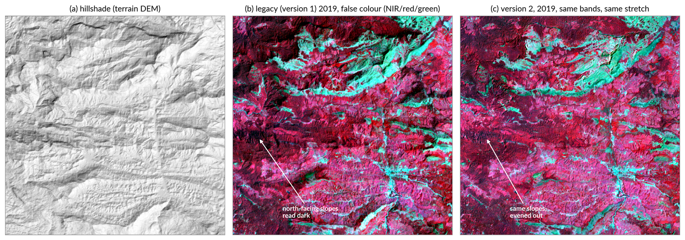

*Figure 10b — One steep patch of the Anamalai hills (76.95–77.10°E, 10.04–10.19°N, cell NC-43-X-D, 2019) shown three ways: a hillshade (a drawing of the terrain lit from one side), then the legacy product (version 1, its Landsat 8 image for that year) and version 2 in the same false colour (built from the near-infrared, red and green bands) at the same display stretch. The two mosaic panels are the finished products' own median bands; the hillshade comes from the product's terrain layer. In version 1 the north-facing slopes are dark, because the sun's lighting of the hills is still in the mosaic (its brightness follows the hillshade closely: a similarity score, or correlation, of +0.54 on a scale where 1 is a perfect match and 0 is no relation). In version 2 the same slopes are evened out (similarity score −0.09). Both scores come from a script named `hillshade_correlation_check.py`, kept with the project's working records and not part of this release. The correction removes the lighting of the hill, not the hill itself.*

**Closing decision (a recorded project decision, approved by the project lead).** Topographic correction applies the full physical SCS+C correction, with a C read for each scene and each band from the 6S atmosphere tables (MERRA-2 aerosol and water vapour at pass time, each pixel's own elevation), and with the correction factor bounded to 0.25–4. The bound was kept after thorough testing showed that every scheme which damps some bands and not others (band-by-band strengths, band-by-band factor ceilings) harms the indices by breaking the relationship between band pairs. Damping that depends on illumination merely swaps a bright artefact for a dark one. Remaining over-brightening of a small share (< 1%) of pixels in extreme terrain shadow is a known limitation.

---

### 5.5 Sunlight-and-view normalisation (BRDF)

**What this step does, and why.** The same ground does not look equally bright from every direction. A mown lawn shows stripes that look light or dark depending on which way you walk, though the grass is the same. Satellites see the same effect. A pixel imaged at the east edge of the satellite's swath (the strip of ground one pass images), at the west edge, or at the centre, under different sun angles, returns different reflectance from land that has not changed. This step is the correction for sun and viewing angles (BRDF, short for bidirectional reflectance distribution function: a description of how a surface's brightness depends on where the light comes from and where it is viewed from). It moves every observation to one standard set of angles. After it, a change in the record means a change on the ground.

**The model.** Surface reflectance is modelled as the sum of three parts,

$$R(\theta_s, \theta_v, \phi) \;=\; f_{\mathrm{iso}} \;+\; f_{\mathrm{vol}}\, K_{\mathrm{vol}}(\theta_s, \theta_v, \phi) \;+\; f_{\mathrm{geo}}\, K_{\mathrm{geo}}(\theta_s, \theta_v, \phi), \tag{Eq. 7}$$

with $\theta_s$, $\theta_v$ the sun and view zenith angles (the angle away from straight overhead) and $\phi$ the relative azimuth (the compass angle between the sun direction and the view direction). The first part is the same in every direction. The other two are kernels (a kernel here is a fixed formula for one kind of scattering). The second is the RossThick kernel (Roujean et al., 1992), for light scattered inside a volume such as a leafy canopy. The third is the LiSparse-Reciprocal kernel (Wanner et al., 1995), for the shadowing of solid shapes. This is the pair used in day-to-day production for MODIS (Schaaf et al., 2002). The kernels are implemented exactly as published (`pipeline/radiometry.py`, functions `_ross_thick` and `_li_sparse_r`; crown-shape constants $h/b = 2$, $b/r = 1$, two ratios that fix the proportions of a typical tree crown: $h$ its height, $b$ and $r$ its vertical and horizontal size). $R$ is a modelled brightness on the reflectance scale, with no units. It is never compared with the measured pixel and never stored. Because the coefficients are one fixed national set, $R$ depends only on the band and the three angles, never on what the pixel is covered with. It exists only to be formed twice and divided, in Eq. 8. The three crown letters belong to the kernel formulas alone: in particular this $b$ is not the band index $b$ used elsewhere, and this $f$ is not the pixel share $f$ of Eq. 24.

**The correction** is the c-factor method of Roy et al. (2016). For each band and each pixel,

$$c \;=\; \frac{R(\theta_s^{\mathrm{ref}},\, 0,\, -)}{R(\theta_s, \theta_v, \phi)}, \qquad \rho_{\mathrm{NBAR}} \;=\; c\,\rho, \tag{Eq. 8}$$

The model is evaluated twice: once for the angles the satellite actually had, and once for a standard set of angles (looking straight down, at a reference sun angle). Their ratio, $c$, rescales the observation to that standard set of angles. The result is NBAR, nadir BRDF-adjusted reflectance ("nadir" means straight down). Because $c$ is a ratio of two model values, errors in the coefficients (the fixed numbers in the model) largely cancel. That is why one **fixed, global coefficient set** works for Landsat's narrow ±7.5° field of view. The set used is the "global, 12 months" fit of Roy et al. (2016), made over roughly 16 billion MODIS pixels for each band and checked against the paper (values as $f_{\mathrm{iso}}$ / $f_{\mathrm{vol}}$ / $f_{\mathrm{geo}}$): In the top line of Eq. 8 the three angles are set to the standard geometry: the reference sun zenith, a view zenith of 0 (straight down), and a dash in the third slot, because once you look straight down the compass angle between sun and view no longer means anything. Because Landsat looks almost straight down, $c$ stays very close to 1: above 1 it brightens the observation a little, below 1 it dims it, and the measured size of the whole adjustment is a few tenths of a percent of reflectance. The adjusted value replaces the original and is what Section 5.6 then transforms. Nothing here is stored as a band.

- blue 0.0774 / 0.0372 / 0.0079
- green 0.1306 / 0.0580 / 0.0178
- red 0.1690 / 0.0574 / 0.0227
- near-infrared 0.3093 / 0.1535 / 0.0330
- shortwave-infrared 1 0.3430 / 0.1154 / 0.0453
- shortwave-infrared 2 0.2658 / 0.0639 / 0.0387

**Reference geometry, stated exactly.** The view is set to straight down. The reference sun zenith $\theta_s^{\mathrm{ref}}$ is the **scene-centre** value, taken from the scene metadata and constant across the scene. It is not the angle for each pixel, and it is not one fixed sun for the whole year. The seasonal change in sun height is deliberately *kept* in the record. The only thing removed is the small east–west change in sun angle across one swath. This follows published practice for Landsat data adjusted onto a common footing, and its measured size is small: about a 1.2° adjustment, moving reflectance by +0.28% to +0.61% and NDVI by less than 0.001 (`pipeline/radiometry.py`, function `apply_brdf`, and the analysis recorded at `config.BRDF_NORMALISE_SOLAR_ZENITH`).

**Order: terrain first, then BRDF. The physical reason.** Terrain changes how much light *arrives*: a slope facing the sun receives more, a slope facing away receives less. The BRDF is a property of the *surface itself*: how it scatters whatever light it receives. The arrival effect must be removed first. Otherwise the BRDF model is asked to explain brightness differences it does not describe. The approximation is stated plainly beside it: after the slope correction, the kernels are still evaluated with flat-terrain angles. The sun and view directions are not rotated into each pixel's own tilted frame. The slope check below sets a bound on what this costs.

**Evidence.**

- **The blind paired test that kept BRDF** (run in August 2026). The test used blind national samples (blind: the tester did not know which version was which) of pixel pairs seen by two sensors on the same day, in the sidelap (the strip of ground where neighbouring satellite tracks overlap). The correction closes 50–100% of the between-sensor gap on every join and every cover type. It never inflates the scatter within a single sensor. The clearest case: Landsat 7 against Landsat 8 over trees, where a gap of +141.7 stored units fell to −0.4. **One limit, from the record**: same-day pairs between satellites eight days out of phase occur only in the sidelap between neighbouring tracks. There the two sensors view from 178° apart, both about 7° off straight-down (nadir), against about 3.8° for a typical pixel. The raw gaps are therefore a worst case, and the test is a stress test of BRDF specifically; comparisons between the different rebuilt versions of the processing are unaffected (same points, same geometry). In plain terms: the pairs come from the strips where neighbouring tracks overlap, seen from opposite sides, so the raw gaps are larger than a normal pixel would show. Comparisons between rebuilt versions use the same points, so they are unaffected.
- **The slope check** (run in September 2026). After the terrain correction, does the flat-terrain BRDF adjustment paint hill patterns back in? On the finished NC-43-X-D 2019 image, dense forest, the near-infrared median by slope bin (group of slope steepness) is 2895 / 2864 / 2799 / 2735 stored units from flat to steepest (−5.5%), against −5.6% and −7.8% in the two images of the uncorrected legacy product (version 1). The BRDF step brings no terrain pattern back. The sun-facing against shady test on the same data shows the known near-infrared overshoot already reported in Section 5.4; it belongs to what the terrain correction leaves behind, not to the BRDF order.

---

### 5.6 Sensor harmonisation

**What this step does, and why.** Four satellites contribute to the record (Landsat 5, 7, 8 and 9; Section 3.4), carrying three kinds of instrument (TM, ETM+ and OLI), and their colour filters are not identical. The same ground gives slightly different reflectance through a Landsat 5 band than through a Landsat 8 band. Left alone, those differences would appear in the archive as sudden national "changes" in 1999 and 2013, the years a new kind of instrument first enters the record, that never happened on the ground. Harmonisation (putting every satellite on a common footing) transforms every sensor's reflectance onto one common basis. **The target basis is OLI, the Landsat 8/9 instrument.** Everything downstream depends on that choice, from the tasselled-cap weights (Section 5.9) to any comparison between years. So it is stated here once and plainly: Landsat 8 and 9 data are never transformed; Landsat 5 and 7 are transformed onto them. The chain (`pipeline/radiometry.py`, function `normalise_era_a`; "era A" is explained in Section 5.1) runs after the correction for sun and viewing angles (BRDF, Section 5.5): TM→ETM+ for Landsat 5, then ETM+→OLI for Landsat 5 and 7 (TM is the Landsat 5 instrument, ETM+ the Landsat 7 instrument). The code lists Landsat 4, which also carried TM, under the same rule, but Landsat 4 is not among the satellites the product queries (`config.SENSOR_YEARS`).

**The estimator.** All transforms here are reduced major axis (RMA) regressions. A regression fits a straight line through paired samples; RMA is the version that treats both sides of the pair as uncertain. For each band $b$, with paired samples from the source and target sensors,

$$m_b \;=\; \operatorname{sign}(r_b)\, \frac{s_{\mathrm{target}}(b)}{s_{\mathrm{source}}(b)}, \tag{Eq. 9}$$

the slope of the fitted line (its steepness) is the ratio of the two standard deviations (a measure of spread), with its sign taken from the correlation (a number from −1 to 1 that says how closely the two sensors' values move together). RMA is used rather than ordinary least squares (the usual line fit, which treats one side of the pair as exact and puts all the error on the other side) because **both** sensors carry error (Smith, 2009; Roy et al., 2016 make the same argument for their published set). The least-squares slope is shrunk by the correlation. It would narrow the spread of the noisier sensor's values, and so build a step into every spread statistic at each sensor join. That is precisely the false step harmonisation exists to prevent. The slope is a plain number with no units, one for each band, worked out once from the paired samples and then frozen: the production run reads it from a table and never fits it again. For these sensors every correlation is positive, so the sign is always +1 and every fitted slope comes out close to 1. Its only use is as the multiplier in Eq. 10.

**TM→ETM+, the in-house transform.** Roy et al. compare ETM+ against OLI only. Landsat 5 previously received a transform derived for a different instrument. The replacement was derived from India's own data. There is no published precedent for this specific derivation, so it is given in full.

The Landsat 5 TM to Landsat 7 ETM+ transform was derived in-house from India's own 1999–2011 period, when both satellites were flying. It used sidelap pairs: scenes from the two sensors taken over the same ground no more than two days apart, where neighbouring orbital paths overlap. Both members of each pair received identical preprocessing up to the point where the transform is applied: cloud and shadow masking and the BRDF correction, with no sensor harmonisation applied. Pixels were kept only where NDVI differed by less than 0.05 between the pair. This holds down leftover cloud and real change on the ground.

Candidate pixels were sampled at 150 points for each pair. The sample was then balanced by capping every region × year × elevation × land-cover stratum (group) at 40 samples. The groups: nine regions across India; four years (2000, 2003, 2006, 2009; later years were excluded to avoid Landsat 5's orbital drift); four elevation groups (breaks at 500, 1,500 and 3,000 m); and three NDVI classes (breaks at 0.2 and 0.5). This gave 3,952 pixel pairs, on which a reduced-major-axis regression was fitted for each band. RMA was preferred over ordinary least squares because both sensors carry error, and least squares demonstrably shrinks the spread of the noisier Landsat 5 values.

In the blue band the fitted slope was unstable across groups (0.40–1.01, attributed to noise in the TM blue channel) while the offset was stable, so blue is corrected by offset only. Recorded correlations for each band range from r = 0.918 (near-infrared) to 0.962 (red). The blue correlation and the leftover-error (residual) statistics for each band are not on record, because the original sample table was not archived. A later re-derivation on same-path pairs (identical viewing angles, 7–9 days apart) detected a small imprint of the viewing angles in the original coefficients (the fixed numbers of the transform). But it failed a test on data kept back for testing, across regions, so the original coefficients were retained. On those independent samples the transform leaves median leftover errors within roughly ±50 reflectance ×10,000 units in each band.

The transform as applied (`config.TM_TO_ETM`; intercepts, the constant added, in reflectance ×10,000):

$$\rho_{\mathrm{ETM+}} \;=\; m_b\, \rho_{\mathrm{TM}} + c_b \tag{Eq. 10}$$

What comes out is a Landsat 5 reading rewritten as Landsat 7 would have measured the same ground. **Both sides of this one equation are on the stored scale, reflectance × 10,000**, the same scale as the intercepts listed below, so a reflectance of 0.25 enters as 2500 and an intercept of −43.5 is −0.00435 of reflectance. The typical size of the change is a few tens of those units, well under a hundredth of reflectance.

- blue: slope 1.0, intercept −43.5 (offset only, by the evidence above)
- green: 0.9852, −54.9 (r = 0.945)
- red: 1.0234, −48.4 (r = 0.962)
- near-infrared: 0.9918, −16.2 (r = 0.918)
- shortwave-infrared 1: 1.0132, −63.3 (r = 0.944)
- shortwave-infrared 2: 1.0189, −35.3 (r = 0.960)

**ETM+→OLI, the published transform.** This is the RMA set of Roy et al. (2016), surface-reflectance table, checked against the paper (`config.ETM_TO_OLI`; intercepts in 0–1 reflectance, rescaled when applied):

$$\rho_{\mathrm{OLI}} \;=\; m'_b\, \rho_{\mathrm{ETM+}} + c'_b \tag{Eq. 11}$$

**Note the change of scale from Eq. 10.** This published set quotes its intercepts on the 0-to-1 reflectance scale, so the reflectances in Eq. 11 are on that scale; the code multiplies each intercept by 10,000 before applying it, so that both transforms in fact run on the stored scale. Anyone chaining the two by hand must watch this, or the Landsat 5 offset comes out ten thousand times wrong. What comes out is a Landsat 5 or Landsat 7 reading expressed on the Landsat 8 and 9 basis. Landsat 8 and 9 readings pass through untouched. From here on every observation in the product is on that one basis, and these are the values every statistic in Section 5.8 is built from.

- blue: slope 0.9785, intercept −0.0095
- green: 0.9542, −0.0016
- red: 0.9825, −0.0022
- near-infrared: 1.0073, −0.0021
- shortwave-infrared 1: 1.0171, −0.0030
- shortwave-infrared 2: 0.9949, +0.0029

**No local Landsat 5↔7 offset.** A further added offset between the two sensors, one for each cell, was built and then removed on evidence. It was tested blind on about 40,000 same-day pixel pairs across 14 cells, restricted to the 13 cells holding their own soundly fitted offset row, which is the best possible case for it. The offset made the between-sensor gap *worse*: trees +10.7% worse (n = 559), grassland +10.8% worse (n = 409), cropland +4.7% worse (n = 1,277). Only built-up improved (−3.8%, n = 47, too few to lean on). The underlying reason: the Landsat 5-to-7 difference is neither a national constant nor stable enough to estimate cell by cell. Fitted slopes varied by 0.16–1.03 between the reference cells used for fitting, roughly ten times the difference between candidate coefficient sets. A re-tuning of the national TM→ETM+ transform was also tested. It also failed on data kept back for testing, which is itself evidence that the shipped coefficients are not overfitted (tuned too closely to one sample). Both routes are closed by measurement; no offset ships. One housekeeping note: the retired offset step still runs on the production path as a checked do-nothing call (its switch is off), so that the code and this document list the same steps.

---

### 5.7 Pass assembly

**What this step does, and why.** A **pass** is one satellite overflight of the cell. The catalogue, however, delivers a pass cut into frames: fixed rectangles along the orbital track. Neighbouring frames of the *same* pass overlap. A pixel in that overlap was imaged once but delivered twice. Counted twice, it enters every median, spread and count twice, and the record shows banding along exactly those overlap strips. This was measured before the fix, not assumed. Pass assembly merges the frames of each pass into a single image, so that **every physical observation enters every statistic exactly once**.

**Mechanism.** Each frame carries a pass key: a whole number built from the day the image was taken and the orbital path number. Frames of one overflight share a key; neighbouring paths, imaged on different days, keep distinct keys. The corrections made frame by frame come first (Section 5.2–Section 5.6 all need each frame's own context and angles). Then the frames of each key are joined into one image (`pipeline/sources.py`, function `merge_passes`). Compositing then sees one image for each pass. The counts for each pixel and the `n_scenes` property (Section 7) count these merged passes: `n_scenes` counts distinct passes, not frames. The inset of Figure 5 draws the frames-to-strip geometry.

**Assumptions, with their size.**

- **One atmosphere for each pass.** The terrain correction reads one haze (aerosol) and water-vapour value for each pass (the pass hour, scene-wide mean; Section 5.4). This assumes the atmosphere is uniform along the pass at the scale of a grid cell. Within one cell a pass spans at most about a degree and a half of latitude. The MERRA-2 atmosphere record has coarser cells than the grid cell, so reading a value for each frame would add nothing but seams.
- **One sun angle for each pass.** The pass's sun zenith (the sun's angle down from straight overhead) is read once. Across a cell's latitude span the true sun zenith varies by roughly a degree. By the sensitivity worked out from the formula and recorded with the BRDF settings, even a 5° zenith error moves near-infrared reflectance by 1.8% and red by 2.4% (NDVI by 0.0024). A one-degree span therefore contributes a few tenths of a percent, well inside the corrections' other leftover errors.

---

### 5.8 Compositing

**What this step does, and why.** After masking, the brightness cut and the corrections, each pixel holds its set of observations for the year. Compositing reduces that set to the product's statistics: a typical value (the median), a spread (the MAD), a seasonal split (wet and dry medians and their difference), and the quarterly greenness curve. Every one of these is found by sorting the values and reading off a position, so a stray bad value cannot pull it far. And every one is worked out pixel by pixel: no neighbourhood, no smoothing, no borrowing from next door.

**The median, band by band.** For each band $b$ separately,

$$\tilde{x}_b \;=\; \operatorname{median}\{\,x_{b,i} : i = 1 \dots n\,\}. \tag{Eq. 12}$$

The median is the middle value of the sorted list, so a few cloudy observations cannot drag it. It is taken **band by band, not observation by observation**. The composite pixel (the summarised pixel) is *not* one "best" observation: its red may come from March and its near-infrared from October, so the composite's spectrum (its pattern of values across the bands) can be a mixture that no single day showed. This is deliberate. It gives the most robust value in each band, and it must be remembered when reasoning about composite spectra. Figure 11 shows the device in miniature: eleven sorted blue values with the middle one circled. That, band by band, is the whole trick. The braces in Eq. 12 gather a set of values and the colon inside them reads as “for”: that band's value, for every observation from the first to the last. The output keeps the band's own units and becomes that band's `_median` layer — `red_median`, `ndvi_median` and the rest — each decoded by its family rule (Eq. 16, Eq. 21, Eq. 23, Eq. 26). Where the year's observations come to an even number there is no single middle value, and the median is the average of the middle two, so the stored number need not be a value any single day held. Where a pixel has no usable observation at all, no median is formed and the pixel is left empty in every band, never filled with a made-up number.

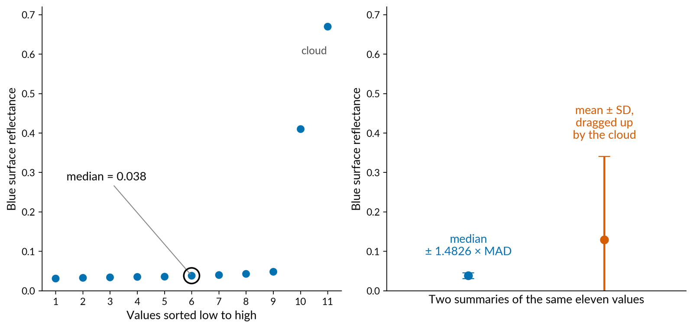

*Figure 11 — A worked example of the idea at the heart of the product. (a) Eleven blue-reflectance values for one pixel in one year, sorted from low to high: nine clean and two brightened by cloud, with the median (the middle value) circled. (b) Two ways of summarising those same eleven values, side by side. The numbers were made up by hand for the illustration, not taken from data. The median and its robust spread (MAD, the median absolute deviation: the typical distance of the observations from their middle value) ignore the two cloud values completely. The mean plus or minus the standard deviation is dragged upwards by them. This is why every band in the product is built from medians.*

The median's protection has a limit, and it is the limit that all of Section 5.2 works to hold. The median still lands on a clean value only while leftover contamination is below 50% of the observations that remain. The masks hold contamination down at any fraction. The brightness cut rescues the majority-cloudy case up to about 75%. What gets past all three checks (case 7 of Section 5.2) is shown by the counts.

**The spread.** For each band,

$$\mathrm{MAD}_b \;=\; \operatorname{median}\big|\,x_{b,i} - \tilde{x}_b\,\big|, \tag{Eq. 13}$$

the median absolute deviation (Hampel, 1974), a robust measure of spread: the typical distance of the observations from their middle value. It is stored **raw**. The constant 1.4826 that would put it on a standard-deviation scale for bell-shaped data (Rousseeuw and Croux, 1993) is **not** applied in the stored bands. A double-cropped pixel's year is not bell-shaped, and a constant multiplier carries no information. To compare a `_mad` band with a standard deviation, use the one conversion given in Section 8.3. Note plainly: the MAD mixes real within-year change with noise. A rice pixel has a large MAD because rice changes, not because the sensor erred; Section 8 treats this. Figure 11 works a MAD and standard-deviation pair by hand. The upright bars in Eq. 13 mean the distance is taken as a plain positive number, so readings above and below the middle count the same. The spread is in the band's own units and can never be negative, so zero is its floor — and that floor carries a warning. A pixel with only one observation in the year has a spread of exactly zero, and a pixel with two has half their difference, so a small spread can mean thin evidence rather than steady ground. Read `usable_count` beside any `_mad` band before believing a low value.

**The wet/dry split, the formal rule.** The seasonal bands never use calendar months. India's two green peaks make any fixed window wrong somewhere, so seasons are decided **pixel by pixel, from the pixel's own NDVI record** (`pipeline/compositing.py`, function `composite`):

1. Compute the pixel's 25th and 75th percentile of NDVI across the year's observations (the values below which 25% and 75% of the observations fall). Snow is excluded from this ranking wherever the pixel has at least 6 snow-free observations spanning at least 2 quarters; otherwise all observations are used. The two guards protect against different failures: the count protects the percentile estimate, and the quarter span makes sure the observations cover enough of the year. The two cut-off values ship as `ndvi_p25` and `ndvi_p75`.
2. Form two groups, the dry group and the wet group (the equation writes them as "dry stack" and "wet stack"):
$$\text{dry stack} = \{\, i : \mathrm{NDVI}_i \le P_{25} \,\}, \qquad \text{wet stack} = \{\, i : \mathrm{NDVI}_i \ge P_{75} \,\}, \tag{Eq. 14}$$
with snow excluded from both under the same guard. What Eq. 14 produces is two groups of whole observations, not two values. An observation sitting exactly on a cut-off belongs to its group, so in a thin year the same observation can fall in both groups at once; with four or fewer observations that overlap is certain, and the two ends of the year then rest on much the same evidence. Six is the fewest observations from which a quarter-way and a three-quarter-way value can be read with any steadiness, and two quarters is the least that can span both a green and a lean part of the year. The cut-offs themselves ship as `ndvi_p25` and `ndvi_p75`; which observations fell in which group is not stored.
3. Take the median of each band over each set: the `_dry` and `_wet` bands.

**One ranking drives every band.** The cut-offs come from NDVI alone, and each whole observation is kept or dropped by its own NDVI. So `swir1_median_dry` is *not* the 25th percentile of shortwave-infrared. It is the median of shortwave-infrared over the pixel's **least-green** observations. This keeps all bands describing the same moments in time. It also makes the ranking band a single point of leverage, which is why it gets the snow guard. Figure 12 shows a two-peak NDVI trace with the wet and dry picks marked.

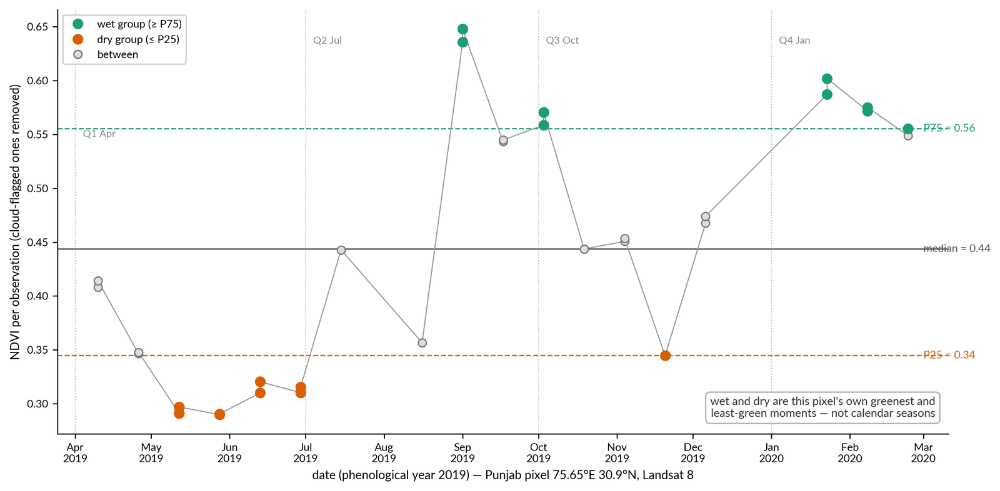

*Figure 12 — One farmed pixel's greenness (NDVI, an index of how much green plant cover a pixel has) through the phenological year 2019 (April 2019 to March 2020, following the crop calendar rather than the calendar year). Three reference lines are drawn from the pixel's own observations for that year: values at or above the 75th percentile (the top quarter) form the wet group (teal), values at or below the 25th percentile (the bottom quarter) form the dry group (orange), and the solid grey line is the median. The points are NDVI values pulled afresh from the archive for each Landsat 8 scene at a Punjab pixel that grows two crops a year (75.65°E, 30.9°N), with cloud-flagged scenes removed. It shows that wet and dry are this pixel's own greenest and least green moments, not calendar seasons. The wet group takes in both the September kharif peak and the January–February rabi peak.*

The rule is inherited, not invented here: the pixel-by-pixel NDVI-rank form is version 1's own (Section 3.7), and percentile-based seasonal compositing runs through the MapBiomas family (Souza et al., 2020). What is new is the snow guard, the two cut-off values shipped as bands, and the swing, hence the full specification. Its **documented consequences** are part of the specification, not bugs:

- "Dry" means *least green*, not driest. A flood is water, and water has low NDVI, so **flood observations land in the "dry" group**. In flood-prone pixels the dry-season bands can describe flooding.
- Above the snowline, where a pixel fails the snow-free guard, the ranking falls back to all observations and **"dry" can mean snow-covered**. The swing then partly measures how long the snow lasted.
- The labels are therefore **operational, not seasonal**: they name the two ends of the pixel's own spread of greenness, never calendar seasons.

**The swing.** For each band,

$$\mathrm{swing}_b \;=\; \tilde{x}_b^{\,\mathrm{wet}} - \tilde{x}_b^{\,\mathrm{dry}}, \tag{Eq. 15}$$

the **signed** difference of the wet and dry medians. Negative values are correct behaviour. They mean a surface that is brighter, in that band, in its least-green group: water, soil that darkens when wet, or the flood case above. The swing is not a max-minus-min range. Each end is the median of the top or bottom 25% of the observations, so neither end drifts with how many observations the year happened to get. Measured across groups of years with different numbers of observations, this stability is why it replaced both max-minus-min and percentile ranges. The output keeps the band's own units, carries a sign, and becomes that band's `_swing` layer. A swing near zero has two possible meanings, and the counts tell them apart: a surface that genuinely holds steady through the year, or a thin year in which the greenest and least-green groups drew on much the same observations.

**The two count meanings, defined side by side, once, here.**

- **Annual counts** (`usable_count`, and the thermal and snow counts) are captured **before** the brightness cut: they count distinct passes *entering the compositor*. They are the record of what the pixel started with. A pixel whose observations the cut later thinned still declares everything it began with.
- **Quarterly counts** (`q1_count`–`q4_count`) are computed **after** the cut: they count the observations *their own quarterly medians actually used*.

The two are deliberately different numbers answering deliberately different questions; neither is an error.

**The quarterly greenness curve.** Every statistic above comes from sorting, and sorting destroys order in time. A single long kharif crop (the monsoon crop) and a kharif–rabi double crop (monsoon crop then winter crop) can have identical median, dry, wet and swing. Four points in calendar order restore the shape: the median NDVI of each quarter of the phenological year (three months, starting 1 April), from `ndvi_q1_median` April–June through `ndvi_q4_median` January–March (`pipeline/compositing.py`, function `quarterly_ndvi`), after the brightness cut like everything else. A quarter with no usable observation is **masked**: a real gap, left empty, never a filled value.

**Sensitivity of the brightness cut.** The cut's constants (0.03 anchor margin, 0.03 spread trigger, the minimum number of observations that must remain) were tuned by inspection on named evidence and fixed by a recorded project decision. The ±50% change check measured what happens when each constant is halved and raised by half: four rebuilt test versions for each cell, phenological year 2019, in two neighbouring cells. NC-43-X-C (centre 75.75°E, 10.5°N) is the wet cell on the Kerala side of the Western Ghats. NC-43-X-D (centre 77.25°E, 10.5°N) is its eastern neighbour: it straddles the Ghats crest at the Anamalai hills, cloudy and steep on its western side, and runs east into the drier Tamil Nadu plains. (It is the same cell used as the wet-Ghats check cell in Section 5.1 and Section 9.1.) In the wet cell the annual NDVI median moved by under 0.007 on average across all four test versions, 93–95 % of pixels moved by less than 0.025, and the 95th-percentile move was 0.024–0.035. In the eastern neighbour the annual blue-reflectance median moved by about 0.001 on average, at most 0.007 at the 95th percentile. Since the cut is the only thing changed, every changed pixel changed for one reason: some observation crossed the moved cut line, and the set of observations remaining for that pixel changed. The typical pixel does not move. The sensitive few percent are the pixels standing at the cut's own decision boundary, and isolated pixels there can step much further.

**Decoding.** The six reflectance bands store reflectance in ten-thousandths at every statistic:

$$\text{reflectance} \;=\; \text{stored} \times 0.0001 \qquad \text{(red, green, blue, nir, swir1, swir2 — every statistic).} \tag{Eq. 16}$$

A stored 2500 is a reflectance of 0.25, and a stored −180 is −0.018: negative numbers decode by the same multiplication, with no special case. Stored values run from a little below zero up to 16000, the top of the Collection 2 valid range, though almost every land pixel sits below 10000.

Slightly negative stored reflectance is real and kept. It is inherited from the Collection 2 surface-reflectance input over deep shadow (about 2.6% of blue-median pixels in the verified cell, almost none below −0.05). It is deliberately not cut off at zero (clamped), because clipping would bias every dark surface upwards. The indices in Section 5.9 are computed from a copy floored at zero (and capped at the 1.6 valid-range top) and are unaffected. Both halves of that statement are needed, or the two designs look contradictory.

> [!example] Follow one pixel — the Aalo pixel, continued
> Eleven observations pass the masks. The brightness cut finds the set contaminated (blue spread above 0.03) and drops the 18 March 2023 observation (blue 0.67), which sits far above the line set by the darkest 25% of the observations. Enough observations remain above the minimum, so the cut acts rather than standing aside. The median settles onto the clean middle; the MAD, computed around that median, shrinks accordingly. `usable_count` still reports the set before the cut, the record of what the pixel started with, while the quarterly counts report what each quarter's median actually used.

---

### 5.9 Derived bands

**What this step does, and why.** Classifiers and analysts rarely want raw bands alone. They want contrasts (greenness, moisture, water, built surface) and the mix of surfaces that sits inside one pixel. This section defines every derived quantity, its storage decode, and the refusal codes. The ratio and rotation indices (NDVI through IBI) are computed **observation by observation** and composited like any band, so each carries the full statistic set. The level bands of the unmixing family (spectral unmixing, defined below) are instead derived **once from the medians of the composite** (the summarised image), for a reason given below. All index arithmetic runs on a copy of reflectance floored at zero (and capped at 1.6, the Collection 2 valid-range top, a ceiling that is almost never reached; Section 5.8's last paragraph). Each ratio index is held (clamped) within the range its formula allows.

#### Ratio and rotation indices

The first four indices below are each built from the difference of two bands divided by a sum of bands, so overall scene brightness largely cancels out. A rotation index (the tasselled cap) is a fixed weighted sum of bands.

$$\mathrm{NDVI} = \frac{\rho_{\mathrm{nir}} - \rho_{\mathrm{red}}}{\rho_{\mathrm{nir}} + \rho_{\mathrm{red}}} \tag{Eq. 17}$$

the normalised difference vegetation index (Tucker, 1979): greenness. It is the product's workhorse and the season-ranking band of Section 5.8. It runs from −1 to 1 and has no units. Values above about 0.6 mean dense green plant cover; values near zero mean bare or built ground; values below zero mean water, snow or cloud. It flattens out once cover is dense, so it cannot rank one closed forest against another.

$$\mathrm{EVI2} = 2.5\,\frac{\rho_{\mathrm{nir}} - \rho_{\mathrm{red}}}{\rho_{\mathrm{nir}} + 2.4\,\rho_{\mathrm{red}} + 1} \tag{Eq. 18}$$

the two-band enhanced vegetation index (Jiang et al., 2008). It is less prone to topping out over dense canopy, and it is kept for continuity with the MapBiomas family. Its three numbers do three jobs. The 2.4 weights red more heavily, which cancels most of what the soil and the air contribute. The +1 stops the bottom line reaching zero over very dark ground, and it works only because reflectance runs 0 to 1 here. The 2.5 then stretches the result back out. That stretch is why this index alone does not run −1 to 1: it runs from about −1 to 2.5. High values mean heavy leaf cover, and it keeps separating one dense canopy from another after plain greenness has topped out.

$$\mathrm{NDMI} = \frac{\rho_{\mathrm{nir}} - \rho_{\mathrm{swir1}}}{\rho_{\mathrm{nir}} + \rho_{\mathrm{swir1}}} \tag{Eq. 19}$$

the normalised difference moisture index (Gao, 1996; Wilson and Sader, 2002): canopy and soil moisture. Noted for the record: the built-up index NDBI is the same band pair with the sign flipped — NDBI ≡ −NDMI — so no separate NDBI band ships. It runs from −1 to 1 and has no units. High values mean moisture held in canopy or soil; low and negative values mean dry vegetation, bare ground and hard built surfaces. To read a built-up index from the product, take any stored `ndmi` band, decode it by Eq. 21 and change its sign. Nothing else changes.

$$\mathrm{MNDWI} = \frac{\rho_{\mathrm{green}} - \rho_{\mathrm{swir1}}}{\rho_{\mathrm{green}} + \rho_{\mathrm{swir1}}} \tag{Eq. 20}$$

the modified normalised difference water index (Xu, 2006): open water, and snow too, since the formula is exactly the same as the snow index. It runs from −1 to 1 and has no units. High values mean open water or snow; low values mean dry land. Because water and snow both read high, this one output does three jobs in the product: it ships as the `mndwi` bands, it is the snow index in the temperature check's snow rescue (Section 5.2), and it is half the snow test behind the −20 refusal code later in this section.

**Storage decode for the four ratio indices** (one rule, every statistic; no shift, no offset):

$$\text{index} = \text{stored} \times 0.0001 \qquad \text{(every statistic — level, swing and MAD alike; never shifted).} \tag{Eq. 21}$$

One rule covers every band of this family, at every statistic. (Earlier drafts carried a +1 storage shift on the level bands, inherited from the storage of the legacy product (version 1). A recorded amendment removed it before the national run, which also removed the decoding trap the shift created.)

**Tasselled cap.** The tasselled cap turns the raw bands into three scores: brightness, greenness and wetness. Each score is a fixed weighted sum of the five bands green through shortwave-infrared 2. Heritage: Crist, 1985; Baig et al., 2014:

$$\mathrm{tc}_k = \sum_{b} w_{k,b}\, \rho_b, \qquad b \in \{\text{green, red, nir, swir1, swir2}\}. \tag{Eq. 22}$$

The set of weights used is the Collection 2 surface-reflectance derivation of Wang et al. (2026), from the November 2021 Landsat 8/9 underfly (a short campaign in which Landsat 9 flew beneath Landsat 8 and both imaged the same ground; 43 scene pairs, fitted by a standard method, modified Gram–Schmidt). It is five-band on the paper's own recommendation: blue is not an independent measurement (the atmospheric correction works blue out as part of its haze estimate), and the five- and six-band sets agree to R² > 0.998 (R² is a score of agreement, where one means perfect). It applies directly to this product's reflectance. The weights were derived on the OLI basis, and after Section 5.6 every observation *sits* on the OLI basis. Both the harmonisation and the tasselled cap are weighted sums, and one weighted sum applied after another is still a weighted sum, so the Landsat 8 matrix (the grid of weights) serves every sensor, with native Landsat 9 taking its own matrix. The weights (brightness / greenness / wetness, in band order green, red, nir, swir1, swir2):

- Landsat 8 matrix — tcb: 0.4556, 0.5656, 0.5453, 0.0106, 0.4184; tcg: −0.2419, −0.3931, 0.8355, −0.0567, −0.2927; tcw: 0.1858, 0.1190, −0.0499, −0.9345, −0.2747.
- Landsat 9 matrix — tcb: 0.4326, 0.5191, 0.5420, 0.0421, 0.4978; tcg: −0.2328, −0.3810, 0.8380, −0.0604, −0.3077; tcw: 0.1966, 0.0883, −0.0295, −0.9646, −0.1492.

Being a plain weighted sum, the tasselled cap has no denominator and cannot blow up. It stores under the same one rule as the other indices: The stretched capital S means add up: multiply each of the five bands by its own weight and add the five results together, with the symbol $\in$ saying which bands the index runs over. Each score is a reflectance-like number with no units, and it may be negative. Brightness reads high over bare, built and sandy ground; greenness reads high over dense canopy; wetness reads high over water and moist surfaces and sits below zero over most ordinary land, which is normal and not a fault. Measured across the country, brightness runs from about 0 to 1.4, greenness from about −0.05 to 0.25, and wetness from about −0.5 to 0.15; those are the same ranges frozen as the rescaling constants for BCI below. A stored −4800 decodes to −0.48, and negative stored numbers are ordinary here, especially in the wetness bands.

$$\text{value} = \text{stored} \times 0.0001 \quad \text{(tcb, tcg, tcw — every statistic, no offset).} \tag{Eq. 23}$$

#### The unmixing family

**Model.** Spectral unmixing treats each observation's spectrum as a blend of a few pure-material spectra, called endmembers (Adams et al., 1986, 1995). For each band $b$,

$$\rho_b \;=\; \sum_{k} f_k\, e_{k,b} \;+\; \varepsilon_b, \tag{Eq. 24}$$

The model uses four reference colours: green vegetation, dry vegetation, soil and cloud. The cloud share is solved for and then thrown away. Shade is not solved for; it is worked out afterwards as what is left when the other three shares are added up (Eq. 25). The shares $f_k$ are solved for each pixel by least squares (`pipeline/sma.py`, function `get_fractions`). The equation is written forwards, as a recipe for building a spectrum out of shares; the pipeline runs it backwards, taking the spectrum the satellite measured and returning the shares. Least squares picks the set of shares that makes the leftovers $\varepsilon_b$ as small as it can: it squares each band's leftover, so overshoots and undershoots both count, adds the six squares together, and takes the shares that give the smallest total. Both sides of Eq. 24 are on the stored scale, reflectance × 10,000, which is the scale of the reference-colour table below. Each share is a fraction of the pixel, with no units, and would sit between 0 and 1 if the surface really were a mixture of these four colours, **unconstrained**: no rule that the shares add up to one, and no rule that they stay positive. A negative share carries information and is kept. It does not mean a negative amount of soil is present. It means the pixel is darker, or differently coloured, than any mix of the reference colours can produce, and the fit records that by pushing a share below zero. The spread statistics need both tails, and a sum-to-one rule would move water's spectrum into fake green vegetation. The only scene-level guard is a cap at ±3, chosen because it sits far outside any meaningful value while still stopping a failed fit from producing an absurd stored number.

**Endmembers.** The pure-material spectra used for unmixing, in surface reflectance × 10,000, band order blue/green/red/NIR/SWIR1/SWIR2. One matrix serves all sensors. Shade is not in the matrix: it is recovered after compositing as 1 − (GV+NPV+Soil), floored at zero and clamped to [0, 1]. The cloud endmember is solved for but discarded; cloud screening is handled by the masking stage (Section 5.2).

- GV (green vegetation): 119, 475, 169, 6250, 2399, 675
- NPV (non-photosynthetic, dry vegetation): 1514, 1597, 1421, 3053, 7707, 1975
- Soil: 1799, 2479, 3158, 5437, 7707, 6646
- Cloud: 4031, 8714, 7900, 8989, 7002, 6607 (solved, then discarded)

**Where the values come from.** The endmember values are inherited unchanged from the MapBiomas countries-mosaics codebase used for the legacy product (version 1). That codebase's source module attributes them to the NDFI methodology of Souza et al. (2005), with additional citations of Adams et al. (1995) and an "adapted from Carnegie Institution" note. The module provides no derivation script, site description, or DOI for the numeric values, so how they were measured is not on record. The cited work is an Amazon study, so the values are presumed Amazonian; the module does not say where they were measured. They have not been re-derived for India. Keeping them is a recorded decision (final, for cross-country comparability). It is logged as the product's largest known scientific compromise, with the unmixing misfit computed internally as its evidence base. (The misfit, the reconstruction error of Eq. 24, is computed for each pixel and never exported.)

**Composite-level derivation** (`pipeline/sma.py`, functions `derive_composite` and `_derive_one`). The raw fractions are composited like any band. Then, for each variant (annual, dry, wet), the fraction medians receive the family's one physical clamp to [0, 1], and shade is recovered as what is left over,

$$f_{\mathrm{shade}} \;=\; \operatorname{clamp}\big(1 - (f_{\mathrm{gv}} + f_{\mathrm{npv}} + f_{\mathrm{soil}}),\; 0,\, 1\big) \tag{Eq. 25}$$

This is a floor, deliberately not an absolute value. An absolute value would label bright overshoot as shadow exactly where the terrain correction makes overshoot most common. Storage: What comes out is a share of the pixel from 0 to 1, shipping as the `shade` bands. The bounds are 0 and 1 because a share of a pixel cannot be less than none of it or more than all of it. It reads high where the pixel really is dark, in terrain shadow, deep canopy or dark water, and also where the three reference colours simply fit the pixel badly, so it is a flag that a pixel is dark or oddly coloured, never proof of shadow. A zero likewise has two meanings: the three shares came to exactly one, or they overshot past one and the floor caught them.

$$\text{percent} = \text{stored}; \qquad \text{fraction} = \text{stored} / 100 \qquad \text{(gv, npv, soil, shade — every statistic).} \tag{Eq. 26}$$

There is nothing to multiply here, which is exactly why this rule is the easiest to get wrong. The stored number is already the percentage: a stored 45 means 45% of the pixel, that is a fraction of 0.45. The level and spread bands run from 0 to 100; the swing bands, being a difference, run from −100 to 100.

**NDFI.** The normalised difference fraction index (Souza et al., 2005) is computed from the clamped fraction medians, so it is a ratio of medians, not a median of ratios:

$$\mathrm{gv_s} = \frac{f_{\mathrm{gv}}}{\max(f_{\mathrm{gv}} + f_{\mathrm{npv}} + f_{\mathrm{soil}},\, 10^{-6})}, \qquad \mathrm{NDFI} = \frac{\mathrm{gv_s} - (f_{\mathrm{npv}} + f_{\mathrm{soil}})}{\max\big(\mathrm{gv_s} + f_{\mathrm{npv}} + f_{\mathrm{soil}},\, 0.05\big)} \tag{Eq. 27}$$

where $\mathrm{gv_s}$ is the green-vegetation share with shade taken out. The 0.05 floor in the denominator is a deliberate departure from the published form. Over water, and on the watery pixels just outside the water refusal, all three shares are tiny, so the denominator is tiny, and the raw ratio jumps to +1 or −1. Every water body would be ringed with false extreme values. Made-up numbers show it. Take a pixel whose fraction medians are green 0.00, dry 0.01 and soil 0.01: $\mathrm{gv_s}$ is 0, the numerator is −0.02, the published denominator is 0.02, and the index is exactly −1. With the floor, the denominator becomes 0.05 and the index −0.4. Ordinary pixels have a denominator well above 0.05, so the floor leaves them untouched. Deriving levels from medians is what removed the pinned-at-maximum values that an observation-by-observation NDFI produces over reservoirs (measured on this product's own early rebuilds; the same formula sits in the version 1 code, where a green-vegetation share of 1% or more with zero soil and dry-vegetation shares gives exactly the maximum). For a water pixel the green-vegetation shares of the individual observations scatter around zero, their median clamps to exactly zero, and the index reads neutral instead of pinned. A separately **tamed observation-by-observation NDFI** (fractions clamped to [0, 1] first, the same denominator floor, clamped to the legal span) exists for one purpose only: to give the compositor a spread band, `ndfi_mad` (MAD, the median absolute deviation, a robust measure of spread). The MAD looks only at the middle of the sorted values, so the extreme values that a ratio computed observation by observation can still produce do not affect it. That is why an observation-by-observation NDFI is acceptable for the spread band though not for the level bands. That first quantity is a working number inside the formula and is never stored. NDFI itself runs from −1 to 1 and is held within that range before storage. It reads high where a whole, closed green canopy fills the pixel, and falls as dry vegetation and bare soil show through, so a drop between years over forest is the change the index exists to carry. The two floors in the equation do different jobs. The first, a millionth, is there only to stop the arithmetic dividing by zero, and is small enough to change no real pixel. The second, 0.05, is a deliberate departure from the published formula and does change real pixels; it is explained next. (The same figure 0.05 appears in Eq. 5 as a floor on $\cos i$. The two are unrelated: one guards a sum of shares, the other an angle's cosine.)

**Refusal codes.** Over water and snow the mixture model is not just inaccurate. It is meaningless, and an index that answers anyway poisons the record. So the product writes a refusal code instead: a code that says "no answer here" in place of a made-up number. The design principle: a reserved value must be **impossible as a real reading**. It is like a form where some questions are answered and one is stamped "refused" in red ink that no genuine answer could imitate. The classifier learns the refusal as a fact, and no arithmetic can mistake it for data.

- **−10, refused water.** A pixel is refused where the independent JRC monthly surface-water history (Pekel et al., 2016) shows water in at least **half of the months JRC actually observed**. The window is three phenological years (each 1 April to 31 March) centred on the mosaic year (April of year−1 to March of year+2), and at least 3 observed months are required. The rule uses a fraction of observed months for a reason: in cloudy single-track years JRC saw some pixels only a few months, and permanently wet rivers escaped a fixed six-of-twelve bar entirely (measured before the rule was fixed). Monthly maps: the v1.4 record to December 2021, its v1.5 continuation for 2022–2024; years past the record repeat the last window.
- **−20, refused snow.** Snow-index bright and cold — annual MNDWI median at or above 0.2 **and** annual surface temperature median at or below 280 K (about 7°C) — **or** elevation at or above 5,000 m. That height sits above every Indian treeline, so no forest pixel can be lost to the elevation test.
- **Water wins** where both apply (a glacial lake): it is the more specific evidence.

The codes are stamped into the NDFI **level** bands and into `ndfi_mad` (legal there because a real MAD is ≥ 0, so −10 and −20 are impossible readings). The **swing** cannot carry them: its legal span is signed −200..200, where −10 and −20 are real values. It uses a reserved marker value for no data, **−999**, instead. That marker is set unless *both* parents (wet and dry) are real: never a half-real subtraction, never arithmetic on codes. The swing is signed wet − dry, and negative values are correct behaviour.

**Storage decode:**

$$\text{ndfi} = \text{stored}/100 - 1 \;\text{ (levels)}; \quad \text{ndfi units} = \text{stored}/100 \;\text{ (swing, MAD)}; \quad \text{codes: } -10 \text{ water}, \; -20 \text{ snow (levels, MAD)}; \; -999 \text{ no real pair (swing)}. \tag{Eq. 28}$$

**Check for a code before decoding, never after.** A stored −10 or −20 in a level or spread band, and a stored −999 in a swing band, are labels rather than numbers: set them aside first, then apply the rule to what is left. Decoding a stored −10 as though it were a reading gives −1.1, which looks like a plausible value just outside the range, and nothing later would catch it. Real stored values run 0 to 200 in the level and spread bands, giving −1 to 1 and 0 to 2, and −200 to 200 in the swing, giving −2 to 2. The shift of 1 is what undoes the 0-to-200 store; it is kept here, unlike for the four ratio indices of Eq. 21, because this family shares its store with the refusal codes, which need room below zero.

#### Built-surface indices

**BCI**, the biophysical composition index (Deng and Wu, 2012): built surfaces positive, bare soil near zero, vegetation negative. With $H$, $V$, $L$ the tasselled-cap brightness, greenness and wetness each rescaled to [0, 1],

$$\mathrm{BCI} = \frac{(H + L)/2 - V}{\max\big((H + L)/2 + V,\; 10^{-6}\big)}, \quad \text{clamped to } [-1, 1]. \tag{Eq. 29}$$

**Deliberate departure, stated in full.** The paper rescales $H$, $V$, $L$ for each image. Rescaling image by image makes the index inconsistent through time, because every pixel's scale then depends on the brightest and darkest pixels in that image. A new reservoir in a cell would shift every other pixel's BCI that year. This product instead rescales with **frozen national constants**, in tasselled-cap ×10,000 units: brightness (0, 14 000), greenness (−500, 2 500), wetness (−5 000, 1 500) (`config.BCI_NORM`). They were derived as the range from the 2nd to the 98th percentile (the values just above the lowest few and just below the highest few in the sorted list) of annual tasselled-cap medians over nine cell-year samples. The samples were five contrasting cells (Ghats forest, Himalaya, north-western plains, a sensor-join cell, a southern site whose surface does not change) in each of two eras, 2005 and 2023. That would make ten, except that one 2023 cell ran out of memory in Earth Engine and was dropped, leaving nine. The values were rounded outward and frozen. Changing them would renumber every BCI value in the archive, so the export refuses to run if the freeze flag is ever cleared. **No published precedent exists for a BCI time series with fixed rescaling constants** (searched); the departure is recorded here as the price of consistency through time. Each of the three is rescaled the same way: subtract the low constant, divide by the gap between the two constants, then hold the answer within 0 and 1. So a brightness of 7,000 becomes 0.5. The `(H + L)/2` is simply the average of brightness and wetness, so that the two together weigh the same as greenness on its own. One consequence of freezing the constants belongs here too. They were set from the 2nd and 98th percentiles of the sample, so a small share of pixels at the extremes falls outside them, is held at 0 or 1 before the ratio, and returns a value that has stopped following the ground. Between those ends the same number means the same thing in every cell and every year, which is the point of the freeze.

**IBI**, the index-based built-up index (Xu, 2008): a contrast of a built-up component against vegetation and water components. One documented departure: the three component indices are rescaled to [0, 1] **before** the ratio, so the denominator is a sum of non-negative numbers and the index is bounded. The published raw form has a denominator that can cross zero, the exact blow-up that ruled out two other candidate indices on this archive during band selection (recorded in the project's band-selection review; neither ships). Its three components: NDBI as defined above (the negative of NDMI), MNDWI from Eq. 20, and SAVI, the soil-adjusted vegetation index (Huete, 1988), computed here with the standard soil adjustment factor of 0.5, written $L$ in the published formula — and that $L$ is not the $L$ of Eq. 29: here it is a fixed number allowing for bare soil showing through thin vegetation, while in Eq. 29 it is tasselled-cap wetness: $\mathrm{SAVI} = 1.5\,(\rho_{\mathrm{nir}} - \rho_{\mathrm{red}})\,/\,(\rho_{\mathrm{nir}} + \rho_{\mathrm{red}} + 0.5)$. SAVI serves only inside this ratio; it is not shipped as a layer of its own. With $u(x) = (\operatorname{clamp}(x, -1, 1) + 1)/2$:

$$\mathrm{IBI} = \frac{u(\mathrm{NDBI}) - \tfrac{1}{2}\big(u(\mathrm{SAVI}) + u(\mathrm{MNDWI})\big)}{\max\big(u(\mathrm{NDBI}) + \tfrac{1}{2}\big(u(\mathrm{SAVI}) + u(\mathrm{MNDWI})\big),\; 10^{-6}\big)}, \quad \text{clamped to } [-1, 1]. \tag{Eq. 30}$$

Both built indices ship annual median and MAD only, because the built classes they exist for have no seasons. They use the 0–200 convention: Because $u$ turns each component into a number between 0 and 1, the denominator is a sum of non-negative numbers and cannot cross zero, which is the whole point of the departure. IBI runs from −1 to 1: positive where hard built surfaces dominate, negative over vegetation and water. It is built from a different band combination than BCI, so the two are worth reading together rather than one instead of the other. In SAVI, the 0.5 in the bottom line pushes the ratio away from zero over bare ground, and the 1.5 on top is one plus that same 0.5, which stretches the answer back onto about the same range as NDVI. The halves on the vegetation and water components mean those two together weigh the same as the built-up component on its own.

$$\text{index} = \text{stored}/100 - 1 \;\text{ (median)}; \qquad \text{spread} = \text{stored}/100 \;\text{ (MAD)} \qquad \text{(bci, ibi).} \tag{Eq. 31}$$

A stored 92 is −0.08, and a spread stored as 30 is 0.30. Note the difference from the other indices: these two are stored 0 to 200 with a shift, not multiplied by 0.0001. Note also that they carry **no reserved codes at all**. The −10, −20 and −999 codes belong to the NDFI bands only, even though the storage convention is shared.

---

### 5.10 Export conventions

**What this step does, and why.** The finished statistics become one 117-band image for each cell-year, on a fixed grid, with a sealed set of properties. The conventions here are what make eleven thousand images behave as one product.

**Grid and projection.** Every image is exported in EPSG:4326 (the plain latitude–longitude grid) on a **fixed lattice** at a scale of 30 m in name (nominal; `config.EXPORT_CRS`, `config.EXPORT_SCALE`). "30 m" is the equivalent on a degree grid, not a constant ground distance. The pixel step is fixed in degrees. So the north–south size stays close to 30 m, while the true east–west width shrinks with the cosine of latitude, from about 29.7 m at 8°N to about 24.0 m at India's northern limit near 37°N. Anyone computing areas by counting pixels must weight by latitude; Section 12 states the convention. The lattice is fixed across all years and versions, so pixels line up exactly through time. That is the property that makes reading change pixel by pixel possible at all.

**Resampling.** The Landsat observations are never explicitly resampled (re-gridded onto new pixel centres). At every reprojection (redrawing of the image) onto the export lattice, Earth Engine's default nearest-neighbour resampling applies: each output pixel takes the one nearest input value. So no smoothing or mixing of neighbouring observations ever enters a measured brightness value. The one deliberate exception is the elevation model, which is read with bilinear resampling (a smooth blend of the four nearest values) **for the correction geometry only** (`pipeline/terrain.py`, function `dem`). Terrain is smooth, and nearest-neighbour terrain produces speckled corrections. The exported terrain bands themselves are unsmoothed.

**Integer storage.** All bands ship as whole numbers: Int16 (16-bit), except position (Int32; 97.4° × 10,000 overflows Int16). Values are rounded before being converted to whole numbers. Truncation (cutting off the decimals) would bias every band by up to half a unit, and in different directions on the signed bands. Earth Engine's conversion pins an out-of-range value at the edge of the type rather than wrapping it round, so an extreme value cannot corrupt its neighbours (`pipeline/build.py`, function `apply_band_types`). The smallest step the stored numbers can show, for each family — 0.0001 in reflectance and index units, 0.01 in NDFI/BCI/IBI units, one percentage point for fractions, 0.1 K for temperature — sits well below the published Collection 2 surface-reflectance uncertainty. Section 8 prints the combined table, family by family, of uncertainty floor beside storage step.

**Band order and contract.** Bands are exported in a fixed order, grouped by statistic (`config.BAND_ORDER`). The file opens as true colour (the first three bands are the red, green and blue medians), the first twenty-one bands are the whole "typical year", and bookkeeping sits last. The final band selection doubles as a contract: a missing or misnamed band fails the build rather than shipping silently.

**Properties.** Each image carries exactly the 26 properties of the sealed contract: identity, time window, inputs, processing, the nine decoding formulas, and the build record. They are set in `pipeline/build.py`, function `build_mosaic`, and specified in Section 7. Three decode families not yet numbered above are defined here, completing the set:

$$\text{elevation: metres};\;\; \text{slope: degrees} = \text{stored}/100;\;\; \text{aspect\_sin/cos} = \text{stored}/10000 \text{ (slope-damped — use directly, never rebuild the angle)};\;\; \text{hand: metres} = \text{stored}/10. \tag{Eq. 32}$$

Read the four in plain words. Elevation is whole metres above sea level. Slope runs from 0 to 90 degrees, so its stored numbers run from 0 to 9000. The two aspect numbers each run from −1 to 1 and are already damped by the slope, so flat ground reads near zero; rebuilding a compass direction from them would mean dividing zero by zero there, which is why the rule is to feed them to a model as they stand. And `hand` is the height of the pixel above the nearest stream, in metres, never negative: low values mark ground that water can reach and stand on. The three divisors differ because the quantities need different fineness — slope to a hundredth of a degree, the aspect numbers to a ten-thousandth, height above the stream to a tenth of a metre — while elevation needs none, whole metres being enough.

$$\text{degrees} = \text{stored}/10000 \qquad \text{(lon, lat).} \tag{Eq. 33}$$

$$\text{plain integers, no conversion} \qquad \text{(all count bands — quality signals only, never classifier features).} \tag{Eq. 34}$$

These are plain whole numbers of observations, never negative, and a zero means the pixel had nothing that year, in which case the matching data bands are left empty rather than set to zero. They are not all counting the same thing: the annual counts were taken before the brightness cut and the quarterly counts after it (Section 5.8), and `quarters_present` runs from 0 to 4.

(The aspect bands are the sine and cosine of the slope direction, each multiplied by the sine of the slope. They are deliberately not unit vectors, so flat ground reads zero rather than an arbitrary direction. Rebuilding a compass angle from them on flat ground is division of zero by zero. Section 6 carries the full consumer rules.)

**Cell seams.** The country is built cell by cell, so the fair question is whether a pixel near a cell boundary gets the same answer from both sides. **Boundary pixels in adjacent cells are built from the same set of passes**, and this follows from three facts about the build. Scene selection admits every pass intersecting the cell with its margin added, so any pass covering a boundary pixel enters both neighbours' builds. Every mask, cut and statistic is strictly pixel by pixel, over that pixel's own observations. And each pass's correction inputs (sun angle, haze, moisture, and so its C value for each band) are read from the pass's own scene information, never from the cell, so the same pass carries the same correction on both sides. The two national tables that do not depend on the cell (the Landsat 7 enlistment grid at 600 m, and the extent mask) are fixed national rasters, identical from either side. Each cell is exported with a 100 m margin, so a thin strip of pixels appears in both neighbouring images; within it the values should agree. Exact agreement to the last digit has one measured exception, reported in Section 11. In thin years, observations lying exactly on a pixel's own season cut-off can flip between the wet and dry groups from one run to the next, on last-decimal arithmetic. That moves thin-season seasonal bands. The measured check, the median offset in each band along a line across one cell boundary (a transect), is: **zero stored units in all six reflectance bands** (median offset over a ±1.5 km strip along the shared NC-43-X-C | NC-43-X-D boundary, phenological year 2019, both cells built independently), with 95 % of strip pixels differing by less than one stored unit. That is agreement at the smallest step the stored numbers can show.

---

### 5.11 Thermal provenance

**What this step does, and why.** The three thermal bands (`tir`, short for thermal infrared) are, in effect, a different product wearing the same image. This section is the one place that says so plainly (Section 10 cross-references it).

`tir_median`, `tir_mad` and `tir_count` are **not** computed from the mosaic's own observations. They are copied from the clear-sky temperature record: one national image for each phenological year (1 April to 31 March), 1986–2025, at 30 m. It holds each pixel's median and MAD (the median absolute deviation, a robust measure of spread) of Collection 2 surface temperature (the Landsat surface-temperature product; Malakar et al., 2018) over the observations the strict QA-bit clear-sky mask keeps, plus their count (`pipeline/masking.py`, function `thermal_bands_from_record`; built by `pipeline/build.py`, function `export_witness_stats_national`). This is the same record the temperature check reads (Section 5.2): one asset, two jobs. A missing or stale record stops the build rather than shipping silently empty thermal bands.

The consequences are stated in one list:

- **No temperature check.** The thermal population is selected by the strict QA-bit clear-sky mask alone; the temperature check cannot consult itself.
- **No brightness cut.** The brightness cut of Section 5.2 never touches it.
- **Uncorrected.** No terrain, sun-and-view-angle (BRDF) or harmonisation step (putting sensors on a common footing) applies to temperature; the values are the Collection 2 product values, summarised.
- **A different population.** `tir_count` counts the record's own clear thermal observations, not the observations that passed the mosaic's production mask, so it differs from `usable_count`: usually slightly, sometimes substantially in snow and monsoon country. The two counts must never be interchanged.

The three cloud checks of Section 5.2 govern the **optical** (visible and infrared) observations only; thermal bypasses them entirely. Decode:

$$\text{kelvin} = \text{stored} \times 0.1 \qquad \text{(tir bands).} \tag{Eq. 35}$$

Temperature is stored in tenths of a kelvin, which is far finer than the measurement itself. A stored 2986 is 298.6 K, about 25 °C; subtract 273.15 to get Celsius.

---

**End of Section 5.**

---

## 6. Band Catalogue

Every image in this collection carries the same 117 bands, in the same order, with the same names, in every grid cell and every phenological year (1 April to 31 March). This chapter explains how the bands are organised and how to read any of them safely. The full band-by-band list is in Appendix A. It is written by a script from the band list fixed in the code, so it cannot drift out of step with it, and each row there also says what that band is useful for. Appendix B is a one-page decoding card for daily use.

All bands are stored as whole numbers. A stored value must be decoded (turned back into its true physical value) before any use. The decode formulas are defined in Section 5.9 and Section 5.10, and every image carries them again as properties (Section 7). Appendix B gathers them on one page.

### 6.1 How the Bands Are Organised

Almost every band in this product is one measured quantity crossed with one statistic. Learn the handful of quantities and the five statistics, and you can read any band name in the file without looking it up.

**The five statistics.** Each is a different question about the same quantity, asked of one pixel's year.

- **The whole-year typical value** (`_median`). Sort everything the satellites saw of that pixel over the year and take the middle one. The middle value is used rather than the average because a single cloudy or shadowed observation cannot drag it far. This is the band to reach for when you want one number for the year.
- **The typical value at the pixel's greenest time** (`_median_wet`). The same, but over only the greenest quarter of that pixel's own observations.
- **The typical value at its least-green time** (`_median_dry`). The same, over the least-green quarter.
- **The change between the two** (`_swing`). The greenest-time value minus the least-green-time value, with the sign kept. This is where seasonality lives. A negative number is correct and carries meaning: it says the value went down as the ground greened up, which is exactly what bare soil does when it gets wet.
- **How much the value moved within the year** (`_mad`). Sort the year's observations, take the middle one, then take the middle of the distances from it. That is the median absolute deviation, or MAD, a measure of spread that one stray observation cannot inflate. Read it as a measure of how settled the year was, and as a warning where it runs high.

Two points about the greenest and least-green groups matter for reading any of the seasonal bands. First, they are decided pixel by pixel, from that pixel's own greenness record, and not from a calendar season. A patch of irrigated land and the dry hillside beside it can have their green times in different months, and both are handled correctly. Second, 'wet' and 'dry' are shorthand for greenest and least-green. They are not rainfall measurements.

**The quantities these statistics are applied to.**

- **Six colours of light the ground bounces back**: `red`, `green`, `blue`, `nir`, `swir1`, `swir2`. The last three are invisible to the eye. Near-infrared (`nir`) is the light just past red, which healthy leaves bounce back strongly and water swallows almost completely. The two shortwave-infrared bands sit at longer wavelengths still. `swir1` drops where leaves and soil hold water, so this document calls it the moisture band; `swir2` rises over dry, bare and burnt ground, so it is called the dryness band. Those two plain names are used in the band listing.
- **Surface temperature** (`tir`), how warm the ground itself runs. It comes from a separate clear-sky record, so it has its own count band (Section 5.11).
- **Four shares of the pixel** (`gv`, `npv`, `soil`, `shade`). Each pixel's colour is split into how much of it behaves like living green leaf, dry plant material, bare soil and cloud, and whatever is left over is called shade. The cloud share is not shipped. These bands are stored as percentages, so the number is directly readable: 45 means 45% of the pixel. The shade share is a leftover rather than a measurement, so it is high both where the ground truly is dark and where the four reference colours simply fit that pixel badly.
- **Ten indices**, which are numbers made by combining the colour bands so that one property stands out: greenness (`ndvi` and `evi2`), moisture (`ndmi`), water (`mndwi`), forest wholeness (`ndfi`), the three tasselled-cap bands for overall brightness, green cover and wetness (`tcb`, `tcg`, `tcw`), and two built-surface indices (`bci`, `ibi`).

Not every quantity carries all five statistics. Temperature has no seasonal split. The two built-surface indices come as a whole-year typical value and a spread only. The listing in Appendix A shows exactly which bands exist.

**Four sets that are not quantity-times-statistic.**

- **Greenness quarter by quarter, and the seasonal cut-offs** (6 bands). The greenness median for each quarter of the year, plus the two greenness values that decided where the greenest and least-green groups were split. A quarter with no usable observation is left empty rather than given a code.
- **The shape of the land** (5 bands): height, steepness, two bands describing which way a slope faces, and how far the pixel sits above the nearest stream. They travel with the mosaic so that terrain can be used without fetching another dataset.
- **Where the pixel is** (2 bands): `lon` and `lat`. These are meant to be used as inputs, not merely read; Section 6.4 says why.
- **How each pixel was built** (8 bands): how many usable observations sit under the pixel, how many were snow, how many quarters of the year were seen at all, and the count for each quarter. These are the reader's means of judging how far to trust everything else, and Section 6.5 gives the rule that goes with them.

That accounts for all 117 bands: 21 whole-year values, 18 at the greenest time, 18 at the least-green time, 18 changes, 21 spreads, 6 quarterly and cut-off bands, 5 for the land's shape, 2 for position and 8 for how the pixel was built.

### 6.2 One Decode Rule, One Exception

One rule covers most of the decoding.

For the reflectance, temperature, index and tasselled-cap families (tasselled cap: three fixed blends of the bands that track brightness, greenness and wetness), every statistic follows the same rule: true value = stored × its family scale, with no shift. So `ndvi_median` stored 5000 decodes to 0.5, `ndvi_mad` stored 400 to 0.04, and `ndvi_swing` stored −1200 to −0.12, all by the same multiplication. The one family with a shift is NDFI (together with BCI and IBI). Its levels are stored as 0–200 (true = stored ÷ 100 − 1), the convention inherited from version 1. Keeping it is deliberate: it puts the refusal codes −10 and −20 (codes that say "no answer here" instead of a made-up number) outside the legal range, where no real value can look like them (Section 6.6). (An earlier draft stored the index levels with a +1 shift, as version 1 did; that rule was dropped before the national run, and Figure 13 refers to that change.) Worked through: a stored 5000 is 0.5, a stored −1200 is −0.12, and a spread stored as 400 is 0.04. Stored values run from −10000 to 10000 for these bands, except EVI2, whose wider range reaches 25000. Spread bands are never negative.

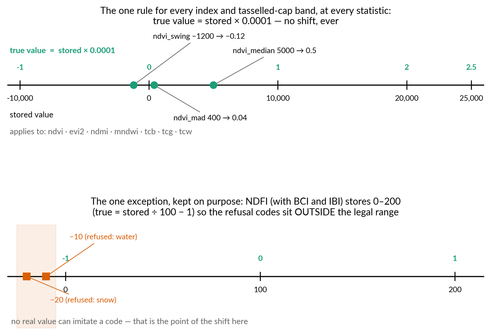

*Figure 13 — How the stored whole numbers turn back into real values, after the change to the storage rules. Top: one rule now covers all seven index and tasselled-cap bands (tasselled cap: three weighted band combinations that summarise brightness, greenness and wetness) for every statistic. Multiply the stored number by 0.0001, with no shift. Worked examples: a stored 5000 is an NDVI of 0.5; a spread of 400 is 0.04; a swing of −1200 is −0.12. Bottom: the one deliberate exception. The NDFI family (a forest index) is stored as 0–200, so that its refusal codes (a code that says 'no answer here' instead of a made-up number: −10 for water, −20 for snow) sit outside the range any real value can reach. One rule with one explained exception is much harder to get wrong than the two rules it replaced.*

### 6.3 Decode families and their exceptions

Nine decode families cover all 117 bands. Each formula is defined once in Section 5 and stamped on every image as a property (Section 7). The families, with their exceptions:

- **Reflectance** (`red/green/blue/nir/swir1/swir2`, every statistic): reflectance = stored × 0.0001. (Eq. 16)
- **Temperature** (`tir` bands): kelvin = stored × 0.1. (Eq. 35)
- **Shares of the pixel** (`gv/npv/soil/shade`, every statistic): the stored number is already the percentage. A stored 45 means 45% of the pixel. Divide by 100 if you would rather have a fraction between 0 and 1. (Eq. 26)
- **Indices and tasselled cap** (`ndvi`, `evi2`, `ndmi`, `mndwi`, `tcb`, `tcg`, `tcw`): value = stored × 0.0001, every statistic, never shifted — signed values stored plainly. (Eq. 21 and Eq. 23)
- **NDFI** (`ndfi` bands): levels = stored ÷ 100 − 1 (stored range 0–200); swing and MAD = stored ÷ 100. Reserved values sit outside the real range — see Section 6.6. (Eq. 28)
- **BCI and IBI** (`bci`, `ibi`): median = stored ÷ 100 − 1 (stored 0–200, the NDFI convention, **not** the ×10000 index convention); MAD = stored ÷ 100.
- **Terrain** (Eq. 31)
- **Terrain**: elevation in plain metres; slope = stored ÷ 100 degrees; `aspect_sin`/`aspect_cos` = stored ÷ 10000; `hand` = stored ÷ 10 metres. (Eq. 32)
- **Position** (`lon`, `lat`): degrees = stored ÷ 10000. (Eq. 33)
- **Counts** (all the bands recording how a pixel was built): plain whole numbers, no conversion. (Eq. 34)

One fact about reflectance clears up what looks like a contradiction. A slightly negative stored reflectance is real and is kept. It comes from the Landsat surface-reflectance input (Collection 2) over deep shadow, and it is deliberately not clipped to zero (about 2.6% of `blue_median` pixels in the verified cell, almost none below −0.05 reflectance). The indices, however, are computed from a copy of the reflectance in which negative values are set to zero, so no index is spoiled by a negative input. Both statements are true at once.

### 6.4 Terrain and position bands

The aspect bands need one firm rule for users. `aspect_sin` and `aspect_cos` are **not** simply the sine and cosine of the compass direction a slope faces. Each is that sine or cosine, scaled down by the sine of the slope, so that flat ground, where the facing direction means nothing, sits near zero instead of pointing somewhere at random. Use the two bands directly as classifier inputs. **Never rebuild a compass angle from them.** On flat ground that would mean dividing zero by zero, and the result is nonsense.

The position bands `lon` and `lat` **are proper classifier inputs**. This is a deliberate design decision. Across India, position carries real ecological information (rainfall pattern, which species live where), and at national scale plain degrees are safe to use as flat map coordinates. Position sits in its own group, before bookkeeping, precisely because it is meant to be used.

### 6.5 Bookkeeping bands — the warning, both halves

The eight bands recording how each pixel was built are there as quality checks for people and quality filters for automated pipelines. They are **never classifier features**. A model trained on them learns the history of the satellite archive (which years had more passes, where the masks were strict) rather than anything about the ground. That learning will not carry over to other eras or regions.

To exclude the whole group in Earth Engine:

```js
var featureBands = image.bandNames().removeAll([
  'usable_count', 'tir_count', 'snow_count', 'quarters_present',
  'q1_count', 'q2_count', 'q3_count', 'q4_count'
]);
var features = image.select(featureBands);
```

Read them, though, every time. `usable_count` is the single most useful band in the product for judging whether a pixel-year can be trusted.

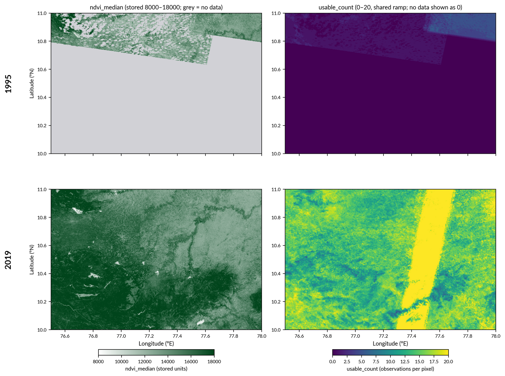

*Figure 14 — The same place in two different years, each shown as a pair of maps: the greenness map (ndvi_median) beside its evidence map (usable_count, the number of observations behind each pixel), on identical colour scales. Both pairs are the finished mosaics of cell NC-43-X-D, 1995 above and 2019 below; grey in a greenness panel means no data. In 1995 only the northern strip has any observations at all, while in 2019 every pixel rests on many. Read the count band before trusting any comparison between the two greenness maps.*

> [!tip] How many observations is enough? A measured anchor
> usable_count is the how-many-photographs-went-into-this-answer band. In the verified wet-Ghats cell, a typical pixel rests on about 15 usable observations a year after 2013, about 6 in 2000–2012, and only 1–2 before 2000. Treat any pixel-year with usable_count below about 3 as a sketch rather than a measurement — and check quarters_present beside it: below 3, the seasonal bands describe part of a year, not a year. These anchors come from one very cloudy cell; drier regions run higher, and national numbers follow the national build.

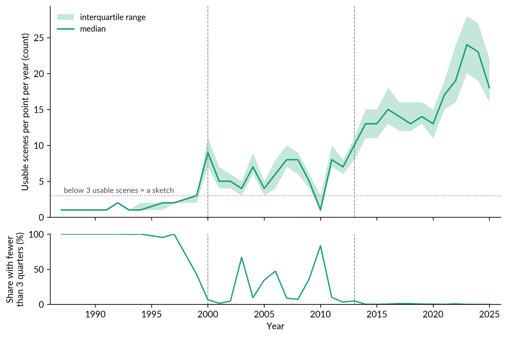

*Figure 15 — Top: how many usable observations sit behind a sampled point in each year, 1987–2025, drawn as the median line with a band covering the middle half of the points. A guide line at 3 marks the level below which a year's value is a rough sketch rather than a measurement. Bottom: the share of points that draw on fewer than 3 of the year's 4 quarters. This is real data, not a diagram: 700 points on stable land in one very cloudy cell in the wet Western Ghats, read from the finished mosaics' own count bands in every year. It gives a feel for what usable_count means in practice: roughly 15 observations a year after 2013, about 6 in 2000–2012, and only 1–2 before 2000 in the hardest cells.*

### 6.6 Reserved values and the code warning, both halves

The whole product has three reserved values, and they differ by band family. "The ndfi codes" is not one rule:

- **−10** — refused: water. The pixel sat in lasting water over the span of years used to judge it, and the unmixing model refuses to report a fraction-based value there (Section 5.9).
- **−20** — refused: snow. As above, for lasting snow. Where both apply, water wins.
- **−999** — a reserved marker value meaning no data, in `ndfi_swing` only: the pixel had no real pair of seasonal values to subtract. The swing is stored from −200 to 200, so it decodes ÷ 100 to −2 to 2, so the −10/−20 codes would clash with real values; hence the separate marker.

The refusal codes −10 and −20 appear in the `ndfi` level bands **and** in `ndfi_mad` (allowed there because a real MAD is never negative). They sit inside the numeric bands by design. There is no separate flag band. That design has two halves, and both must be understood.

**Codes are safe for tree classifiers and poison for means, rescaling (normalisation), line-fitting (linear) models and neural networks.** A decision tree simply learns "−10 means water" as a fact. But any method that does arithmetic on the band (averaging, rescaling, fitting a line, feeding a neural network) will quietly mix "refused" into its numbers and corrupt them.

Before any such arithmetic, remove the codes with exactly this expression:

```js
// ndfi level and mad bands: real stored values are >= 0
var ndfiClean  = image.select('ndfi_median')
                      .updateMask(image.select('ndfi_median').gte(0));
// ndfi_swing: exclude the no-data sentinel
var swingClean = image.select('ndfi_swing')
                      .updateMask(image.select('ndfi_swing').neq(-999));
```

The same `gte(0)` mask applies to `ndfi_median_dry`, `ndfi_median_wet` and `ndfi_mad`.

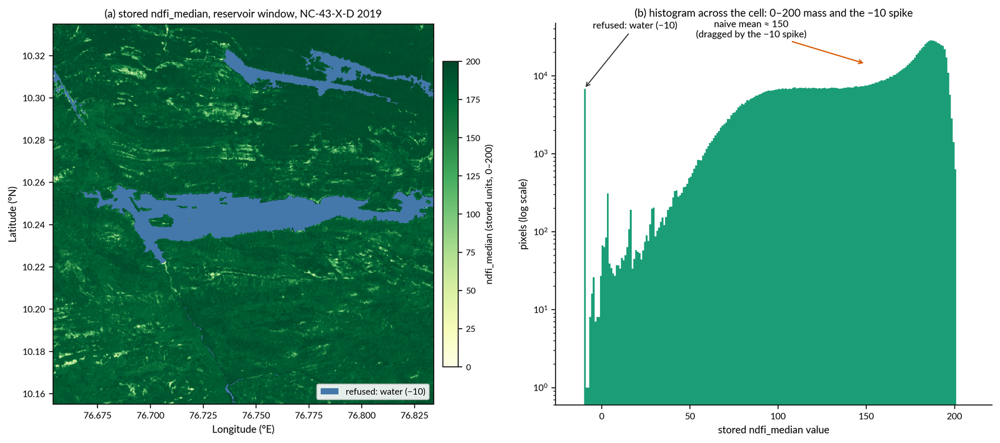

*Figure 16 — The refusal code as it appears in the data. A refusal code is a code that says 'no answer here' instead of a made-up number. (a) A map of the stored ndfi_median (a forest index) over the Idukki reservoir in cell NC-43-X-D, 2019. Real land values run from 0 to 200 on the colour scale; the flat blue patch is the code −10, meaning 'this is water, so NDFI is not reported here'. (b) A bar chart of how often each value occurs across the whole cell (a histogram): the real values form one mass, the −10 code stands apart, and an arrow marks where a plain average (≈150) would land if the code were averaged in as if it were a number. Both panels come from the finished mosaic itself. The point is that −10 is a label, not a measurement. Filter it out before any statistics. Note also that its edge follows a fixed map of the largest water extent, not that year's shoreline.*

---

## 7. Image Properties and Decoding

Every image carries exactly 26 properties, nothing more. There is no free-text description on each image: the one human-readable summary lives on the collection asset, kept up to date once rather than copied roughly 11,300 times. The properties fall into six categories, used here as headings. The decode formulas under Decoding Formulas are the property values word for word. Each is defined once, in Section 5.9 or Section 5.10, and every other mention points to that definition.

### 7.1 Identity (6 properties)

- `product` — `'IOLN annual Landsat mosaic, India'`
- `product_version` — `'2'` (the legacy collection on disk is version 1)
- `grid_name` — the grid cell, for example `'NC-43-X-D'`
- `region` — `'India'`
- `contact` — `'mdmadhu@gmail.com'`
- `citation` — `'India Open LandCover Network'`. This property names the body to credit; it is **not** a complete citation. The full recommended citation is in Section 12.5.

### 7.2 Time Window (5 properties)

The product year is the phenological year: 1 April to 31 March, chosen so that the monsoon's two green peaks fall inside one year rather than being split across two (Section 5.1).

- `year` — the start year of the phenological year, for example `2022`. Filter on this.
- `start_date` / `end_date` — for example `'2022-04-01'` / `'2023-03-31'`
- `system:time_start` / `system:time_end` — the machine-readable window.

One deliberate difference must not be smoothed away. `end_date` is the **inclusive** last calendar day of the window. `system:time_end` is the **exclusive** end instant: midnight at the start of 1 April of the following year, which is the Earth Engine convention. They are deliberately not the same moment. Code that treats them as equal will be one day wrong.

### 7.3 Inputs (3 properties)

- `input_collection` — `'Landsat Collection 2 Level 2'`
- `sensors_used` — a short list, for example `'L5,L7'`
- `n_scenes` — the number of **distinct passes** used. A pass is one satellite overflight, with its neighbouring frames joined together (Section 5.7). `n_scenes` does not count frames, and it does not count observations for each pixel. A pixel's own observation count is the `usable_count` band.

### 7.4 Processing (1 property)

- `corrections` — `'Topographic Correction + BRDF + Sensor Harmonisation'`

This is the processing sequence only, in order. The full plain-language story lives in the collection description and in Section 5. That includes the fact that the sensor harmonisation (the bandpass adjustment, matching the bands of different satellites) is global with no local offset, and the three cloud checks.

### 7.5 Decoding Formulas (9 properties)

One property for each band family. The value is the rule itself, so an analyst with only the image in front of them can still decode it. True value = apply the formula to the stored whole number. The text inside the quotation marks is exactly what the image carries, character for character; the equation number after each one points to where the same rule is set out in Section 5.

- `decode_reflectance` — `'reflectance = stored x 0.0001 (red/green/blue/nir/swir1/swir2, every statistic)'` (Eq. 16)
- `decode_temperature` — `'kelvin = stored x 0.1 (tir bands)'` (Eq. 35)
- `decode_fractions` — `'percent = stored; fraction = stored / 100 (gv/npv/soil/shade, every statistic)'` (Eq. 26)
- `decode_indices` — `'index = stored x 0.0001, every statistic, never shifted -- ndvi, evi2, ndmi, mndwi, tcb, tcg, tcw'` (Eq. 21 for ndvi, evi2, ndmi and mndwi; Eq. 23 for tcb, tcg and tcw — the same rule, written once for each family)
- `decode_ndfi` — `'ndfi = stored / 100 - 1 (levels); ndfi units = stored / 100 (swing, mad). Codes: -10 refused water, -20 refused snow (levels, mad); -999 no real pair (swing)'` (Eq. 28)
- `decode_bci_ibi` — `'index = stored / 100 - 1 (median); spread = stored / 100 (mad)'` (Eq. 31)
- `decode_terrain` — `'elevation: metres. slope: degrees = stored / 100. aspect_sin/cos = stored / 10000, slope-damped — use directly, never rebuild the angle. hand: metres = stored / 10'` (Eq. 32)
- `decode_position` — `'degrees = stored / 10000 (lon, lat)'` (Eq. 33)
- `decode_counts` — `'plain integers, no conversion. Quality signals only — never classifier features'` (Eq. 34)

### 7.6 Build Record (2 properties)

- `built_utc` — the date and time of the build. Within one product version, this tells a build made before a fix from a rebuild made after it, during the weeks-long national run.
- `git_commit` — exactly which code built this image. Together with the repository, this identifies the recipe for any image (Section 11).

### 7.7 Reading properties in practice — three gotchas

- The Earth Engine Code Editor shows properties **in alphabetical order**, so the six categories above are mixed together on screen (`built_utc` appears near `citation`, not near `git_commit`). The categories are a logical grouping, not the display order.
- `end_date` is inclusive and `system:time_end` is exclusive, as stated in Section 7.2. This is the property most often scripted wrongly.
- Facts about the map projection and pixel size are not image properties. They live in the collection description and in Section 12.3, where the "30 m" statement is given with its real meaning (the grid is a fixed lattice in degrees).

### 7.8 The authority rule

The collection asset carries a human-readable description that sums up the decode rules, the warnings for users and the limits. That text is generated again from this document. **Where the collection description and this document disagree, this document wins, and the description is generated again.** The description is a convenience copy; the ATBD is the authority.

---

## 8. Uncertainty Characterisation

This chapter is short, and says only what is known. The product does not carry a formal error budget (a sum, stage by stage, of how much error each step adds). It says what is known instead: the smallest uncertainty possible, inherited from the input; the extra error added by the correction steps; the precision of the stored numbers; and the spread the product measures for itself.

### 8.1 The floor: input surface-reflectance uncertainty

Every optical (visible and infrared) band begins as Landsat Collection 2 Level 2 surface reflectance. The published expectation for that product is that reflectance is within about ±(0.005 + 5% of the value) of the truth (Vermote et al. 2016; Crawford et al. 2023). For dark vegetation (reflectance ~0.03 in red) that floor is roughly ±0.007; for bright soil (~0.30 in SWIR) roughly ±0.020. The shortest wavelengths are the worst affected, because errors in correcting for haze concentrate there.

Nothing done later can make a value more certain than this floor. Every correction step adds some error of its own on top: terrain, the correction for sun and viewing angles (BRDF), and sensor harmonisation (putting the sensors on a common footing; Section 5.4–Section 5.6). Where the leftover errors of those steps have been measured, they are reported in Section 9 and Section 10 rather than folded into a single ± number.

The thermal band's published uncertainty is about 1–2 K under clear sky, and worse in moist air (Malakar et al. 2018). The thermal bands also bypass the three cloud checks made on the optical bands (Section 5.11), so over cloud-prone regions their real uncertainty is larger than the published figure.

### 8.2 Storage precision beside the floor

Storing each value as a whole number rounds it to a fixed step (the smallest step the stored numbers can show). In every family that step is deliberately far below the input floor, so storage never dominates the uncertainty. For each family, the storage step first, with the input floor beside it:

- **Reflectance** — step 0.0001 reflectance; floor ±(0.005 + 5%), that is, the step is 50–200 times finer than the floor.
- **Temperature** — step 0.1 K; floor about 1–2 K.
- **Indices (ndvi, evi2, ndmi, mndwi)** — step 0.0001 index units; the reflectance floor, carried through into the index, is typically of order 0.01–0.03 index units, depending on brightness.
- **Tasselled cap** — step 0.0001; floor is the reflectance error carried through fixed weights, order 0.005–0.02.
- **Fractions (gv/npv/soil/shade)** — step 1 percentage point; the unmixing model's error is larger and dominates (no published pixel-level figure exists for this set of reference colours — Section 5.9).
- **NDFI, BCI, IBI** — step 0.01 index units; floor as for the fractions and indices they are built from.
- **Terrain** — elevation step 1 m, slope step 0.01°, aspect components step 0.0001, `hand` step 0.1 m; the input terrain model's stated absolute vertical accuracy is under 4 m (90% linear error, meaning nine points in ten are within that height), so the terrain model, not the storage, is the limit.
- **Position** — step 0.0001° (about 11 m on the ground), below half a pixel.
- **Counts** — exact integers; no rounding.

### 8.3 What the MAD bands measure

The `_mad` bands are the product's own measured spread for each pixel: the MAD (the median absolute deviation, a robust measure of spread: the typical distance of the observations from their middle value) of the year's usable observations around their median. Read them plainly for what they are. **The MAD mixes real within-year change (the plant cycle, flooding, harvest) together with everything unreal (leftover cloud, shadow, sensor noise). It is a measured spread, not an error bar.** A high MAD over a rice paddy is mostly real seasonal change. A high MAD over evergreen forest is mostly contamination or noise. The bookkeeping bands and the seasonal bands help tell those apart.

The stored MAD values do **not** include the 1.4826 scaling constant. To compare a MAD with a standard deviation — including every comparison with the `_stdDev` bands of the legacy product (version 1) — convert first:

**σ ≈ 1.4826 × MAD**

(the constant that makes the MAD estimate the standard deviation for bell-shaped, normally distributed data; Rousseeuw and Croux 1993). This conversion is repeated in the caption of every figure in this document that sets a MAD beside a version 1 STDDEV.

### 8.4 Why there is no formal error budget

A formal budget would give each pipeline stage an error term and combine them. That has not been done, for three stated reasons.

First, the stage errors are neither independent nor evenly spread over the map. Terrain-correction error concentrates on steep slopes, and haze error in hazy seasons. A single national ± number would therefore mislead more than inform. Second, several stages are methods built for this product, with no published error model to inherit (the temperature check, the brightness cut, the physics-based C term; Section 5 gives their full definitions instead). Third, testing a budget would need reference measurements that do not exist across the full depth of this archive, particularly before 2000.

What the product offers instead is: the input floor (Section 8.1), storage steps beside it (Section 8.2), measured spread for each pixel (Section 8.3), and measured leftover errors and bounds for the specific defects we know about (Section 9, Section 10).

---

## 9. Verification and Consistency Assessment

This chapter reports how the product has been checked. The word "verification" is used on purpose. What follows is a set of internal checks and a comparison with the legacy product (version 1). It is not an accuracy assessment against independent reference data. Section 9.5 states the position on independent validation plainly.

### 9.1 Full-series verification

The whole pipeline was run from start to finish on grid cell NC-43-X-D (the Anamalai hills, in the Western Ghats). The cell was chosen on purpose: it is one of the cloudiest and steepest in India. It was run for all 38 available phenological years (1 April to 31 March; "pheno years" from here on). Every output image was checked by a script: all 117 bands present, in contract order; every stored value inside the legal range for its family; the reserved values (−10, −20, −999) appearing only in the bands where they are defined; the decode formulas giving back the true values correctly; all 26 properties present and well formed. Every year passed.

One limit must be stated: this is a single cell. Generalisation of these results to all 283 cells is untested until the national run. This document says so rather than assuming it.

### 9.2 Stable-point inter-comparison with the legacy product

Seven hundred stable points (places chosen because their land cover does not change) across 14 land-cover classes in NC-43-X-D were sampled in every year each product holds for the cell: 38 years each, version 1 from 1988 to 2025 and version 2 from 1987 and 1989 to 2025. Version 2 has no pheno year 1988 (April 1988 to March 1989) because that window holds no usable scenes; the calendar-year 1988 image that version 1 holds covers a different stretch of time. Where version 1 holds one image per satellite for a year (23 of its 38 years), those images were averaged. Not every sampled year returned usable values at the points: four version 1 years (1989, 1995, 1998, 1999) and three version 2 years (1990, 1995, 1998) came back empty and are absent from the series and the figures below, which therefore rest on 34 and 35 years. Findings:

- **Medians agree.** For each year, the medians of the level bands, pooled by class, track each other closely across the series in both products. The rebuild did not move the product's central values away from the record.
- **The spread spikes of version 1 do not recur.** In version 1 the spread statistic rises to 0.11–0.12 in NDVI units in 2017, 2020 and 2022, against 0.07–0.10 in the years either side; the spikes sit in its Landsat 8 images rather than its Landsat 7 ones, and their cause has not been traced. Version 1 also reaches about 0.10 in a few earlier years (2004, 2007, 2012), so the later years are where the largest values fall, not the only ones. The version-2 spread stays within 0.08–0.10 through those years. The two products measure spread differently (a standard deviation against 1.4826 × MAD), so the comparison is indicative rather than exact.
- **The 1990s haze spikes are real and shared.** Both products show occasional 1990s years where the stable points brighten in the short wavelengths. This fits aerosol (dust and smoke) that gets past the masks, because the masks are not designed for aerosol (Section 9.4, Section 10 L4).
- **A terrain yardstick.** In steep (15–40°) dense forest in the finished 2019 mosaic, near-infrared reflectance on sun-facing slopes minus shady slopes is −160 stored units in this product, against +288 and +416 in version 1's two images for that year, which have no terrain correction. So the correction removes the raw terrain signature and overshoots, leaving a reversed difference smaller than the signature itself (about 1.6% absolute reflectance). The drift from the flattest to the steepest slope bin is −5.5% here against −5.6% and −7.8% in version 1. The overshoot is a known and accepted leftover error (a residual; Section 10 L9). The point of the yardstick is that the terrain signature is removed, not merely reduced.

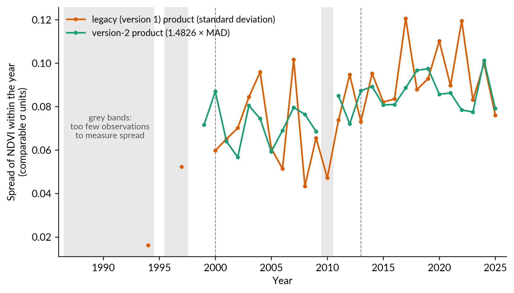

*Figure 17 — How much greenness (NDVI) varies within each year at fixed check points, for the legacy product (version 1, orange, using the standard deviation) and version 2 (teal, using the robust spread MAD, the median absolute deviation: the typical distance of the observations from their middle value, multiplied by 1.4826 so the two measures can be compared on equal terms). Both lines are computed from the finished mosaics at 700 points on stable land. Grey bands mark years with too few observations to measure spread at all. A year seen only once shows a spread of exactly zero, so those years are drawn as gaps rather than as false calm. Where both lines exist, the version 1 spread rises to 0.11–0.12 in 2017, 2020 and 2022 (the cause is not established), while version 2 stays within 0.08–0.10. A robust spread was chosen for version 2 so that a few stray values cannot inflate it; this comparison is one test of that choice.*

### 9.3 Era flatness at the sensor joins

The series was tested at three sensor joins: 2003 (when the Landsat 7 scan-line fault begins), 2013 (Landsat 8 arrives), and 2017, a control year: nothing changes there in the shipped recipe, and Section 3.4 says why it was tested. The test is flatness. At each join, the stable points' band medians, pooled by class, must not step by more than ordinary year-to-year variation. The step statistic is the three-year mean after the join minus the three-year mean before it. It is judged against the spread of the same statistic at every other year.

At the three sensor joins the test passes in every band: no band at any join exceeds twice the typical year-to-year variation. The largest excursion anywhere is the 2003 near-infrared step (about 1.8 times it: -96.2 stored units against a typical variation of about 50). That is inside ordinary variation. The 2017 join is the quietest, with no band above 0.7 times it. The band-by-band tables are deposited with the published evidence base (Section 9.6).

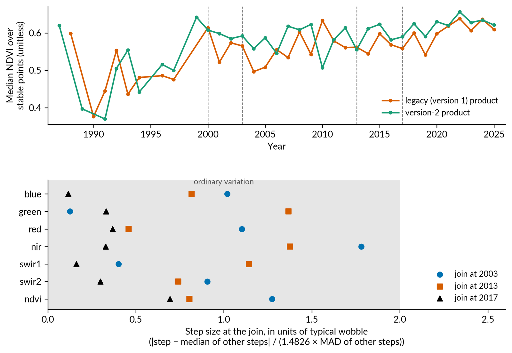

*Figure 18 — (a) The median greenness (NDVI) at the stable check points, year by year, for the legacy product (version 1) and version 2, with the years the satellites changed (2000, 2003, 2013, 2017) marked. (b) For each band, the size of the jump across each version 2 satellite change, divided by the series' normal year-to-year variation. A score of 2 or more would stand out from ordinary variation. Both panels come from the finished mosaics sampled at 700 points on stable land. The score is |step − median of other steps| ÷ (1.4826 × MAD of other steps), where MAD is the median absolute deviation, the typical distance of the steps from their middle value. Every change scores inside the 0–2 zone of ordinary variation (the largest is 1.8, near-infrared at 2003). Changing satellites did not leave visible steps in the record.*

The same test was applied at 2000, where the character of the haze (aerosol) input changes (Section 10 L11). It finds no step in any band: −13.8 (blue), −2.6 (green), −46.5 (red), +31.4 (nir), −27.2 (swir1), −60.6 (swir2) stored units, against typical year-to-year variation of 29–81. These cannot be told apart from ordinary variation. This is a clean negative: the test looked for a step and found none.

### 9.4 The cloud story, graded two ways

**The brightness bound.** The leftover-cloud score (the residual-cloud score) is defined by a simple rule: the share of a product's valid land pixels whose stored `blue_median` is above 1000 (reflectance 0.10). Clean land is almost never that bright in blue, so a bright blue median is a sign of cloud that got through into the annual composite (the summarised year image). One limit of this score must be stated. It detects cloud by brightness, and the masks themselves partly do the same, so cloud that fools both is invisible to it. That is why the eye-graded check below is the independent grade.

Across all 38 years of NC-43-X-D, the version-2 median score is 0.06% of valid pixels. From 1999 onward it is at or below 0.5% every year, and mostly at or below 0.1%. The thin early years are the worst cases: 9.5% in pheno year 1991 (version 1: 23.5%), 3.5% in 1987, 3.4% in 1995, 2.3% in 1994. With one or two observations for each pixel, a cloudy observation can *be* the median. One limit: the shares are computed over each product's own valid pixels, which flatters whichever product masks more away in thin years.

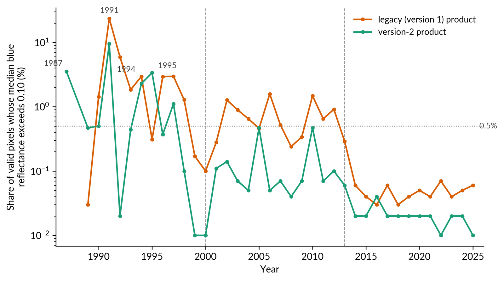

*Figure 19 — The share of each year's valid pixels whose stored median blue reflectance is above 0.10, for the legacy product (version 1) and version 2, on a logarithmic axis (each step up the axis is ten times more). Clean land almost never reaches that brightness, so the share is a stand-in for cloud that got into the mosaic. It is computed from the finished mosaics of the check cell NC-43-X-D across all 38 years each product holds there (version 1 from 1988, version 2 from 1987 with 1988 absent). The dotted guide marks 0.5%, and the worst early years (1991, 1987, 1995, 1994) are labelled. Version 2 stays at or below 0.5% from 1999 onward, with a median of 0.06% across the whole series. Its worst years are the early ones with few observations, where a single cloudy observation can end up as a pixel's median.*

**The eye-graded check — the independent grade.** Sixteen gradeable pairs were graded by eye. Each pair is a raw scene beside the result of the production mask on that scene. Six of the pairs were independently audited by the project lead. The pairs span ten climate anchors (Punjab, Thar, Rann of Kachchh, Central India, Deccan, Odisha, Assam, Tamil Nadu, Kerala, Himalaya) and two eras (Landsat 5 in 1995, Landsat 8 in 2019). Each scene was chosen to be partly cloudy. Two words are used below: omission (cloud that the mask left in) and commission (clear ground that the mask wrongly removed). Findings:

- **Thick cloud: removed in every pair**, in both eras, with generous halos. No thick cloud remained in any of the 16 pairs.
- **No commission on clean scenes**: the fully clear control window showed zero removals; a clear-land window showed only scattered specks removed.
- **Two kinds of slight omission, seen repeatedly**: bright cloud rims remain as specks at the edges of removals; and thin see-through veils of dust and smoke (aerosol rather than cloud) partly remain, matching the 1990s haze spikes of Section 9.2. The masks are not designed for aerosol.
- **Shadow**: caught where the ground is dark; sometimes kept over brighter desert ground where the darkness test fails. Slight to moderate omission.
- **Mountain snow**: cloud removed cleanly, but much high-altitude summer snow removed with it. This is the recorded trade-off from tightening the snow rescue; `snow_count` reports it for each pixel.
- **One audited commission case**: in the Rann of Kachchh 1995 pair, the project lead's audit corrected the first grading. The removals across the northern third and the central patch were false positives: clear dry ground removed as cloud or shadow. Over bright dry and salty ground in the Landsat 5 era, the mask can remove usable clear pixels. The practical cost is modest, because deserts have plenty of observations and `usable_count` stays high. But it is a real failure mode, and it is stated here and in Section 10 L6.

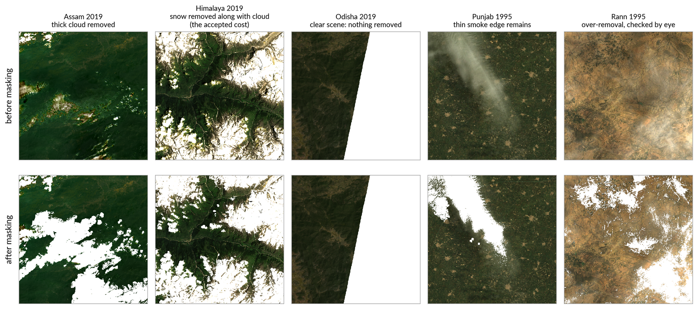

*Figure 20 — A check of the cloud masks by eye, independent of any score: five real scenes, each shown before masking (above) and after (below), judged visually and reviewed by the project lead, including the one case where the mask got it wrong. Each column is one Landsat scene. Removed pixels are blank; in the final mosaic they are filled from other passes in the same year. Assam 2019 shows thick cloud removed. Himalaya 2019 shows the deliberate trade in which high-altitude summer snow is removed along with the cloud. Odisha 2019 is the clean control, with nothing removed (the white wedge on its right is the edge of the scene, present before and after, not the mask). Punjab 1995 shows a thin trail of smoke left in place (the masks are not designed to catch smoke and haze). Rann 1995 is the reviewed mistake: clear, bright, salty ground was wrongly removed. This check matters because it does not rely on brightness scores. Cloud that fools the automatic score cannot fool the eye.*

### 9.5 The position on independent validation

**The mosaics have not been independently validated against reference data.** This is a declared position, not something left out by mistake. The mosaic is a halfway product. Its purpose is to feed land-cover classification, and its real test is how well the classifier performs. That is where independent accuracy assessment against reference data takes place. Before 2000 no suitable independent reference exists at all at this archive's depth.

A comparison against an outside product (for example against MODIS reflectance adjusted to a straight-down (nadir) view over stable sites, which is possible after 2000) is a stated candidate for after the national run. Until then, the product's quality claims rest on the checks in this chapter: internal verification, comparison with version 1, flatness at the sensor joins, and the two-way cloud grade. Nothing in this document claims more.

### 9.6 The published evidence base

The evidence behind this chapter is published, not just described. The 700-point stable sample (with class labels), the count-anchor sample, the flatness tables for each join, and the eye-graded mask-check manifest (scene identifiers and gradings) are deposited as repository files and Earth Engine assets, cited by the repository tag named in Section 1. Two of the checks are re-runnable end to end from scripts that state their own method, the terrain yardstick and the hillshade similarity scores. Those scripts are kept with the project's working records rather than in this repository; the results they produced are quoted in full above. Every statement this document makes about version 1 was audited independently by two people on 2 September 2026 against its code and its published collection. That audit record is kept with the project's working records and is not part of this release; its corrections are already carried in the text above. The remaining checks are deposited as their measured results together with the method stated here, not as scripts; a reader can check those numbers against the deposited tables but would have to rebuild the measuring code to repeat them from the raw archive.

### 9.7 Comparing years

The most common analyst question is: can I compare year A with year B and believe the difference? The answer is gathered here, in order.

**The harmonisation target.** All eras are adjusted onto the OLI (Landsat 8/9) reference (harmonisation: putting all the sensors on a common footing), through the TM→ETM+ and ETM+→OLI bandpass adjustments (corrections for the sensors' slightly different colour filters), with no local offset (Section 5.6). A pixel's 1992 value and its 2022 value are expressed on the same scale.

**The joins and their flatness.** The sensor joins at 2003, 2013 and 2017 pass the flatness test of Section 9.3; the 2000 change in the atmosphere input is clean in every band. The deposited tables carry the numbers for each band.

**The weakest eras.** Three, in rising order of confidence. First, the pre-2000 years: the archive is thin (Section 10 L1; in the verified wet cell a typical pixel-year rests on one observation); the temperature check cannot run over most of the country, so every cloud flag there is upheld, the cautious choice (Section 10 L2); and leftover cloud is at its worst (Section 9.4). Second, the scan-line-fault years 2003–2013, where Landsat 7's stripes are filled and the fill leaves faint, measured marks (Section 10 L8). Third, in any era, the named thin-archive island cells (Section 10 L1).

**One usable rule of thumb.** A change smaller than the local `_mad` band across an era join should not be trusted. The MAD (the median absolute deviation, a robust measure of spread) is the pixel's own measured spread. A step that hides inside it is not evidence of change.

---

## 10. Known Limitations and Assumptions

Each limitation is numbered. It is stated symptom first (what a user would notice), then cause, then how to detect it in the data. Sizes are given wherever one has been measured. Cross-references point to the pipeline section where each arises.

**L1. Pre-2000 mosaics rest on thin archives; some island cells on almost nothing.**
*Symptom:* patchy, noisy, or single-date-looking mosaics before 2000; seasonal bands describing only part of a year. *Cause:* the Landsat 5 archive over India is shallow (Section 5.1). Missing years are gaps in the archive; they are never filled in by interpolation, padding or borrowing from other years. The median grid cell has 395 Tier-1 Landsat 5 scenes across the 1990s decade, but eleven cells have fewer than 20 for the whole decade: NC-43-Y-C (3 — Lakshadweep), NC-43-Z-D (4), NC-46-Y-B (4), NC-46-Y-D (9 — the Nicobar cell), NB-46-X-C (10), NB-46-X-A (12), NC-46-Z-C (12), NC-46-X-A (13), NC-46-V-B (14), NC-46-V-D (14), ND-46-Y-B (15). Five cells, all islands (NC-43-Y-C, NC-46-Y-D, ND-43-V-A, ND-46-Y-B, ND-46-Y-D), sat under a single Landsat track in the 1990s, so an outage on that track empties them. *Detect:* `usable_count` and `quarters_present`, judged against the measured anchor in Section 6.5; `n_scenes` on the image.

**L2. Masking is stricter — cleaner but thinner — in the early era.**
*Symptom:* early-era mosaics with low counts even where scenes exist. *Cause:* the temperature check cannot run where a pixel-year holds fewer than 8 clear thermal readings (Section 5.2). When it cannot run, no flag can be overruled: every medium-confidence cloud flag is upheld and the flagged observation is dropped, the cautious choice, so masking is near-strict there. The share of India's land in that state, by era median: **56.6%** in 1986–1999 (peaking at 59.2% in 1997), **10.1%** in 2000–2012, **0.6%** in 2013–2025. The direction of the bias this causes was accepted by a recorded project decision and is stated plainly: early mosaics are cleaner but thinner over most of the country. This adds to L1. *Detect:* `usable_count` low relative to `n_scenes`.

**L3. Leftover cloud remains in thin years.**
*Symptom:* implausibly bright pixels, especially pre-2000. *Cause:* with one or two observations for each pixel, a cloudy observation can be the median, and no compositor can vote it out (Section 5.8). Measured bound (definition and limits in Section 9.4): median 0.06% of valid pixels across the verified series; at or below 0.5% every year from 1999 onward; worst cases 9.5% (1991), 3.5% (1987), 3.4% (1995), 2.3% (1994). *Detect:* high `blue_median` with low `usable_count`.

**L4. Thin aerosol veils — dust and smoke — partly get past the masks.**
*Symptom:* whole-scene or plume-shaped brightening, mostly in short wavelengths, notably in 1990s years. *Cause:* the cloud checks are designed for cloud, not aerosol. See-through veils get past both the flag tests and the brightness cut (Section 5.2; graded in Section 9.4). The 1990s haze spikes in the stable-point series are the measured trace. *Detect:* short-wavelength `_mad` raised across large areas; year-level spikes in blue against neighbouring years.

**L5. Cloud rims and some shadows are missed.**
*Symptom:* bright specks at the edges of masked areas; dark smudges over bright ground. *Cause:* bright cloud rims remain as specks at the edges of removals; the shadow test keys on darkness and can fail over bright desert ground (Section 9.4: slight to moderate). *Detect:* speckle in `_mad` bands; visual inspection where `usable_count` is moderate.

**L6. Over bright arid and saline ground, the early-era mask can remove clear pixels.**
*Symptom:* lower-than-expected counts over deserts and salt flats in Landsat 5 years. *Cause:* the audited commission case (Section 9.4): in the Rann of Kachchh 1995 check, clear dry ground was removed as cloud or shadow across substantial parts of the window. *Magnitude:* the practical cost is modest, because these regions have plenty of observations, so `usable_count` stays high. But the failure mode is real. *Detect:* `usable_count` against `n_scenes` over arid ground in the Landsat 5 era.

**L7. High-altitude summer snow is partly removed with the cloud.**
*Symptom:* thin or missing summer-snow signal in Himalayan pixels. *Cause:* the deliberate trade-off from tightening the snow rescue (Section 5.2). Snow is kept by design, and the temperature check rescues it, but the tightening that keeps cloud out also removes much genuine high-altitude snow. *Detect:* `snow_count` reports, for each pixel, how much snow was seen.

**L8. Landsat 7 scan-line gaps leave faint, measured marks (2003–2013).**
*Symptom:* very faint stripe patterning in years dominated by Landsat 7. *Cause:* the in-house fill (Section 5.3) rebuilds the scanner's missed stripes from other passes. Measured on a Landsat-7-only year over dense forest, inside against outside the stripes: `usable_count` 7 against 8 (exactly the expected loss of one observation); `blue` −17.9, `nir` −66.5, `ndvi` +33 stored units (0.2–0.7% reflectance); `ndvi_mad` −80 (slightly smoother inside, because there are fewer observations). Not invisible, not disfiguring. Limit: one reference scene, one year, one cover class. *Detect:* stripe-period patterning in `usable_count`.

**L9. Near-infrared over-correction in steep, wet terrain.**
*Symptom:* on steep forested slopes, shady faces are slightly brighter than sun-facing faces in the near-infrared. That is the reverse of the raw terrain signature. *Cause:* the terrain correction removes the illumination signature and overshoots in this band (Section 5.4). *Magnitude:* in steep (15–40°) dense forest, sun-facing minus shady `nir_median` is −160 stored units in this product against +288 and +416 in version 1's two images for that year, which have no terrain correction. That is a sign flip, at about 1.6% absolute reflectance and about 6% relative. Accepted as a known leftover error (a residual); band-by-band refinement of the correction tables is named future work. *Detect:* a `nir` difference between shady and sun-facing faces on steep slopes.

**L10. The correction tables stop at 5,500 m elevation.**
Land above 5,500 m (32,406 km², 0.99% of India's 3,270,257 km², glacier and rock) is corrected with the table's top entry. The value is held at that entry, not extended beyond the table. So the atmospheric-and-terrain correction there is an approximation, and this one sentence sizes it.

**L11. The atmospheric input is coarse, and its character changes around 2000.**
*Symptom (potential):* a step in corrected reflectance around 2000 in the mountains. *Cause:* the haze (aerosol) input (MERRA-2, ~50 km cells) begins taking in satellite aerosol data around 2000, and haze drives the physics-based correction term. *Measured result:* the step at 2000, tested on the stable points of the hilly verified cell, cannot be told apart from ordinary year-to-year variation in any band (Section 9.3). This is a clean negative. The ~50 km coarseness itself remains: correction inputs cannot vary within one MERRA-2 cell. *Detect:* none needed for the 2000 step; for coarseness, none available below ~50 km.

**L12. The terrain model is a surface model from ~2011–2015.**
*Symptom:* terrain quantities biased by the tree canopy; changed terrain corrected with the shape it had after the change. *Cause:* the elevation input is a digital *surface* model (it measures treetops and rooftops, not bare ground), collected around 2011–2015. `elevation`, `slope`, `aspect_sin/cos` and `hand` inherit the canopy-height bias. Ground that changed shape (mining, landslides, new reservoirs) is corrected, in all years, with its post-change shape. *Detect:* not detectable in the product; areas of known change need care.

**L13. Passes with no atmospheric match are used uncorrected, and this is logged.**
Where a pass cannot be matched to its atmospheric inputs, it is used without terrain correction rather than dropped without notice or mis-corrected without notice (Section 5.4). The condition is rare and is logged in the build record.

**L14. Refusal-code stamps have edges.**
The −10 water and −20 snow codes (a code that says "no answer here" instead of a made-up number) are stamped from a mapped assessment window (Section 5.9). At the edge of the mapped water or snow, a pixel can sit coded on one side of a line and numeric on the other. Treat code boundaries as map edges, not as measured shorelines.

**L15. The thermal bands are a separate product carried in the same image.**
`tir_median` and `tir_mad` come from the same record, but they do not go through the temperature check, the brightness cut or the corrections, and their set of observations differs from that of the optical (visible and infrared) bands (Section 5.11). *Detect:* `tir_count`, which can differ substantially from `usable_count` for the same pixel.

**L16. Seasonal bands blur where the year is thin.**
*Symptom:* wet/dry medians and swing describing a fraction of a year, especially pre-2000. *Cause:* the wet and dry groups are the pixel's own top and bottom 25% of observations ranked by NDVI (Section 5.8). With few observations the groups are thin or empty, and `ndfi_swing` then carries the −999 reserved marker value. *Detect:* `quarters_present` below 3 (Section 6.5 anchor); `q1_count`–`q4_count`.

**L17. Thin-year seasonal picks are not reproduced exactly between runs.**
*Symptom:* rebuilding an image reproduces annual medians, counts and masks exactly, but some pixels in the 54 seasonal bands (wet/dry medians and swing) differ between runs. The worst observed difference is about 2,600–3,100 stored units on isolated pixels. *Cause (best-fitting; the mechanism is not yet pinned down):* an observation lying exactly on a pixel's own season cut-off (in a five-observation year, the 25% mark *is* one of the observations) can flip in or out between runs on last-decimal arithmetic differences. A thin season's median then swings. The behaviour predates and is unrelated to recent code changes. *Detect:* affects reproduction runs (Section 11.4), not any single published image; thin years only.

**L18. Cell boundaries can carry faint seams.**
Adjacent grid cells are built independently, but by design their boundary pixels rest on the same set of passes. Scene selection admits every pass that touches the cell with its margin added, so a pass covering a boundary pixel enters both neighbours' builds. Each pass carries its own correction inputs into both (Section 5.10). The measured seam offset was zero: a median difference of zero stored units in all six reflectance bands along the one line across a boundary (transect) checked. The one known exception is the thin-year seasonal flip reported in Section 11. In a thin year an observation sitting exactly on a pixel's season cut-off can fall on different sides in the two builds, moving that pixel's seasonal bands. *Detect:* band-by-band offsets across cell edges; consult the Section 5.10 transect before joining cells into a wall-to-wall mosaic.

---

## 11. Reproduction — The Contract

This chapter states what reproduction means for this product, and only that. The operational manual (scripts, queues, monitoring) lives in the repository and is cited by the tag in Section 1.

### 11.1 The fork promise

A fork is your own copy of the code, run in your own environment. To run this pipeline in your own environment, edit exactly two configuration values: `EE_PROJECT` (your Earth Engine project) and `OUTPUT_COLLECTION` (where your images go). Nothing else changes.

That promise holds for two reasons. Every input is either a public catalogue dataset or a published cloud asset in the one input folder (`mosaic_v2_inputs`). And **inputs are never repointed**: a fork reads the same published inputs as the production run. A runner therefore needs three things: the code at the stated tag, Earth Engine access, and read access to `mosaic_v2_inputs`. No local data is required. The correction-table files kept in the repository are an exact copy of the cloud assets, kept as a fallback (this has been checked), and the pipeline reads the cloud copies first.

### 11.2 Identifying any build

Every image carries `git_commit` (exactly which code built it) and `built_utc` (when). Together with the repository, these identify any image's build completely. They also tell apart pre-fix from post-fix rebuilds within one product version (Section 12.7).

### 11.3 What reproduction promises — and what it cannot

**The recipe is pinned; the input bits are not.** The `n_scenes` property counts the distinct passes used but names none of them, and the USGS reprocesses Collection 2 scenes over time. So the inputs to any build are whatever the public catalogue serves at build time. What this chapter guarantees is reproduction of the **recipe**: same code, same rules, same published correction inputs. It does not guarantee bit-for-bit reproduction of the archive the recipe was fed. A rerun after a catalogue reprocessing can differ, and that difference is the catalogue's, not the recipe's.

**One measured internal limit sits beside that.** Rebuilding a verified thin-archive year reproduces the masks, the annual medians and all counts exactly, bit for bit. But the 54 seasonal bands (wet/dry medians and swing) can differ on isolated pixels between runs of the *same* code on the *same* inputs, worst about 2,600–3,100 stored units (Section 10 L17: observations sitting exactly on a cut-off in thin years). So the plain statement is: the recipe reproduces the product. Bit-for-bit reproduction holds for annual medians, counts and masks, but not for the seasonal picks of thin years.

### 11.4 Practical scale

The full product is 283 grid cells × 40 phenological years = 11,320 export tasks. At Earth Engine's limits on how many exports can run at once, this is a run of weeks, not hours. That is why the build record (Section 11.2) tells apart rebuilds within the run. Anyone reproducing a subset should budget for each cell-year accordingly; a single cell-year is an ordinary export.

---

## 12. Access, Format, Licence and Citation

### 12.1 Where the product lives

The production collection is the Earth Engine image collection:

`projects/mapbiomas-mosaics/assets/LANDSAT/LULC/INDIA/mosaics-2`

One image for each grid cell and each phenological year.

### 12.2 Image naming

Production images are named `CELL_YEAR`. For example, `NC-43-X-D_2019` is grid cell NC-43-X-D, phenological year 2019 (1 April 2019 – 31 March 2020). There is no variant tail and no version suffix in the name: the version lives in the `product_version` property and in the collection address.

### 12.3 Projection, pixel size and the honest "30 m"

Images are exported on a fixed geographic grid in EPSG:4326 (plain latitude–longitude degrees). "30 m" is the name, not the exact size (nominal). The grid step is a constant fraction of a degree, so the north–south pixel edge is a constant ≈30 m. The east–west ground width shrinks with latitude: from about 29.7 m at 8°N to about 24 m at 37°N across India's span. Two consequences:

- Any statistic that counts pixels (areas, class proportions) must weight each pixel by its true ground area (in Earth Engine, `ee.Image.pixelArea()`). It must not treat pixels as equal 900 m² squares.
- Any reprojection (redrawing the image onto a different map grid) resamples it (each new pixel takes its value from the old ones). The pipeline's own resampling choices at export are stated in Section 5.10, and a user's further reprojection adds their own.

### 12.4 Data availability

The product is served through Google Earth Engine only. There is at present no bulk download service, and this document says so plainly rather than implying one. The input folder `mosaic_v2_inputs` is public-read, so the reproduction contract of Section 11 is real for outside users. The grid-cell boundary asset is checked to be readable without a login at publication; the repository carries the same boundaries as a GeoJSON file as a fallback.

### 12.5 Recommended citation

The `citation` property on each image names the crediting body only; it is not a complete citation. Cite the product as:

> India Open LandCover Network (IOLN), 2026. *IOLN annual Landsat mosaics of India, version 2.* Earth Engine collection `projects/mapbiomas-mosaics/assets/LANDSAT/LULC/INDIA/mosaics-2`. DOI to be minted; until then cite this document's identifier IOLN-ATBD-MOS-002 and state the date of access.

State the access date in all cases. The collection grows by one year annually (Section 12.7), and Collection 2 reprocessing means the access date is part of the record of where the data came from (Section 11.3).

### 12.6 Licence and credit

There is no formal licence on this product yet. An open licence is intended. Which form it will take, and who will hold it, are both still to be settled (the India Open LandCover Network is not yet a legal entity able to hold one). Academic use with citation is expected. Until the licence is settled: credit the India Open LandCover Network wherever credit is due, and for any use beyond that, contact the address in Section 1. The condition for closing this open item is recorded in Section 13.

### 12.7 Forward-processing and reprocessing policy

This policy is binding on the product's maintenance:

- (a) New phenological years are added under the frozen recipe, with no version change.
- (b) **Any** recipe change reprocesses the full series under a new `product_version`. There will be no mixed-recipe series, ever.
- (c) Named triggers that would force such a reprocessing decision: a USGS Collection 3 release; the end of the MERRA-2 atmospheric reanalysis; and updates to the JRC Global Surface Water dataset. The water refusal codes rest on a three-pheno-year water window, so a new water release can change recent years' refusal codes.
- (d) Bug-fix rebuilds within a version are told apart by `built_utc` and `git_commit`, and every such rebuild carries a mandatory erratum in the Section 1 change log (precedent: the NDFI overwrite fix recorded there).

---

## 13. Open Issues and Maturity Register

This is the one authoritative list of what remains open; the front matter carries only a pointer here. Each open issue states the condition for closing it. Below it, every major component carries a maturity label: **settled** (measured or decided, evidence deposited) or **provisional** (an interim claim stands in for evidence not yet obtainable; the operative sentence is quoted so a reader can tell measured claims from interim ones without cross-reading).

### 13.1 Open issues

- **O1 — Licence form and holder.** An open licence is intended; neither its form nor the body that will hold it is decided (Section 12.6). *Closed when:* the project lead decides the licence form and the holding body, and Section 12.6 is rewritten to name both.
- **O2 — Collection-description final wording.** The structure of the collection asset's human-readable description is approved; the final text needs explicit clearance from the project lead before it is set on the asset (Section 7.8). *Closed when:* the project lead clears the text and the description-writing script sets it.

### 13.2 Maturity register

**Settled** — measured or decided, with evidence deposited (Section 9.6):

- Grid and coverage: 283 cells, including the Nicobar cell; production naming `CELL_YEAR`.
- Band contract (117 bands) and property contract (26 properties): sealed; Appendix A generated from the sealed contract.
- Masking design and grade: the three cloud checks; the 16-pair eye check, audited by the project lead, including the Rann commission case (Section 9.4).
- Leftover-cloud bound (the residual-cloud score), with its stated definition and its stated limit (it detects cloud by brightness, as the masks partly do) (Section 9.4).
- Terrain correction: closed by a recorded decision, with the measured near-infrared leftover error stated (Section 10 L9); 5,500 m ceiling sized (0.99% of land).
- Correction order (terrain before BRDF, the correction for sun and viewing angles): the check split by slope class is clean (Section 9.2).
- Sensor harmonisation (putting the sensors on a common footing): chain and target; era flatness at the joins; the year-2000 atmosphere check (clean negative, Section 9.3).
- Landsat 7 fill: stripe marks measured (Section 10 L8).
- The share of land, by era, where the temperature check cannot run and every cloud flag is upheld (Section 10 L2).
- Forward-processing policy (Section 12.7).

**Provisional** — the operative interim sentence quoted:

- Independent validation. "The mosaics have not been independently validated against reference data" (Section 9.5); fitness is tested at the classification stage. A comparison against an outside product is a candidate for after the national run.
- The count anchor. "These anchors come from one very cloudy cell; drier regions run higher, and national numbers follow the national build" (Section 6.5). Replaced by national statistics after the national run.
- Single-cell generalisation. "Generalisation of these results to all 283 cells is untested until the national run" (Section 9.1).
- Thin-year seasonal reproducibility. "Bit-for-bit reproduction holds for annual medians, counts and masks, but not for the seasonal picks of thin years" (Section 11.3); the exact mechanism is not pinned down and a small probe is noted.
- The near-infrared terrain leftover error. "Accepted as a known leftover error (a residual); band-by-band refinement of the correction tables is named future work" (Section 10 L9).
- The Landsat 7 stripe measurement. "One reference scene, one year, one cover class" (Section 10 L8).

---

## 14. References

### 14.1 Methods

- Adams, J.B., Smith, M.O. and Johnson, P.E., 1986. Spectral mixture modeling: a new analysis of rock and soil types at the Viking Lander 1 site. *Journal of Geophysical Research*, 91(B8), 8098–8112.
- Adams, J.B., Sabol, D.E., Kapos, V., Almeida Filho, R., Roberts, D.A., Smith, M.O. and Gillespie, A.R., 1995. Classification of multispectral images based on fractions of endmembers: application to land-cover change in the Brazilian Amazon. *Remote Sensing of Environment*, 52(2), 137–154.
- Baig, M.H.A., Zhang, L., Shuai, T. and Tong, Q., 2014. Derivation of a tasselled cap transformation based on Landsat 8 at-satellite reflectance. *Remote Sensing Letters*, 5(5), 423–431.
- Chastain, R., Housman, I., Goldstein, J., Finco, M. and Tenneson, K., 2019. Empirical cross sensor comparison of Sentinel-2A and 2B MSI, Landsat-8 OLI, and Landsat-7 ETM+ top of atmosphere spectral characteristics over the conterminous United States. *Remote Sensing of Environment*, 221, 274–285.
- Chen, J., Zhu, X., Vogelmann, J.E., Gao, F. and Jin, S., 2011. A simple and effective method for filling gaps in Landsat ETM+ SLC-off images. *Remote Sensing of Environment*, 115(4), 1053–1064. (Cited as not used; see Section 5.3.)
- Crawford, C.J. et al., 2023. The 50-year Landsat collection 2 archive. *Science of Remote Sensing*, 8, 100103.
- Crist, E.P., 1985. A TM tasseled cap equivalent transformation for reflectance factor data. *Remote Sensing of Environment*, 17(3), 301–306.
- Deng, C. and Wu, C., 2012. BCI: a biophysical composition index for remote sensing of urban environments. *Remote Sensing of Environment*, 127, 247–259.
- Dozier, J. and Frew, J., 1990. Rapid calculation of terrain parameters for radiation modeling from digital elevation data. *IEEE Transactions on Geoscience and Remote Sensing*, 28(5), 963–969.
- Foga, S. et al., 2017. Cloud detection algorithm comparison and validation for operational Landsat data products. *Remote Sensing of Environment*, 194, 379–390.
- Gao, B.-C., 1996. NDWI — a normalized difference water index for remote sensing of vegetation liquid water from space. *Remote Sensing of Environment*, 58(3), 257–266.
- Gorelick, N., Hancher, M., Dixon, M., Ilyushchenko, S., Thau, D. and Moore, R., 2017. Google Earth Engine: planetary-scale geospatial analysis for everyone. *Remote Sensing of Environment*, 202, 18–27.
- Griffiths, P., van der Linden, S., Kuemmerle, T. and Hostert, P., 2013. A pixel-based Landsat compositing algorithm for large area land cover mapping. *IEEE Journal of Selected Topics in Applied Earth Observations and Remote Sensing*, 6(5), 2088–2101.
- Gu, D. and Gillespie, A., 1998. Topographic normalization of Landsat TM images of forest based on subpixel sun–canopy–sensor geometry. *Remote Sensing of Environment*, 64(2), 166–175.
- Hampel, F.R., 1974. The influence curve and its role in robust estimation. *Journal of the American Statistical Association*, 69(346), 383–393.
- Housman, I.W., Chastain, R.A. and Finco, M.V., 2018. An evaluation of forest health insect and disease survey data and satellite-based remote sensing forest change detection methods: case studies in the United States. *Remote Sensing*, 10(8), 1184. (Cited to distinguish the TDOM shadow method; see Section 5.2.)
- Huete, A.R., 1988. A soil-adjusted vegetation index (SAVI). *Remote Sensing of Environment*, 25(3), 295–309.
- Jiang, Z., Huete, A.R., Didan, K. and Miura, T., 2008. Development of a two-band enhanced vegetation index without a blue band. *Remote Sensing of Environment*, 112(10), 3833–3845.
- Kotchenova, S.Y., Vermote, E.F., Matarrese, R. and Klemm, F.J., 2006. Validation of a vector version of the 6S radiative transfer code for atmospheric correction of satellite data. Part I: path radiance. *Applied Optics*, 45(26), 6762–6774.
- Malakar, N.K., Hulley, G.C., Hook, S.J., Laraby, K., Cook, M. and Schott, J.R., 2018. An operational land surface temperature product for Landsat thermal data: methodology and validation. *IEEE Transactions on Geoscience and Remote Sensing*, 56(10), 5717–5735.
- Markham, B.L., Storey, J.C., Williams, D.L. and Irons, J.R., 2004. Landsat sensor performance: history and current status. *IEEE Transactions on Geoscience and Remote Sensing*, 42(12), 2691–2694.
- Masek, J.G. et al., 2006. A Landsat surface reflectance dataset for North America, 1990–2000. *IEEE Geoscience and Remote Sensing Letters*, 3(1), 68–72.
- Pekel, J.-F., Cottam, A., Gorelick, N. and Belward, A.S., 2016. High-resolution mapping of global surface water and its long-term changes. *Nature*, 540, 418–422.
- Rennò, C.D., Nobre, A.D., Cuartas, L.A., Soares, J.V., Hodnett, M.G., Tomasella, J. and Waterloo, M.J., 2008. HAND, a new terrain descriptor using SRTM-DEM: mapping terra-firme rainforest environments in Amazonia. *Remote Sensing of Environment*, 112(9), 3469–3481.
- Roujean, J.-L., Leroy, M. and Deschamps, P.-Y., 1992. A bidirectional reflectance model of the Earth's surface for the correction of remote sensing data. *Journal of Geophysical Research*, 97(D18), 20455–20468.
- Rousseeuw, P.J. and Croux, C., 1993. Alternatives to the median absolute deviation. *Journal of the American Statistical Association*, 88(424), 1273–1283.
- Roy, D.P., Zhang, H.K., Ju, J., Gomez-Dans, J.L., Lewis, P.E., Schaaf, C.B., Sun, Q., Li, J., Huang, H. and Kovalskyy, V., 2016. A general method to normalize Landsat reflectance data to nadir BRDF adjusted reflectance. *Remote Sensing of Environment*, 176, 255–271.
- Roy, D.P., Kovalskyy, V., Zhang, H.K., Vermote, E.F., Yan, L., Kumar, S.S. and Egorov, A., 2016. Characterization of Landsat-7 to Landsat-8 reflective wavelength and normalized difference vegetation index continuity. *Remote Sensing of Environment*, 185, 57–70.
- Schaaf, C.B. et al., 2002. First operational BRDF, albedo nadir reflectance products from MODIS. *Remote Sensing of Environment*, 83(1–2), 135–148.
- Smith, R.J., 2009. Use and misuse of the reduced major axis for line-fitting. *American Journal of Physical Anthropology*, 140(3), 476–486.
- Soenen, S.A., Peddle, D.R. and Coburn, C.A., 2005. SCS+C: a modified sun-canopy-sensor topographic correction in forested terrain. *IEEE Transactions on Geoscience and Remote Sensing*, 43(9), 2148–2159.
- Souza, C.M., Roberts, D.A. and Cochrane, M.A., 2005. Combining spectral and spatial information to map canopy damage from selective logging and forest fires. *Remote Sensing of Environment*, 98(2–3), 329–343.
- Souza, C.M. et al., 2020. Reconstructing three decades of land use and land cover changes in Brazilian biomes with Landsat archive and Earth Engine. *Remote Sensing*, 12(17), 2735.
- Teillet, P.M., Guindon, B. and Goodenough, D.G., 1982. On the slope-aspect correction of multispectral scanner data. *Canadian Journal of Remote Sensing*, 8(2), 84–106.
- Tucker, C.J., 1979. Red and photographic infrared linear combinations for monitoring vegetation. *Remote Sensing of Environment*, 8(2), 127–150.
- U.S. Geological Survey. *Landsat 7 ETM+ Scan Line Corrector failure documentation.* USGS Landsat Missions technical documents.
- Vermote, E.F., Tanré, D., Deuzé, J.L., Herman, M. and Morcrette, J.-J., 1997. Second Simulation of the Satellite Signal in the Solar Spectrum, 6S: an overview. *IEEE Transactions on Geoscience and Remote Sensing*, 35(3), 675–686.
- Vermote, E., Justice, C., Claverie, M. and Franch, B., 2016. Preliminary analysis of the performance of the Landsat 8/OLI land surface reflectance product. *Remote Sensing of Environment*, 185, 46–56.
- Wang, S., Yang, L., Shi, T. and Chen, J., 2026. Harmonized tasseled cap transformation coefficients for Landsat 8 and 9 OLI sensors using surface reflectance from near-coincident underfly observations. *Science of Remote Sensing*, 13, 100353.
- Wanner, W., Li, X. and Strahler, A.H., 1995. On the derivation of kernels for kernel-driven models of bidirectional reflectance. *Journal of Geophysical Research*, 100(D10), 21077–21089.
- White, J.C. et al., 2014. Pixel-based image compositing for large-area dense time series applications and science. *Canadian Journal of Remote Sensing*, 40(3), 192–212.
- Wilson, E.H. and Sader, S.A., 2002. Detection of forest harvest type using multiple dates of Landsat TM imagery. *Remote Sensing of Environment*, 80(3), 385–396.
- Xu, H., 2006. Modification of normalised difference water index (NDWI) to enhance open water features in remotely sensed imagery. *International Journal of Remote Sensing*, 27(14), 3025–3033.
- Xu, H., 2008. A new index for delineating built-up land features in satellite imagery. *International Journal of Remote Sensing*, 29(14), 4269–4276.
- Zhu, Z. and Woodcock, C.E., 2012. Object-based cloud and cloud shadow detection in Landsat imagery. *Remote Sensing of Environment*, 118, 83–94.
- Zhu, Z., Wang, S. and Woodcock, C.E., 2015. Improvement and expansion of the Fmask algorithm: cloud, cloud shadow, and snow detection for Landsats 4–7, 8, and Sentinel 2 images. *Remote Sensing of Environment*, 159, 269–277.

### 14.2 Data references (inputs, with versions)

- U.S. Geological Survey. *Landsat 4–5 Thematic Mapper Collection 2 Level-2 Science Products.* DOI: 10.5066/P9IAXOVV.
- U.S. Geological Survey. *Landsat 7 ETM+ Collection 2 Level-2 Science Products.* DOI: 10.5066/P9C7I13B.
- U.S. Geological Survey. *Landsat 8–9 OLI/TIRS Collection 2 Level-2 Science Products.* DOI: 10.5066/P9OGBGM6.
- Global Modeling and Assimilation Office (GMAO). *MERRA-2 reanalysis*, version 2 (Gelaro, R. et al., 2017. The Modern-Era Retrospective Analysis for Research and Applications, version 2 (MERRA-2). *Journal of Climate*, 30(14), 5419–5454; aerosol component: Randles, C.A. et al., 2017. The MERRA-2 aerosol reanalysis, 1980 onward. Part I. *Journal of Climate*, 30(17), 6823–6850). Served by NASA GES DISC.
- European Space Agency, 2021. *Copernicus DEM GLO-30*, 30 m global digital surface model. DOI: 10.5270/ESA-c5d3d65. Used under the ESA Copernicus DEM licence, whose attribution terms apply to derived products.
- European Commission Joint Research Centre. *Global Surface Water*, version 1.5 (dataset for Pekel et al. 2016), including the monthly water history used by the refusal-code window (Section 5.9).
- Community HAND asset (fallback only; primary HAND is built in-house from GLO-30 — where it comes from is discussed in Section 4).

---

## Appendix A. Band-by-Band Listing and Band Index


*What this appendix is for.* Here is every one of the 117 bands, one row each, in the order they sit in the file. A row is meant to answer four questions at once: what is this band called, what does it actually contain, how do I turn the stored whole number back into a real value, and what is it good for.

*How to read a row.* Each row runs: row number, band name, a plain English name, storage type, the decoding rule, the legal stored range, any reserved values, what the band contains, and what it is useful for.

All ranges are given in stored whole numbers, before decoding. 'Legal' means the range the build allows; a value outside it should never appear. Reserved values are codes that say 'no answer here' instead of a made-up number, and only the forest index carries any. Every band is a 16-bit whole number except `lon` and `lat`, which need 32 bits because 97.4° × 10000 does not fit into 16 bits. A pixel with no usable observation at all is left empty in every band; missing data is never written as a code.

*A word on the 'useful for' line.* It says what a reader can genuinely tell from that band, and where it helps to separate the land-cover classes this product feeds. Where a band does little on its own, the row says so rather than inventing a use. Several bands exist so that every quantity carries the same five statistics, which keeps the file predictable, and that is a good enough reason for them to be there.

*Why the rows can be trusted.* The listing is not written by hand. It is generated from the band contract in the code itself by a script that stops rather than print a listing disagreeing with it; the script and its data table are kept with the project's working records. If the contract changes, the product version changes (Section 12.7) and this appendix is written again, never edited by hand.

*The band index.* After the listing comes an alphabetical index for readers who arrive with a band name and nothing else: band name, its row number, and the decoding rule that applies. Find the name, jump to the row for the meaning and the legal range, then apply that rule from the Appendix B card.

### A.1 The listing, in contract order

#### Whole-year typical values (21 bands)

The typical value of each quantity over the whole year, as defined in Section 6.1. This is the block to reach for when you want one number for the year.

1. `red_median` — **Typical red brightness for the year** — Int16 — decode (reflectance): reflectance = stored × 0.0001 — legal about 0–16000, the top of the Collection 2 valid range, though almost every land pixel sits below 10000 (small negative values are real and kept) — no reserved values — Red light the ground bounces back. — *Useful for:* Leaves soak up red light, so a low value means the pixel held green cover through most of the year and a high value means bare or hard ground. It is the main whole-year brightness split: Bare Earth, Beach, Sand Dune and Built Up read high, closed vegetation reads low.
2. `green_median` — **Typical green brightness for the year** — Int16 — decode (reflectance): reflectance = stored × 0.0001 — legal about 0–16000, the top of the Collection 2 valid range, though almost every land pixel sits below 10000 (small negative values are real and kept) — no reserved values — Green light the ground bounces back. — *Useful for:* On its own it separates little, because it rises and falls almost together with red brightness. It earns its place as one of the three bands that make the file's true-colour picture, and because suspended sediment lifts green reflectance, so silty water reads higher here than clear water does. For water bodies that come and go, read the least-green value instead, which is where the water observations sit.
3. `blue_median` — **Typical blue brightness for the year** — Int16 — decode (reflectance): reflectance = stored × 0.0001 — legal about 0–16000, the top of the Collection 2 valid range, though almost every land pixel sits below 10000 (small negative values are real and kept) — no reserved values — Blue light the ground bounces back. — *Useful for:* The haziest of the six bands, carrying the largest inherited error, so it is weak for telling one class from another; treat it mainly as a check, since a pixel that reads bright in blue all year is a pixel where cloud may have slipped past the three cloud checks.
4. `nir_median` — **Typical near-infrared brightness for the year** — Int16 — decode (reflectance): reflectance = stored × 0.0001 — legal about 0–16000, the top of the Collection 2 valid range, though almost every land pixel sits below 10000 (small negative values are real and kept) — no reserved values — Near-infrared light the ground bounces back (light just beyond red, invisible to the eye; healthy leaves bounce back a lot of it). — *Useful for:* Water swallows nearly all near-infrared light while healthy leaves bounce back a lot of it, so this is the strongest single whole-year band for cutting Stable Open Water away from every land class, and for ranking how much leaf a pixel carries taken over the whole year.
5. `swir1_median` — **Typical moisture-band brightness for the year** — Int16 — decode (reflectance): reflectance = stored × 0.0001 — legal about 0–16000, the top of the Collection 2 valid range, though almost every land pixel sits below 10000 (small negative values are real and kept) — no reserved values — Moisture-band light the ground bounces back (shortwave-infrared 1) (invisible light at a longer wavelength; it drops where leaves and soil hold water). — *Useful for:* This light drops wherever leaves and soil hold water, so a low whole-year value marks surfaces that stay damp all year — Mangrove Forest, Wetlands & Marsh Lands, Evergreen Forest — against the high values of Thorn & Scrub and Bare Earth.
6. `swir2_median` — **Typical dryness-band brightness for the year** — Int16 — decode (reflectance): reflectance = stored × 0.0001 — legal about 0–16000, the top of the Collection 2 valid range, though almost every land pixel sits below 10000 (small negative values are real and kept) — no reserved values — Dryness-band light the ground bounces back (shortwave-infrared 2) (longer still; it rises over dry, bare or burnt ground). — *Useful for:* This light rises over dry, bare and burnt ground, so it is the best whole-year band for Bare Earth, Mining Area, Sand Dune and Salt pan/Saline Flat, which stay bright here even in a year when rain greens them for a few weeks.
7. `tir_median` — **Typical surface temperature for the year** — Int16 — decode (temperature): kelvin = stored × 0.1 — legal about 2400–3400 — no reserved values — Surface temperature (from the separate clear-sky temperature record, Section 5.11). — *Useful for:* Says how warm the ground runs across the year: Built Up and Bare Earth sit warmest, forest and Stable Open Water cooler, Snow/Ice/Glaciers coldest; it comes from a separate clear-sky temperature record rather than from this mosaic's own observations, so read tir_count beside it.
8. `gv_median` — **Typical live green plant share for the year** — Int16 — decode (shares): the stored number is the percentage itself (45 means 45%); ÷ 100 for a fraction — legal 0–100 — no reserved values — Green vegetation share of the pixel (Section 6.1). — *Useful for:* Says what share of the pixel, in percent, was living green leaf through the year, so cover can be read as an amount rather than a score; it separates closed leafy cover such as Evergreen Forest, Mangrove Forest and Tree-based Perennial Agriculture from thin or open cover such as Thorn & Scrub and Grassland/Herbaceous.
9. `npv_median` — **Typical dry plant share for the year** — Int16 — decode (shares): the stored number is the percentage itself (45 means 45%); ÷ 100 for a fraction — legal 0–100 — no reserved values — Dry, non-green vegetation share of the pixel (stubble, dry grass, litter). — *Useful for:* Says how much of the pixel was dead plant material — stubble, dry grass, leaf litter — so it marks ground that is plant-covered but not green, which is what separates dry Grassland/Herbaceous, Thorn & Scrub and rested Open Seasonal Agriculture from Bare Earth, where no plant material is present.
10. `soil_median` — **Typical bare soil share for the year** — Int16 — decode (shares): the stored number is the percentage itself (45 means 45%); ÷ 100 for a fraction — legal 0–100 — no reserved values — Bare-soil share of the pixel. — *Useful for:* Says how much bare ground showed through the year, which helps mark Bare Earth, Mining Area, Beach and Sand Dune; one soil reference colour is used for the whole country, so on unusual grounds such as Thar sand, black Deccan soils, laterite and salt flats it ranks pixels more reliably than it gives an exact percent.
11. `shade_median` — **Typical dark leftover share for the year** — Int16 — decode (shares): the stored number is the percentage itself (45 means 45%); ÷ 100 for a fraction — legal 0–100 — no reserved values — Shade share of the pixel: what is left after the green vegetation, dry vegetation and soil shares are added up (shadow and dark surfaces). — *Useful for:* It is not measured; it is whatever is left when the green, dry and soil shares are added up and taken from one, so it is high both where the ground really is dark (terrain shadow, deep canopy, dark water) and where the three reference colours simply fit the pixel badly. Read it as a flag that a pixel is dark or oddly coloured, never as proof of shadow.
12. `ndfi_median` — **Typical forest wholeness for the year** — Int16 — decode (NDFI): ndfi = stored ÷ 100 − 1 — legal 0–200 (whole span −20–200 with the codes) — −10 refused (water), −20 refused (snow); water wins where both apply — Forest index built from the unmixing shares (NDFI): high for intact forest, lower where dry vegetation or soil show through. — *Useful for:* On land it is high where green canopy dominates with little dry material or soil showing through, and it falls where canopy has been opened, so it helps split intact Evergreen Forest and Deciduous Forest from Shifting Cultivation and degraded Thorn & Scrub. Over lasting water it reads -10 and over lasting snow -20, so it carries no forest reading for Stable Open Water or Snow/Ice/Glaciers. Those codes are themselves evidence a decision tree can use, because they come from an independent water and snow test rather than from the index, but they must be removed before any averaging or line fitting (Section 6.6).
13. `ndvi_median` — **Typical greenness for the year** — Int16 — decode (indices and tasselled cap): value = stored × 0.0001, never shifted — legal −10000–10000 — no reserved values — Greenness index (NDVI): high for dense green plants, near zero for bare ground, below zero for water. — *Useful for:* Tells how much green plant cover a pixel carries overall, and sorts vegetated land from bare and built ground (near zero) and from water (below zero). It flattens out once cover is dense, so on its own it will not rank one closed forest against another.
14. `evi2_median` — **Typical leaf cover for the year** — Int16 — decode (indices and tasselled cap): value = stored × 0.0001, never shifted — legal −10000–25000 — no reserved values — Second greenness index (EVI2), which tops out less over dense canopy. It is carried so that this product lines up with the long-running MapBiomas land-cover mapping used in other countries. — *Useful for:* Tells how much leaf cover a pixel carries over the year as a whole, and it keeps ranking dense canopies after the plain greenness reading has flattened out, so it can grade one closed forest against another where the greenness median cannot. To tell Evergreen Forest from Deciduous Forest, use the leaf-cover change band instead.
15. `ndmi_median` — **Typical leaf and soil moisture for the year** — Int16 — decode (indices and tasselled cap): value = stored × 0.0001, never shifted — legal −10000–10000 — no reserved values — Moisture index (NDMI): water held in leaves and soil. Flip its sign and you have the standard reading for built surfaces, so a strongly negative value here is the usual reading over a town. — *Useful for:* Tells how much water the leaves and soil hold across the year: high over Mangrove Forest and Evergreen Forest, low over Bare Earth. A strongly negative value is the standard reading for Built Up, because the usual built-up index is exactly this band with the sign turned round.
16. `mndwi_median` — **Typical water reading for the year** — Int16 — decode (indices and tasselled cap): value = stored × 0.0001, never shifted — legal −10000–10000 — no reserved values — Water index (MNDWI): high for open water and snow, low for land. — *Useful for:* A high value across the whole year marks Stable Open Water. The same formula is also the snow index, so a high value must be read beside temperature and height before it is called water.
17. `tcb_median` — **Typical overall brightness for the year** — Int16 — decode (indices and tasselled cap): value = stored × 0.0001, never shifted — legal signed, no fixed bound (0 or more in practice) — no reserved values — Tasselled-cap brightness (a fixed weighted sum of the bands that tracks overall brightness). — *Useful for:* Separates pale, bare surfaces (Sand Dune, Beach, Salt pan/Saline Flat, Mining Area, Bare Earth) from dark vegetated ground and water. Being a plain weighted sum with no division, it stays well behaved where ratio indices can misbehave.
18. `tcg_median` — **Typical green-cover score for the year** — Int16 — decode (indices and tasselled cap): value = stored × 0.0001, never shifted — legal signed, no fixed bound — no reserved values — Tasselled-cap greenness (a fixed weighted sum of the bands that tracks green cover). — *Useful for:* A green-cover reading with no upper ceiling, so it goes on ranking heavy canopy where the plain greenness reading has run together at the top. Read beside brightness and wetness it places a pixel in the standard three-way picture of a surface.
19. `tcw_median` — **Typical surface wetness score for the year** — Int16 — decode (indices and tasselled cap): value = stored × 0.0001, never shifted — legal signed, no fixed bound — no reserved values — Tasselled-cap wetness (a fixed weighted sum of the bands that tracks surface wetness). — *Useful for:* Reads how wet a surface is, drawing most of its weight from the shortwave-infrared band. It helps split Wetlands & Marsh Lands and moist forest from dry Thorn & Scrub.
20. `bci_median` — **Typical built-surface score for the year** — Int16 — decode (BCI/IBI): index = stored ÷ 100 − 1 — legal 0–200 — no reserved values — Built-surface index (BCI): positive for built-up surfaces, near zero for bare soil, below zero for vegetation. — *Useful for:* Marks hard, bright, dry surfaces, so it helps find Built Up, and it also picks out Bare Earth and Mining Area. Its scaling is fixed for the whole country, so the same number means the same thing in every cell and every year. That makes it safe to compare across years, to follow a town growing.
21. `ibi_median` — **Typical second built-surface score for the year** — Int16 — decode (BCI/IBI): index = stored ÷ 100 − 1 — legal 0–200 — no reserved values — Second built-up index (IBI): built surfaces contrasted against vegetation and water. — *Useful for:* A second reading of built surface, built from a different band combination that sets built-up brightness against vegetation and water; used beside BCI it helps hold Built Up apart from Beach, Sand Dune and Salt pan/Saline Flat, which can score high on one built index on their own.

#### Typical values in the pixel's least-green part of the year (18 bands)

The same quantities over the pixel's least-green quarter (Section 6.1). Remember that this is the leanest time for that particular patch of ground, not a calendar season.

22. `red_median_dry` — **Typical red brightness at the pixel's least-green time** — Int16 — decode (reflectance): reflectance = stored × 0.0001 — legal about 0–16000, the top of the Collection 2 valid range, though almost every land pixel sits below 10000 (small negative values are real and kept) — no reserved values — Red light the ground bounces back. — *Useful for:* Says how bright the ground goes when the pixel's cover is at its thinnest, so it separates land that strips back towards bare soil each year — Open Seasonal Agriculture, Shifting Cultivation, Deciduous Forest — from land that never does, such as Evergreen Forest and Timber Plantation.
23. `green_median_dry` — **Typical green brightness at the pixel's least-green time** — Int16 — decode (reflectance): reflectance = stored × 0.0001 — legal about 0–16000, the top of the Collection 2 valid range, though almost every land pixel sits below 10000 (small negative values are real and kept) — no reserved values — Green light the ground bounces back. — *Useful for:* Adds little that the red band at the same end of the year does not already give. Use it in the true-colour picture; skip it as a classifier input unless you are keeping the whole family together.
24. `blue_median_dry` — **Typical blue brightness at the pixel's least-green time** — Int16 — decode (reflectance): reflectance = stored × 0.0001 — legal about 0–16000, the top of the Collection 2 valid range, though almost every land pixel sits below 10000 (small negative values are real and kept) — no reserved values — Blue light the ground bounces back. — *Useful for:* Weak for telling classes apart, because blue changes least with plant cover and carries the largest haze error of the six bands; read it as a rough check on how clear the least-green observations were, not as a property of the ground.
25. `nir_median_dry` — **Typical near-infrared brightness at the pixel's least-green time** — Int16 — decode (reflectance): reflectance = stored × 0.0001 — legal about 0–16000, the top of the Collection 2 valid range, though almost every land pixel sits below 10000 (small negative values are real and kept) — no reserved values — Near-infrared light the ground bounces back. — *Useful for:* Near-infrared light collapses over standing water, and flooded observations count as least-green because water is not green, so a very low value here marks pixels that lie under water at their least-green times: Transient Open Water, Wetlands & Marsh Lands, and flooded fields inside Open Seasonal Agriculture.
26. `swir1_median_dry` — **Typical moisture-band brightness at the pixel's least-green time** — Int16 — decode (reflectance): reflectance = stored × 0.0001 — legal about 0–16000, the top of the Collection 2 valid range, though almost every land pixel sits below 10000 (small negative values are real and kept) — no reserved values — Moisture-band light the ground bounces back (shortwave-infrared 1). — *Useful for:* Shows how far the surface really dries out at its thinnest cover: high for Open Seasonal Agriculture after harvest, Thorn & Scrub and Bare Earth, but still low for Mangrove Forest, Evergreen Forest and marsh, which hold water all year round.
27. `swir2_median_dry` — **Typical dryness-band brightness at the pixel's least-green time** — Int16 — decode (reflectance): reflectance = stored × 0.0001 — legal about 0–16000, the top of the Collection 2 valid range, though almost every land pixel sits below 10000 (small negative values are real and kept) — no reserved values — Dryness-band light the ground bounces back (shortwave-infrared 2). — *Useful for:* The clearest reading of exposed ground at its barest, so it is a strong band for Salt pan/Saline Flat, Sand Dune, Mining Area and Bare Earth, and it also lifts where Deciduous Forest or Shifting Cultivation ground has recently burnt.
28. `gv_median_dry` — **Typical live green plant share at the pixel's least-green time** — Int16 — decode (shares): the stored number is the percentage itself (45 means 45%); ÷ 100 for a fraction — legal 0–100 — no reserved values — Green vegetation share of the pixel. — *Useful for:* Says how much living leaf is still there in the leanest part of the pixel's own year, so a high value marks cover that stays green throughout — Evergreen Forest, Mangrove Forest, Tree-based Perennial Agriculture — while a value near zero marks cover that dies back completely, as in Open Seasonal Agriculture and Grassland/Herbaceous.
29. `npv_median_dry` — **Typical dry plant share at the pixel's least-green time** — Int16 — decode (shares): the stored number is the percentage itself (45 means 45%); ÷ 100 for a fraction — legal 0–100 — no reserved values — Dry, non-green vegetation share of the pixel (stubble, dry grass, litter). — *Useful for:* A high value means the ground is still covered by dead plant material when nothing is green — cut stubble on Open Seasonal Agriculture, dry Grassland/Herbaceous, leaf litter under Deciduous Forest — which is what separates them from Bare Earth, where the lean part of the year shows soil instead.
30. `soil_median_dry` — **Typical bare soil share at the pixel's least-green time** — Int16 — decode (shares): the stored number is the percentage itself (45 means 45%); ÷ 100 for a fraction — legal 0–100 — no reserved values — Bare-soil share of the pixel. — *Useful for:* Says how much soil is exposed at the pixel's leanest moment; a high value here beside a low value at the green peak marks cropland between crops and thin Thorn & Scrub, while a high value at both ends of the year marks permanently open ground such as Bare Earth, Sand Dune and Mining Area.
31. `shade_median_dry` — **Typical dark leftover share at the pixel's least-green time** — Int16 — decode (shares): the stored number is the percentage itself (45 means 45%); ÷ 100 for a fraction — legal 0–100 — no reserved values — Shade share of the pixel. — *Useful for:* Mostly useful as the partner to the wet-season value, since the difference between the two is where the information sits; on its own it rises where the least-green observations are dark ones, and note that "dry" means least-green, so flooded observations fall in this group and standing water reads dark.
32. `ndfi_median_dry` — **Typical forest wholeness at the pixel's least-green time** — Int16 — decode (NDFI): ndfi = stored ÷ 100 − 1 — legal 0–200 (whole span −20–200 with the codes) — −10 refused (water), −20 refused (snow); water wins where both apply — Forest index built from the unmixing shares (NDFI): high for intact forest, lower where dry vegetation or soil show through. — *Useful for:* On land, a value that stays high through the leanest part of the year marks canopy that keeps its leaves, which is the mark of Evergreen Forest and Mangrove Forest, while a low value marks Deciduous Forest, cropland and Shifting Cultivation regrowth. Water and snow pixels carry −10 or −20 instead of a value, so the reading applies to land only.
33. `ndvi_median_dry` — **Typical greenness at the pixel's least-green time** — Int16 — decode (indices and tasselled cap): value = stored × 0.0001, never shifted — legal −10000–10000 — no reserved values — Greenness index (NDVI): high for dense green plants, near zero for bare ground, below zero for water. — *Useful for:* Shows how much green cover is still there at the pixel's lowest point: near zero for ground that goes bare each year (Open Seasonal Agriculture, Deciduous Forest), high where cover never comes off (Evergreen Forest, Tree-based Perennial Agriculture). "Dry" means least-green, not driest, so flooded ground lands here too.
34. `evi2_median_dry` — **Typical leaf cover at the pixel's least-green time** — Int16 — decode (indices and tasselled cap): value = stored × 0.0001, never shifted — legal −10000–25000 — no reserved values — Second greenness index (EVI2), which tops out less over dense canopy. — *Useful for:* Says how much leaf is still on at the low point, and because it does not run out of room over dense canopy it can tell an evergreen crown that is still fully in leaf from one that has thinned.
35. `ndmi_median_dry` — **Typical leaf and soil moisture at the pixel's least-green time** — Int16 — decode (indices and tasselled cap): value = stored × 0.0001, never shifted — legal −10000–10000 — no reserved values — Moisture index (NDMI): water held in leaves and soil. — *Useful for:* Shows whether a pixel stays moist when it is least-green: Evergreen Forest and Mangrove Forest hold their water, seasonal cropland and Deciduous Forest dry out. Flood observations rank as least-green, so a high value here can also mean standing water.
36. `mndwi_median_dry` — **Typical water reading at the pixel's least-green time** — Int16 — decode (indices and tasselled cap): value = stored × 0.0001, never shifted — legal −10000–10000 — no reserved values — Water index (MNDWI): high for open water and snow, low for land. — *Useful for:* A high value here with a low one at the green end is the mark of Transient Open Water and seasonal flooding, because a flooded observation counts as a least-green observation. Above the snowline the same high value can instead mean snow cover.
37. `tcb_median_dry` — **Typical overall brightness at the pixel's least-green time** — Int16 — decode (indices and tasselled cap): value = stored × 0.0001, never shifted — legal signed, no fixed bound (0 or more in practice) — no reserved values — Tasselled-cap brightness (a fixed weighted sum of the bands that tracks overall brightness). — *Useful for:* Says how bright the ground becomes once the vegetation is off, which is what separates pale bare soil, salt flats and dune sand from surfaces that stay dark all year.
38. `tcg_median_dry` — **Typical green-cover score at the pixel's least-green time** — Int16 — decode (indices and tasselled cap): value = stored × 0.0001, never shifted — legal signed, no fixed bound — no reserved values — Tasselled-cap greenness (a fixed weighted sum of the bands that tracks green cover). — *Useful for:* The floor of green cover on a scale with no ceiling, so it can still rank dense Evergreen Forest and Timber Plantation that hold a high score through their low point, where the plain greenness reading gives them all much the same number.
39. `tcw_median_dry` — **Typical surface wetness score at the pixel's least-green time** — Int16 — decode (indices and tasselled cap): value = stored × 0.0001, never shifted — legal signed, no fixed bound — no reserved values — Tasselled-cap wetness (a fixed weighted sum of the bands that tracks surface wetness). — *Useful for:* A wet surface at the pixel's least-green moment points at open water, marsh or flooded ground rather than at land that has simply dried off.

#### Typical values in the pixel's greenest part of the year (18 bands)

The same quantities over the pixel's greenest quarter (Section 6.1).

40. `red_median_wet` — **Typical red brightness at the pixel's greenest time** — Int16 — decode (reflectance): reflectance = stored × 0.0001 — legal about 0–16000, the top of the Collection 2 valid range, though almost every land pixel sits below 10000 (small negative values are real and kept) — no reserved values — Red light the ground bounces back. — *Useful for:* Says how dark the pixel goes in red when its cover is fullest; very low values mean a canopy that closes over completely, as in Evergreen Forest, Mangrove Forest and a peak crop, while Grassland/Herbaceous and Thorn & Scrub stay brighter even at their greenest.
41. `green_median_wet` — **Typical green brightness at the pixel's greenest time** — Int16 — decode (reflectance): reflectance = stored × 0.0001 — legal about 0–16000, the top of the Collection 2 valid range, though almost every land pixel sits below 10000 (small negative values are real and kept) — no reserved values — Green light the ground bounces back. — *Useful for:* Much the same as the red band at the pixel's greenest time. Its one distinct use is silty water, which reads higher in green than in the infrared bands.
42. `blue_median_wet` — **Typical blue brightness at the pixel's greenest time** — Int16 — decode (reflectance): reflectance = stored × 0.0001 — legal about 0–16000, the top of the Collection 2 valid range, though almost every land pixel sits below 10000 (small negative values are real and kept) — no reserved values — Blue light the ground bounces back. — *Useful for:* Of little use on its own, because blue carries the most haze error of the six bands. Its value is as a check: a pixel bright in blue at its greenest time is one where cloud may have got past the checks.
43. `nir_median_wet` — **Typical near-infrared brightness at the pixel's greenest time** — Int16 — decode (reflectance): reflectance = stored × 0.0001 — legal about 0–16000, the top of the Collection 2 valid range, though almost every land pixel sits below 10000 (small negative values are real and kept) — no reserved values — Near-infrared light the ground bounces back. — *Useful for:* Says how much leaf the pixel can put up at its best, so it ranks peak cover: high for closed forest and a full crop, middling for Grassland/Herbaceous, and low where even the greenest observations are mostly water or bare ground.
44. `swir1_median_wet` — **Typical moisture-band brightness at the pixel's greenest time** — Int16 — decode (reflectance): reflectance = stored × 0.0001 — legal about 0–16000, the top of the Collection 2 valid range, though almost every land pixel sits below 10000 (small negative values are real and kept) — no reserved values — Moisture-band light the ground bounces back (shortwave-infrared 1). — *Useful for:* Says how wet the surface is when it is greenest: very low where standing water sits under a green crop, as in flooded paddy, or where the canopy is thick and damp, as in Mangrove Forest and Evergreen Forest; higher for rain-fed Grassland/Herbaceous at its own peak.
45. `swir2_median_wet` — **Typical dryness-band brightness at the pixel's greenest time** — Int16 — decode (reflectance): reflectance = stored × 0.0001 — legal about 0–16000, the top of the Collection 2 valid range, though almost every land pixel sits below 10000 (small negative values are real and kept) — no reserved values — Dryness-band light the ground bounces back (shortwave-infrared 2). — *Useful for:* Says whether soil still shows through when cover is fullest: a near-closed canopy reads low, while Open Seasonal Agriculture and Thorn & Scrub keep a higher reading because bare ground stays visible between the plants.
46. `gv_median_wet` — **Typical live green plant share at the pixel's greenest time** — Int16 — decode (shares): the stored number is the percentage itself (45 means 45%); ÷ 100 for a fraction — legal 0–100 — no reserved values — Green vegetation share of the pixel. — *Useful for:* Gives the peak amount of living leaf a pixel ever reaches, so it separates land that can green up strongly — Open Seasonal Agriculture, Deciduous Forest in leaf, Grassland/Herbaceous in the monsoon — from land that never does, such as Bare Earth, Built Up and Sand Dune.
47. `npv_median_wet` — **Typical dry plant share at the pixel's greenest time** — Int16 — decode (shares): the stored number is the percentage itself (45 means 45%); ÷ 100 for a fraction — legal 0–100 — no reserved values — Dry, non-green vegetation share of the pixel (stubble, dry grass, litter). — *Useful for:* Dead plant material should be low when a pixel is at its greenest, so a value that stays high marks cover that is only partly green even at its best: Thorn & Scrub, thin Grassland/Herbaceous, and standing dry stalks in Open Seasonal Agriculture.
48. `soil_median_wet` — **Typical bare soil share at the pixel's greenest time** — Int16 — decode (shares): the stored number is the percentage itself (45 means 45%); ÷ 100 for a fraction — legal 0–100 — no reserved values — Bare-soil share of the pixel. — *Useful for:* Says how much bare ground still shows when the pixel is at its greenest, so a high value marks land whose plant cover never closes over — Bare Earth, Sand Dune, Mining Area and sparse Thorn & Scrub — and separates them from cropland, where the soil disappears at the peak.
49. `shade_median_wet` — **Typical dark leftover share at the pixel's greenest time** — Int16 — decode (shares): the stored number is the percentage itself (45 means 45%); ÷ 100 for a fraction — legal 0–100 — no reserved values — Shade share of the pixel. — *Useful for:* Rises under tall closed canopy, where the greenest observations are also the most shadowed, as in Evergreen Forest and Mangrove Forest; because it is a leftover it also rises wherever the reference colours fit the pixel badly, so it should be read beside the green share and not alone.
50. `ndfi_median_wet` — **Typical forest wholeness at the pixel's greenest time** — Int16 — decode (NDFI): ndfi = stored ÷ 100 − 1 — legal 0–200 (whole span −20–200 with the codes) — −10 refused (water), −20 refused (snow); water wins where both apply — Forest index built from the unmixing shares (NDFI): high for intact forest, lower where dry vegetation or soil show through. — *Useful for:* On land it sits near the top of the range for closed canopy at its best, and comparing it with the least-green value is what separates forest that holds its canopy all year from a crop or a deciduous stand that only looks forest-like for part of it. Water and snow pixels carry −10 or −20 instead of a value.
51. `ndvi_median_wet` — **Typical greenness at the pixel's greenest time** — Int16 — decode (indices and tasselled cap): value = stored × 0.0001, never shifted — legal −10000–10000 — no reserved values — Greenness index (NDVI): high for dense green plants, near zero for bare ground, below zero for water. — *Useful for:* Gives the peak green cover a pixel reaches; a high peak on ground that is bare at the other end marks Open Seasonal Agriculture and Shifting Cultivation, while a low peak marks Built Up, Bare Earth, sand and water.
52. `evi2_median_wet` — **Typical leaf cover at the pixel's greenest time** — Int16 — decode (indices and tasselled cap): value = stored × 0.0001, never shifted — legal −10000–25000 — no reserved values — Second greenness index (EVI2), which tops out less over dense canopy. — *Useful for:* Says how much leaf a pixel puts on at its peak, and because it keeps separating heavy canopies it can tell full forest cover from a crop at full growth, which both sit near the top of the plain greenness scale.
53. `ndmi_median_wet` — **Typical leaf and soil moisture at the pixel's greenest time** — Int16 — decode (indices and tasselled cap): value = stored × 0.0001, never shifted — legal −10000–10000 — no reserved values — Moisture index (NDMI): water held in leaves and soil. — *Useful for:* Says whether the green peak is wet growth on wet ground (paddy, Wetlands & Marsh Lands, moist forest) or green growth on dry ground, as Thorn & Scrub gives after rain.
54. `mndwi_median_wet` — **Typical water reading at the pixel's greenest time** — Int16 — decode (indices and tasselled cap): value = stored × 0.0001, never shifted — legal −10000–10000 — no reserved values — Water index (MNDWI): high for open water and snow, low for land. — *Useful for:* Water still present in the pixel's greenest observations, so a high value at this end as well as the other is the mark of Stable Open Water rather than seasonal flooding.
55. `tcb_median_wet` — **Typical overall brightness at the pixel's greenest time** — Int16 — decode (indices and tasselled cap): value = stored × 0.0001, never shifted — legal signed, no fixed bound (0 or more in practice) — no reserved values — Tasselled-cap brightness (a fixed weighted sum of the bands that tracks overall brightness). — *Useful for:* Full plant cover is dark, so a surface that stays bright even at its green peak has only partial cover: sparse Thorn & Scrub, thin crop, or Built Up with some greening.
56. `tcg_median_wet` — **Typical green-cover score at the pixel's greenest time** — Int16 — decode (indices and tasselled cap): value = stored × 0.0001, never shifted — legal signed, no fixed bound — no reserved values — Tasselled-cap greenness (a fixed weighted sum of the bands that tracks green cover). — *Useful for:* The top of the green score on a scale with no ceiling, so it can rank how heavy the peak canopy is among forests and plantations that all read near maximum on the plain greenness scale.
57. `tcw_median_wet` — **Typical surface wetness score at the pixel's greenest time** — Int16 — decode (indices and tasselled cap): value = stored × 0.0001, never shifted — legal signed, no fixed bound — no reserved values — Tasselled-cap wetness (a fixed weighted sum of the bands that tracks surface wetness). — *Useful for:* Separates a green peak that comes with standing water or saturated soil (paddy, Wetlands & Marsh Lands) from a green peak on dry ground.

#### Change between the greenest and least-green times (18 bands)

The greenest-time value minus the least-green-time value, sign kept (Section 6.1). This is where seasonality lives, so these are the strongest separators between land that changes through the year and land that does not.

58. `red_swing` — **Change in red brightness from least-green to greenest time** — Int16 — decode (reflectance): reflectance = stored × 0.0001 — legal signed, about −10000–10000 — no reserved values — Red light the ground bounces back. — *Useful for:* Normally negative, because red brightness falls as leaves cover the ground; a large negative value marks land that goes from bare to fully covered within one year — Open Seasonal Agriculture, Shifting Cultivation, Deciduous Forest — while Evergreen Forest, Built Up and Bare Earth sit near zero.
59. `green_swing` — **Change in green brightness from least-green to greenest time** — Int16 — decode (reflectance): reflectance = stored × 0.0001 — legal signed, about −10000–10000 — no reserved values — Green light the ground bounces back. — *Useful for:* Follows the red change closely and rarely decides anything by itself. Keep it if you are feeding a model whole families of bands; drop it if you are choosing bands by hand.
60. `blue_swing` — **Change in blue brightness from least-green to greenest time** — Int16 — decode (reflectance): reflectance = stored × 0.0001 — legal signed, about −10000–10000 — no reserved values — Blue light the ground bounces back. — *Useful for:* The smallest and least reliable of the six seasonal changes, since blue moves least with plant cover and carries the most haze error; little used on its own.
61. `nir_swing` — **Change in near-infrared brightness from least-green to greenest time** — Int16 — decode (reflectance): reflectance = stored × 0.0001 — legal signed, about −10000–10000 — no reserved values — Near-infrared light the ground bounces back. — *Useful for:* Large and positive where leaf cover builds up between the two ends of the year (Open Seasonal Agriculture, Shifting Cultivation, Deciduous Forest), but also large and positive where the least-green observations were under flood water, so read it beside swir1_swing to tell the two apart.
62. `swir1_swing` — **Change in moisture-band brightness from least-green to greenest time** — Int16 — decode (reflectance): reflectance = stored × 0.0001 — legal signed, about −10000–10000 — no reserved values — Moisture-band light the ground bounces back (shortwave-infrared 1). — *Useful for:* Usually negative, because the surface holds more water when it is greenest, and a strongly negative value marks land that is wet while it is green, above all flooded paddy. Open water pushes it the other way: observations of open water rank as least green, and this light collapses over water, so Transient Open Water and seasonal flooding give a large positive swing. It stays near zero over Evergreen Forest, Built Up and Bare Earth.
63. `swir2_swing` — **Change in dryness-band brightness from least-green to greenest time** — Int16 — decode (reflectance): reflectance = stored × 0.0001 — legal signed, about −10000–10000 — no reserved values — Dryness-band light the ground bounces back (shortwave-infrared 2). — *Useful for:* This light answers both to losing plant cover and to drying out, so a large negative value marks ground that lies bare and dry at one end of the year and is covered at the other, which is the pattern of Open Seasonal Agriculture and Shifting Cultivation; it stays near zero where cover never changes.
64. `gv_swing` — **Change in live green plant share from least-green to greenest time** — Int16 — decode (shares): the stored number is the percentage itself (45 means 45%); ÷ 100 for a fraction — legal −100–100 — no reserved values — Green vegetation share of the pixel. — *Useful for:* The size of the greening a pixel does within one year, in percentage points; a large positive change is the main marker of Open Seasonal Agriculture and Deciduous Forest, and a change near zero marks cover that does not vary, such as Evergreen Forest, Built Up and Bare Earth.
65. `npv_swing` — **Change in dry plant share from least-green to greenest time** — Int16 — decode (shares): the stored number is the percentage itself (45 means 45%); ÷ 100 for a fraction — legal −100–100 — no reserved values — Dry, non-green vegetation share of the pixel (stubble, dry grass, litter). — *Useful for:* Usually negative, because dead material gives way to green leaf; a strongly negative change marks a full crop cycle from stubble to closed leaf (Open Seasonal Agriculture, Shifting Cultivation), while a change near zero marks cover that stays dry all year, such as Thorn & Scrub.
66. `soil_swing` — **Change in bare soil share from least-green to greenest time** — Int16 — decode (shares): the stored number is the percentage itself (45 means 45%); ÷ 100 for a fraction — legal −100–100 — no reserved values — Bare-soil share of the pixel. — *Useful for:* Usually negative, since plant cover closes over soil as the pixel greens, and the size of the fall says how completely it closes; that separates Open Seasonal Agriculture, where the soil disappears, from sparse Grassland/Herbaceous and Thorn & Scrub, where soil still shows at the green peak.
67. `shade_swing` — **Change in dark leftover share from least-green to greenest time** — Int16 — decode (shares): the stored number is the percentage itself (45 means 45%); ÷ 100 for a fraction — legal −100–100 — no reserved values — Shade share of the pixel. — *Useful for:* Little used on its own and hard to read, because the leftover mixes real shadow with poor fit; it is there so that the shade share carries the same statistics as the other three. It does go strongly negative where the least-green group is flooded, since standing water reads dark.
68. `ndfi_swing` — **Change in forest wholeness from least-green to greenest time** — Int16 — decode (NDFI): ndfi units = stored ÷ 100 — legal −200–200 — −999 = no real pair to subtract (one or both ends refused) — the greenest-time value minus the least-green-time value for the forest index (NDFI), computed only where both parents are real values. — *Useful for:* A large positive change marks land that is only forest-like for part of the year — Open Seasonal Agriculture, Deciduous Forest, Shifting Cultivation — while a change near zero marks canopy that holds all year, such as Evergreen Forest and Mangrove Forest. It holds −999 where either season lacked a real value, and that marker must be removed before any arithmetic.
69. `ndvi_swing` — **Change in greenness from least-green to greenest time** — Int16 — decode (indices and tasselled cap): value = stored × 0.0001, never shifted — legal −20000–20000 — no reserved values — Greenness index (NDVI): high for dense green plants, near zero for bare ground, below zero for water. — *Useful for:* The size of the fall from green peak to green low, which is what separates surfaces that share the same yearly average: near zero over Evergreen Forest, Built Up, Bare Earth and Stable Open Water, large over Deciduous Forest and Open Seasonal Agriculture.
70. `evi2_swing` — **Change in leaf cover from least-green to greenest time** — Int16 — decode (indices and tasselled cap): value = stored × 0.0001, never shifted — legal −32767–32767 (the 16-bit whole-number limit; the formula's extreme of ±35000 is not reached in practice) — no reserved values — Second greenness index (EVI2), which tops out less over dense canopy. — *Useful for:* A strong seasonality band: a large positive change marks vegetation that sheds its leaves, so it helps separate Deciduous Forest from Evergreen Forest, and it also picks out Open Seasonal Agriculture. Use it beside the forest-wholeness and green-cover changes rather than alone.
71. `ndmi_swing` — **Change in leaf and soil moisture from least-green to greenest time** — Int16 — decode (indices and tasselled cap): value = stored × 0.0001, never shifted — legal −20000–20000 — no reserved values — Moisture index (NDMI): water held in leaves and soil. — *Useful for:* How much water content the surface loses between its green peak and its low: large over seasonal crops and Deciduous Forest, near zero over Evergreen Forest and Stable Open Water. A negative value means the ground was wetter when it was least-green, which is the flood case.
72. `mndwi_swing` — **Change in water reading from least-green to greenest time** — Int16 — decode (indices and tasselled cap): value = stored × 0.0001, never shifted — legal −20000–20000 — no reserved values — Water index (MNDWI): high for open water and snow, low for land. — *Useful for:* A strongly negative value marks ground carrying water only in its least-green observations, which is Transient Open Water and seasonal flooding; near zero marks Stable Open Water, which reads wet at both ends.
73. `tcb_swing` — **Change in overall brightness from least-green to greenest time** — Int16 — decode (indices and tasselled cap): value = stored × 0.0001, never shifted — legal signed, no fixed bound — no reserved values — Tasselled-cap brightness (a fixed weighted sum of the bands that tracks overall brightness). — *Useful for:* Strongly negative over ground that lies bright and bare for part of the year and is covered the rest, as in Open Seasonal Agriculture and Shifting Cultivation, because full plant cover is dark. Near zero over surfaces that never change cover, such as Built Up.
74. `tcg_swing` — **Change in green-cover score from least-green to greenest time** — Int16 — decode (indices and tasselled cap): value = stored × 0.0001, never shifted — legal signed, no fixed bound — no reserved values — Tasselled-cap greenness (a fixed weighted sum of the bands that tracks green cover). — *Useful for:* The same seasonality reading as the greenness swing but on a scale with no ceiling, so it goes on sizing the change over heavy canopy where the greenness swing has been squeezed by the top of its scale.
75. `tcw_swing` — **Change in surface wetness score from least-green to greenest time** — Int16 — decode (indices and tasselled cap): value = stored × 0.0001, never shifted — legal signed, no fixed bound — no reserved values — Tasselled-cap wetness (a fixed weighted sum of the bands that tracks surface wetness). — *Useful for:* How much wetter the surface is at its green peak than at its low: large and positive over rain-fed cropland and Deciduous Forest. Negative means the ground was wetter when it was least-green, which points at flooding, or at lying snow above the snowline.

#### How much each value moved within the year (21 bands)

The spread of each quantity within the year, measured by the MAD as defined in Section 6.1. Read a high value as a warning as much as a finding.

76. `red_mad` — **Spread of red brightness within the year** — Int16 — decode (reflectance): reflectance = stored × 0.0001 — legal 0 or more — no reserved values — Red light the ground bounces back. — *Useful for:* The typical distance of the year's red readings from their middle value; large where land alternates between bare and green, near zero over Evergreen Forest and Stable Open Water, so a large value over cover that should not change is a warning that cloud or shadow got past the checks.
77. `green_mad` — **Spread of green brightness within the year** — Int16 — decode (reflectance): reflectance = stored × 0.0001 — legal 0 or more — no reserved values — Green light the ground bounces back. — *Useful for:* Moves with the red spread, so it seldom adds a separate warning. Read the red or near-infrared spread instead unless you have a reason to want this one.
78. `blue_mad` — **Spread of blue brightness within the year** — Int16 — decode (reflectance): reflectance = stored × 0.0001 — legal 0 or more — no reserved values — Blue light the ground bounces back. — *Useful for:* Blue is where clean ground is darkest, so cloud stands out against it further than in any other band, which is why the brightness cut of Section 5.2 is run on blue. A large value therefore points to pixel-years where bright cloudy observations remained. Read it beside usable_count.
79. `nir_mad` — **Spread of near-infrared brightness within the year** — Int16 — decode (reflectance): reflectance = stored × 0.0001 — legal 0 or more — no reserved values — Near-infrared light the ground bounces back. — *Useful for:* Large where leaf cover comes and goes through the year (crops, Deciduous Forest, Shifting Cultivation) or where a shoreline moves back and forth across the pixel (Transient Open Water); small over Evergreen Forest, Built Up and Stable Open Water.
80. `swir1_mad` — **Spread of moisture-band brightness within the year** — Int16 — decode (reflectance): reflectance = stored × 0.0001 — legal 0 or more — no reserved values — Moisture-band light the ground bounces back (shortwave-infrared 1). — *Useful for:* Says how far the surface's water content moved through the year: large over paddy, Wetlands & Marsh Lands and Transient Open Water; small over Bare Earth, which is dry all year, and over Evergreen Forest, which is damp all year, so a small value means steady, not dry.
81. `swir2_mad` — **Spread of dryness-band brightness within the year** — Int16 — decode (reflectance): reflectance = stored × 0.0001 — legal 0 or more — no reserved values — Dryness-band light the ground bounces back (shortwave-infrared 2). — *Useful for:* Large where ground swings between bare and dry and covered or wet, and it can jump in a year when a pixel burns and then regrows; small and steady over Built Up, Bare Earth and closed forest.
82. `tir_mad` — **Spread of surface temperature within the year** — Int16 — decode (temperature): kelvin = stored × 0.1 — legal 0 or more — no reserved values — Surface temperature (from the separate clear-sky temperature record, Section 5.11). — *Useful for:* Small over Stable Open Water, which changes temperature slowly, and over dense forest; large over Bare Earth and Built Up; because the temperature bands skip both the temperature check and the brightness cut, a large value can also mean cold cloud got through.
83. `gv_mad` — **Spread of live green plant share within the year** — Int16 — decode (shares): the stored number is the percentage itself (45 means 45%); ÷ 100 for a fraction — legal 0–100 — no reserved values — Green vegetation share of the pixel. — *Useful for:* The typical distance of the year's green shares from their middle value, so it is large over land that greens and dies back within one year (Open Seasonal Agriculture, Grassland/Herbaceous) and small over steady cover (Evergreen Forest, Built Up); it mixes real change together with leftover cloud and noise, so read it beside the count of clear observations.
84. `npv_mad` — **Spread of dry plant share within the year** — Int16 — decode (shares): the stored number is the percentage itself (45 means 45%); ÷ 100 for a fraction — legal 0–100 — no reserved values — Dry, non-green vegetation share of the pixel (stubble, dry grass, litter). — *Useful for:* Large where dead plant material appears and disappears through the year — harvest and stubble on Open Seasonal Agriculture, leaf fall under Deciduous Forest — and small where the cover stays as it is; like every spread band it also rises with leftover cloud, so check the observation count before trusting a high value.
85. `soil_mad` — **Spread of bare soil share within the year** — Int16 — decode (shares): the stored number is the percentage itself (45 means 45%); ÷ 100 for a fraction — legal 0–100 — no reserved values — Bare-soil share of the pixel. — *Useful for:* Large where soil is uncovered and covered again, as in ploughing and cropping cycles, Shifting Cultivation and a working Mining Area, and small at both ends of the scale: over closed canopy, which never shows soil, and over permanently open ground such as Sand Dune and Bare Earth, which shows it all year.
86. `shade_mad` — **Spread of dark leftover share within the year** — Int16 — decode (shares): the stored number is the percentage itself (45 means 45%); ÷ 100 for a fraction — legal 0–100 — no reserved values — Shade share of the pixel. — *Useful for:* It is worked out from how much the three measured shares, added together, moved through the year, so it says how unsteady the whole fit was; it is high where lighting or water level changed, as on steep slopes through the seasons and over Transient Open Water, and is best read as a warning about how far to trust that pixel's shares.
87. `ndfi_mad` — **Spread of forest wholeness within the year** — Int16 — decode (NDFI): ndfi units = stored ÷ 100 — legal 0–200 — −10 refused (water), −20 refused (snow) — Forest index built from the unmixing shares (NDFI): high for intact forest, lower where dry vegetation or soil show through. — *Useful for:* Large where the canopy opens and closes within one year (Open Seasonal Agriculture, Deciduous Forest, Shifting Cultivation) and small where it does not (Evergreen Forest); it carries the same −10 water and −20 snow codes as the level bands, so it reports nothing over lasting water or snow and must be filtered before any averaging.
88. `ndvi_mad` — **Spread of greenness within the year** — Int16 — decode (indices and tasselled cap): value = stored × 0.0001, never shifted — legal 0–20000 — no reserved values — Greenness index (NDVI): high for dense green plants, near zero for bare ground, below zero for water. — *Useful for:* The typical distance of the year's greenness readings from their middle value: large over cropland that grows and is cut, small over Evergreen Forest, Built Up and Stable Open Water. It mixes real change with leftover cloud, shadow and sensor noise, so read it beside the count of clear observations.
89. `evi2_mad` — **Spread of leaf cover within the year** — Int16 — decode (indices and tasselled cap): value = stored × 0.0001, never shifted — legal 0–32767 (the 16-bit whole-number limit; the formula's extreme of 35000 is not reached in practice) — no reserved values — Second greenness index (EVI2), which tops out less over dense canopy. — *Useful for:* The same reading of within-year change, on a scale that does not compress over dense canopy, so change under closed forest is easier to see than in the greenness spread. It too mixes real change with leftover cloud and noise.
90. `ndmi_mad` — **Spread of leaf and soil moisture within the year** — Int16 — decode (indices and tasselled cap): value = stored × 0.0001, never shifted — legal 0–20000 — no reserved values — Moisture index (NDMI): water held in leaves and soil. — *Useful for:* Large where the water held in leaves and soil swings through the year (paddy, Deciduous Forest, ground that floods), small where a surface stays dry or stays wet all year. That is what separates seasonally wet ground from permanently wet ground.
91. `mndwi_mad` — **Spread of water reading within the year** — Int16 — decode (indices and tasselled cap): value = stored × 0.0001, never shifted — legal 0–20000 — no reserved values — Water index (MNDWI): high for open water and snow, low for land. — *Useful for:* Large where a pixel is water some of the year and land the rest, which marks Transient Open Water and the moving edge of a reservoir. It is near zero for both Stable Open Water and dry land, so it must be read beside the water level bands.
92. `tcb_mad` — **Spread of overall brightness within the year** — Int16 — decode (indices and tasselled cap): value = stored × 0.0001, never shifted — legal 0 or more — no reserved values — Tasselled-cap brightness (a fixed weighted sum of the bands that tracks overall brightness). — *Useful for:* Large where the ground is bare at times and covered at others. It is also the band most easily lifted by cloud that slipped past the checks, since cloud is bright, so a high value with few clear observations is a warning rather than a finding.
93. `tcg_mad` — **Spread of green-cover score within the year** — Int16 — decode (indices and tasselled cap): value = stored × 0.0001, never shifted — legal 0 or more — no reserved values — Tasselled-cap greenness (a fixed weighted sum of the bands that tracks green cover). — *Useful for:* The within-year change in green cover on a scale with no ceiling, so it can grade how much heavy canopy shifts through the year, where the plain greenness spread has run out of room.
94. `tcw_mad` — **Spread of surface wetness score within the year** — Int16 — decode (indices and tasselled cap): value = stored × 0.0001, never shifted — legal 0 or more — no reserved values — Tasselled-cap wetness (a fixed weighted sum of the bands that tracks surface wetness). — *Useful for:* Large over ground that floods and drains, or that is wet only while a crop is growing; small over Stable Open Water, dry Bare Earth and Built Up, which hold one wetness level all year.
95. `bci_mad` — **Spread of built-surface score within the year** — Int16 — decode (BCI/IBI): spread = stored ÷ 100 — legal 0–200 — no reserved values — Built-surface index (BCI): positive for built-up surfaces, near zero for bare soil, below zero for vegetation. — *Useful for:* Built surfaces do not change with the seasons, so a low spread beside a high annual value is stronger evidence of Built Up than the annual value on its own; the spread runs higher over ground whose brightness does change, such as cropland through its cycle and Bare Earth after rain.
96. `ibi_mad` — **Spread of second built-surface score within the year** — Int16 — decode (BCI/IBI): spread = stored ÷ 100 — legal 0–200 — no reserved values — Second built-up index (IBI): built surfaces contrasted against vegetation and water. — *Useful for:* Read the same way as the BCI spread but built from a different band combination; the two together show whether a high built score held steady all year or came from a few bright lean-season observations, which helps keep Built Up apart from Salt pan/Saline Flat and Beach.

#### Greenness through the four quarters, and the seasonal cut-offs (6 bands)

Greenness quarter by quarter, plus the two cut-off values that decided where the greenest and least-green groups were split. A quarter with no usable observation is left empty rather than given a code.

97. `ndvi_q1_median` — **Typical greenness in April to June** — Int16 — decode (indices and tasselled cap): value = stored × 0.0001, never shifted — legal −10000–10000; left empty where the quarter had no usable observation — no reserved values — middle greenness (NDVI) of the first quarter of the pheno year, April–June. — *Useful for:* Places greenness in the hot months before the rains, a point in the calendar that the sorted bands cannot give at all. Green ground here at all marks irrigated or evergreen cover, because rain-fed land is at its barest in this quarter.
98. `ndvi_q2_median` — **Typical greenness in July to September** — Int16 — decode (indices and tasselled cap): value = stored × 0.0001, never shifted — legal −10000–10000; left empty where the quarter had no usable observation — no reserved values — middle greenness (NDVI) of the second quarter, July–September. — *Useful for:* The monsoon-crop quarter. It says whether the pixel's green peak actually falls with the rains, which the wet-season median cannot say, because sorting the year's values throws the dates away.
99. `ndvi_q3_median` — **Typical greenness in October to December** — Int16 — decode (indices and tasselled cap): value = stored × 0.0001, never shifted — legal −10000–10000; left empty where the quarter had no usable observation — no reserved values — middle greenness (NDVI) of the third quarter, October–December. — *Useful for:* Covers the monsoon harvest and the sowing of the winter crop. A dip here between two green quarters is the shape of a two-crop year, and no whole-year, seasonal or change band can show that shape.
100. `ndvi_q4_median` — **Typical greenness in January to March** — Int16 — decode (indices and tasselled cap): value = stored × 0.0001, never shifted — legal −10000–10000; left empty where the quarter had no usable observation — no reserved values — middle greenness (NDVI) of the fourth quarter, January–March. — *Useful for:* The winter-crop quarter. High here together with a high monsoon quarter marks land cropped twice; high here alone marks land farmed only in winter. Those two cases can give much the same greenest, least-green and change values, because sorting throws the dates away, and the quarterly bands are what tell them apart.
101. `ndvi_p25` — **The low cut-off that set the least-green group** — Int16 — decode (indices and tasselled cap): value = stored × 0.0001, never shifted — legal −10000–10000 — no reserved values — the pixel's 25th percentile of greenness (NDVI) for the year: the cut-off that set the seasonal groups: the value a quarter of the way up its sorted observations; the cut-off that defines the 'dry' group. — *Useful for:* The cut-off that decided which of the year's observations counted as the pixel's least-green group, so it shows the level every seasonal band was split at. On its own it is a low-end greenness reading, close to the dry median but not the same number.
102. `ndvi_p75` — **The high cut-off that set the greenest group** — Int16 — decode (indices and tasselled cap): value = stored × 0.0001, never shifted — legal −10000–10000 — no reserved values — the pixel's 75th percentile of greenness (NDVI) for the year: the cut-off that set the seasonal groups: the value three-quarters of the way up; the cut-off that defines the 'wet' group. — *Useful for:* The matching cut-off for the greenest group. The gap between the two cut-offs shows how far apart the two groups really were, which is worth checking before trusting the change band. Read it beside usable_count, because in a thin year the cut-offs themselves are poorly pinned down.

#### The shape of the land (5 bands)

The ground itself, carried alongside the satellite readings so that a classifier can use terrain without fetching another dataset.

103. `elevation` — **Height of the ground above sea level** — Int16 — decode (terrain): metres = stored — legal whole metres, no fixed bound — no reserved values — height of the ground above sea level. — *Useful for:* Tells you how high a pixel sits, which separates cover types that look alike but live at different heights, such as high mountain Grassland/Herbaceous from plains grassland, and it makes Snow/Ice/Glaciers believable only where the ground is high. The height comes from a radar survey flown from space. Radar measures the top of whatever it hits, so tree canopies and buildings are counted into the height.
104. `slope` — **Steepness of the ground** — Int16 — decode (terrain): degrees = stored ÷ 100 — legal 0–9000 (0–90 degrees) — no reserved values — steepness of the ground. — *Useful for:* Tells you how steep a pixel is, which rules out surfaces that can only sit on level ground, such as Salt pan/Saline Flat and Stable Open Water. It makes level-ground classes such as Open Seasonal Agriculture less likely without excluding them, since terraced cropping is common in the hills. It also marks the steep ground where shading makes the colour bands hardest to read.
105. `aspect_sin` — **How strongly the ground faces east or west** — Int16 — decode (terrain): value = stored ÷ 10000 (slope-damped; use directly, never rebuild the angle) — legal −10000–10000 — no reserved values — sine of the direction the slope faces, scaled down by the sine of the slope so flat ground reads near zero. — *Useful for:* A positive value means the ground leans towards the east and a negative value towards the west, and the size of the value also falls away as the ground flattens, so flat pixels read near zero. Feed it to a classifier as it stands; never turn it back into a compass direction, because on flat ground that calculation has no answer.
106. `aspect_cos` — **How strongly the ground faces north or south** — Int16 — decode (terrain): value = stored ÷ 10000 (slope-damped; use directly, never rebuild the angle) — legal −10000–10000 — no reserved values — cosine of the direction the slope faces, scaled down in the same way. — *Useful for:* A positive value means the ground leans towards the north and a negative value towards the south, which is the facing that decides how much sun a slope in India gets, and it too fades to near zero on flat ground. Use it as it stands beside aspect_sin; never rebuild a compass direction from the pair.
107. `hand` — **Height above the nearest stream** — Int16 — decode (terrain): metres = stored ÷ 10 — legal metres × 10, no fixed bound — no reserved values — how far the pixel sits above the nearest stream. — *Useful for:* Low values mark ground that water can reach and stand on, which helps pick out Wetlands & Marsh Lands and Transient Open Water from dry ground of the same greenness and the same height above sea level. High values mark ground that stays dry however wet the year.

#### Where the pixel is (2 bands)

The pixel's own position. These are meant to be used, not just read: across India, where a place sits carries real information about rainfall and about which plants grow there.

108. `lon` — **Where the pixel is, east to west** — Int32 — decode (position): degrees = stored ÷ 10000 — legal degrees × 10000, signed — no reserved values — longitude of the pixel centre (a proper classifier input). — *Useful for:* Meant to be used as a classifier input: across India, east-to-west position stands in for how much rain a place gets and which plants grow there, so the same colours can mean a different class in the dry west and the wet east. At national scale plain degrees are safe to use as flat map coordinates.
109. `lat` — **Where the pixel is, north to south** — Int32 — decode (position): degrees = stored ÷ 10000 — legal degrees × 10000, signed — no reserved values — latitude of the pixel centre (a proper classifier input). — *Useful for:* Meant to be used as a classifier input: north-to-south position carries the change in climate and in which plants grow from the far south to the Himalaya, so it lets a model read the same colours differently in the two places. Like lon, it is used as a plain flat map coordinate.

#### How each pixel was built (8 bands)

The record of the evidence behind every other band on this pixel. These say how far to trust a value. They describe the history of the satellite archive rather than the ground, so they belong in a reader's judgement and never in a model's inputs.

110. `usable_count` — **Number of clear observations behind this pixel's year** — Int16 — decode (counts): plain integer, no conversion — legal 0 or more — no reserved values — number of distinct satellite passes that gave this pixel a usable observation in the year, counted before the brightness cut; the first band to read when judging trust. — *Useful for:* The first band to read when deciding how far to trust a pixel-year. Below about 3 observations the year's values are a rough sketch rather than a measurement. In one very cloudy cell a typical pixel rests on about 15 observations a year after 2013, about 6 in 2000–2012, and only 1–2 before 2000. Read it every time, but never train a model on it: it records the history of the satellite archive, not the ground.
111. `tir_count` — **Number of clear temperature observations behind this pixel** — Int16 — decode (counts): plain integer, no conversion — legal 0 or more — no reserved values — number of clear thermal observations behind the temperature bands, from the separate temperature record; it differs from usable_count. — *Useful for:* The band to read before trusting tir_median or tir_mad; it counts the separate temperature record's own clear observations, so it is not the same number as usable_count and must never be swapped for it, and like every count band it is a quality check for the reader, never a classifier input.
112. `snow_count` — **Number of times the pixel was seen under snow** — Int16 — decode (counts): plain integer, no conversion — legal 0 or more — no reserved values — number of observations in which the pixel was seen as snow. — *Useful for:* Snow is kept rather than removed, so this count tells you whether a year's colours and temperature describe bare ground or a snow surface. Read it as a share of usable_count, never on its own: a pixel under snow in nearly every observation, year after year, is lasting ice, while one under snow in only part of each year's observations is seasonal cover. It is a warning about the other bands, not a model input.
113. `quarters_present` — **Number of the year's four quarters that had an observation** — Int16 — decode (counts): plain integer, no conversion — legal 0–4 — no reserved values — how many of the year's four quarters had at least one usable observation; below 3, the seasonal bands describe part of a year. — *Useful for:* Says whether a pixel's year was built from the whole year or from one season standing in for a year: below 3, the wet, dry and swing bands describe part of a year and should not be compared with a full one. Read it beside usable_count, and keep it out of any model's inputs.
114. `q1_count` — **Number of observations behind the April to June greenness** — Int16 — decode (counts): plain integer, no conversion — legal 0 or more — no reserved values — number of observations used by the first-quarter greenness median (April–June), counted after the brightness cut. — *Useful for:* Says how much evidence sits under ndvi_q1_median, so you can tell a real change in early hot-season greenness from a quarter that rests on a single hazy look. A reading band only, never a model input.
115. `q2_count` — **Number of observations behind the July to September greenness** — Int16 — decode (counts): plain integer, no conversion — legal 0 or more — no reserved values — as q1_count, for July–September (the monsoon quarter, often the thinnest). — *Useful for:* Check this quarter first: the monsoon makes it the thinnest of the four. It is worst in the wet Western Ghats and the North East, which are exactly the places where forest, plantation and tea are hardest to tell apart.
116. `q3_count` — **Number of observations behind the October to December greenness** — Int16 — decode (counts): plain integer, no conversion — legal 0 or more — no reserved values — as q1_count, for October–December. — *Useful for:* Says how much evidence sits under ndvi_q3_median, the quarter just after the monsoon, when much seasonal cover is still green, so a thin count here weakens any claim about how long that greenness lasted. A reading band only, never a model input.
117. `q4_count` — **Number of observations behind the January to March greenness** — Int16 — decode (counts): plain integer, no conversion — legal 0 or more — no reserved values — as q1_count, for January–March. — *Useful for:* Says how much evidence sits under the January-to-March greenness, which is the winter-crop quarter. On rain-fed land that quarter is often the year's low point in greenness, and on irrigated land it is a second peak, so a thin count here weakens both a claim that a pixel sheds its leaves and a claim that it is cropped twice.

### A.2 Alphabetical band index

Arrive with a band name and nothing else; leave knowing which row to read and which decoding rule applies.

- `aspect_cos` — row 106 — terrain
- `aspect_sin` — row 105 — terrain
- `bci_mad` — row 95 — BCI/IBI
- `bci_median` — row 20 — BCI/IBI
- `blue_mad` — row 78 — reflectance
- `blue_median` — row 3 — reflectance
- `blue_median_dry` — row 24 — reflectance
- `blue_median_wet` — row 42 — reflectance
- `blue_swing` — row 60 — reflectance
- `elevation` — row 103 — terrain
- `evi2_mad` — row 89 — indices and tasselled cap
- `evi2_median` — row 14 — indices and tasselled cap
- `evi2_median_dry` — row 34 — indices and tasselled cap
- `evi2_median_wet` — row 52 — indices and tasselled cap
- `evi2_swing` — row 70 — indices and tasselled cap
- `green_mad` — row 77 — reflectance
- `green_median` — row 2 — reflectance
- `green_median_dry` — row 23 — reflectance
- `green_median_wet` — row 41 — reflectance
- `green_swing` — row 59 — reflectance
- `gv_mad` — row 83 — shares
- `gv_median` — row 8 — shares
- `gv_median_dry` — row 28 — shares
- `gv_median_wet` — row 46 — shares
- `gv_swing` — row 64 — shares
- `hand` — row 107 — terrain
- `ibi_mad` — row 96 — BCI/IBI
- `ibi_median` — row 21 — BCI/IBI
- `lat` — row 109 — position
- `lon` — row 108 — position
- `mndwi_mad` — row 91 — indices and tasselled cap
- `mndwi_median` — row 16 — indices and tasselled cap
- `mndwi_median_dry` — row 36 — indices and tasselled cap
- `mndwi_median_wet` — row 54 — indices and tasselled cap
- `mndwi_swing` — row 72 — indices and tasselled cap
- `ndfi_mad` — row 87 — NDFI
- `ndfi_median` — row 12 — NDFI
- `ndfi_median_dry` — row 32 — NDFI
- `ndfi_median_wet` — row 50 — NDFI
- `ndfi_swing` — row 68 — NDFI
- `ndmi_mad` — row 90 — indices and tasselled cap
- `ndmi_median` — row 15 — indices and tasselled cap
- `ndmi_median_dry` — row 35 — indices and tasselled cap
- `ndmi_median_wet` — row 53 — indices and tasselled cap
- `ndmi_swing` — row 71 — indices and tasselled cap
- `ndvi_mad` — row 88 — indices and tasselled cap
- `ndvi_median` — row 13 — indices and tasselled cap
- `ndvi_median_dry` — row 33 — indices and tasselled cap
- `ndvi_median_wet` — row 51 — indices and tasselled cap
- `ndvi_p25` — row 101 — indices and tasselled cap
- `ndvi_p75` — row 102 — indices and tasselled cap
- `ndvi_q1_median` — row 97 — indices and tasselled cap
- `ndvi_q2_median` — row 98 — indices and tasselled cap
- `ndvi_q3_median` — row 99 — indices and tasselled cap
- `ndvi_q4_median` — row 100 — indices and tasselled cap
- `ndvi_swing` — row 69 — indices and tasselled cap
- `nir_mad` — row 79 — reflectance
- `nir_median` — row 4 — reflectance
- `nir_median_dry` — row 25 — reflectance
- `nir_median_wet` — row 43 — reflectance
- `nir_swing` — row 61 — reflectance
- `npv_mad` — row 84 — shares
- `npv_median` — row 9 — shares
- `npv_median_dry` — row 29 — shares
- `npv_median_wet` — row 47 — shares
- `npv_swing` — row 65 — shares
- `q1_count` — row 114 — counts
- `q2_count` — row 115 — counts
- `q3_count` — row 116 — counts
- `q4_count` — row 117 — counts
- `quarters_present` — row 113 — counts
- `red_mad` — row 76 — reflectance
- `red_median` — row 1 — reflectance
- `red_median_dry` — row 22 — reflectance
- `red_median_wet` — row 40 — reflectance
- `red_swing` — row 58 — reflectance
- `shade_mad` — row 86 — shares
- `shade_median` — row 11 — shares
- `shade_median_dry` — row 31 — shares
- `shade_median_wet` — row 49 — shares
- `shade_swing` — row 67 — shares
- `slope` — row 104 — terrain
- `snow_count` — row 112 — counts
- `soil_mad` — row 85 — shares
- `soil_median` — row 10 — shares
- `soil_median_dry` — row 30 — shares
- `soil_median_wet` — row 48 — shares
- `soil_swing` — row 66 — shares
- `swir1_mad` — row 80 — reflectance
- `swir1_median` — row 5 — reflectance
- `swir1_median_dry` — row 26 — reflectance
- `swir1_median_wet` — row 44 — reflectance
- `swir1_swing` — row 62 — reflectance
- `swir2_mad` — row 81 — reflectance
- `swir2_median` — row 6 — reflectance
- `swir2_median_dry` — row 27 — reflectance
- `swir2_median_wet` — row 45 — reflectance
- `swir2_swing` — row 63 — reflectance
- `tcb_mad` — row 92 — indices and tasselled cap
- `tcb_median` — row 17 — indices and tasselled cap
- `tcb_median_dry` — row 37 — indices and tasselled cap
- `tcb_median_wet` — row 55 — indices and tasselled cap
- `tcb_swing` — row 73 — indices and tasselled cap
- `tcg_mad` — row 93 — indices and tasselled cap
- `tcg_median` — row 18 — indices and tasselled cap
- `tcg_median_dry` — row 38 — indices and tasselled cap
- `tcg_median_wet` — row 56 — indices and tasselled cap
- `tcg_swing` — row 74 — indices and tasselled cap
- `tcw_mad` — row 94 — indices and tasselled cap
- `tcw_median` — row 19 — indices and tasselled cap
- `tcw_median_dry` — row 39 — indices and tasselled cap
- `tcw_median_wet` — row 57 — indices and tasselled cap
- `tcw_swing` — row 75 — indices and tasselled cap
- `tir_count` — row 111 — counts
- `tir_mad` — row 82 — temperature
- `tir_median` — row 7 — temperature
- `usable_count` — row 110 — counts

---

## Appendix B. Decoding Quick-Reference Card

One printable page. True value = apply the formula to the stored integer.

## The One Rule Worth Memorising

Multiply by the family scale. That is the whole decode for reflectance, temperature, indices and tasselled cap, at every statistic. Only the NDFI family (with BCI/IBI) also shifts: stored ÷ 100 − 1 on its levels, so its refusal codes sit outside the legal range.

## The Nine Decode Formulas

- Reflectance (`red/green/blue/nir/swir1/swir2`, every statistic): reflectance = stored × 0.0001  (Eq. 16)
- Temperature (`tir`): kelvin = stored × 0.1  (Eq. 35)
- Shares of the pixel (`gv/npv/soil/shade`): the stored number is the percentage itself (45 means 45%); ÷ 100 for a fraction  (Eq. 26)
- Indices and tasselled cap (`ndvi/evi2/ndmi/mndwi/tcb/tcg/tcw`): value = stored × 0.0001, every statistic, never shifted  (Eq. 21, Eq. 23)
- NDFI: level = stored ÷ 100 − 1; swing and mad = stored ÷ 100  (Eq. 28)
- BCI / IBI: median = stored ÷ 100 − 1; mad = stored ÷ 100  (Eq. 31)
- Terrain: elevation m; slope = stored ÷ 100 °; aspect_sin/cos = stored ÷ 10000 (slope-damped — use directly); hand = stored ÷ 10 m  (Eq. 32)
- Position (`lon/lat`): degrees = stored ÷ 10000  (Eq. 33)
- Counts: plain integers, no conversion  (Eq. 34)

## The Three Reserved Values

- −10 = refused, water (ndfi levels and ndfi_mad)
- −20 = refused, snow (same bands; where both apply, water wins)
- −999 = no real pair of seasonal values to subtract (ndfi_swing only)

## The Four Consumer Rules

1. Decode before use — stored integers are not physical values.
2. Never rebuild an aspect angle from `aspect_sin`/`aspect_cos` — use them directly.
3. Bookkeeping bands (all eight counts) are never classifier features.
4. Exclude reserved values before any mean, rescaling (normalisation), line-fitting (linear) model or neural network: mask `ndfi` levels and `ndfi_mad` to stored ≥ 0, and `ndfi_swing` to stored ≠ −999.

## Worked Decodes, One per Family

- Reflectance: stored 8181 → × 0.0001 = 0.8181 reflectance
- Temperature: stored 2986 → × 0.1 = 298.6 K (about 25°C)
- Fractions: stored 62 → 62%, that is, 0.62
- Index level: stored 5000 → × 0.0001 = 0.5 NDVI; index mad: stored 400 → 0.04
- Tasselled cap: stored −1200 → −0.12 (signed, no offset)
- NDFI level: stored 185 → ÷ 100 − 1 = 0.85; stored −10 → refused water, not a value
- BCI: stored 92 → ÷ 100 − 1 = −0.08
- Terrain: slope 1250 → 12.5°; hand 84 → 8.4 m; aspect_sin 4300 → 0.43
- Position: lon 771234 → 77.1234°
- Counts: stored 14 → 14 observations

> [!tip] See it on screen — avoid the black square
> The bands are integer-scaled, so a default display stretch shows a black square. Two visualisations that work first time:
> - **True colour:** bands `red_median`, `green_median`, `blue_median`, stretch min 0, max 3000 (that is stored units — reflectance 0 to 0.30).
> - **Greenness:** band `ndvi_median` with a white-to-green palette, stretch min −2000, max 8000 (stored units — NDVI −0.2 to 0.8).

## Load and Display One Image (Earth Engine, Five Lines)

```js
var col  = ee.ImageCollection('projects/mapbiomas-mosaics/assets/LANDSAT/LULC/INDIA/mosaics-2');
var img  = col.filter(ee.Filter.eq('grid_name', 'NC-43-X-D')).filter(ee.Filter.eq('year', 2019)).first();
var ndvi = ee.Image(img).select('ndvi_median').multiply(0.0001);
Map.centerObject(img, 9);
Map.addLayer(ndvi, {min: -0.2, max: 0.8, palette: ['ffffff', '9acd32', '006400']}, 'NDVI 2019, decoded');
```

---

## Appendix C. Mathematical Symbols

Every symbol used in the numbered equations of Section 5 is listed here, grouped by the part of the pipeline it belongs to. Each entry gives the symbol, its plain meaning, its units, and the equation (or section) where it is first defined. A subscript $b$ always means "for each band" and a subscript $i$ "for each observation"; both are listed once, under compositing.

**Cloud masking (Section 5.2).**

- **$T$** — the observation's surface temperature. Kelvin. Eq. 1.
- **$\tilde{T}$** — the pixel's clear-sky median surface temperature for the same pheno year. Kelvin. Eq. 1.
- **$\mathrm{MAD}$** — the median absolute deviation, a robust measure of spread: the typical distance of the observations from their middle value. In Eq. 1 it is the spread of the pixel's clear-sky temperatures (kelvin); in Eq. 13, written $\mathrm{MAD}_b$, it is the spread of a band's observations for the year (that band's units). Same statistic, two uses.
- **$1.4826$** — the constant that puts a MAD on the scale of a standard deviation for bell-shaped data. Unitless. Eq. 1; the stored `_mad` bands do **not** include it (Section 5.8, Section 8.3).
- **$z$** — the standard score: how many spread-widths the observation's temperature sits from the pixel's clear-sky median. Unitless. Eq. 1.
- **$n$** — a count of observations. In Eq. 2 it is the number of clear thermal observations behind the pixel's clear-sky record (below 8, the temperature check cannot run and every cloud flag is upheld). In the brightness cut's minimum number of observations that must remain (Eq. 3, prose) and in Eq. 12 it is the number of observations in the pixel's set for the year. Unitless count.
- **$P_{25}$, $P_{75}$** — the 25th and 75th percentiles of a pixel's own observations for the year (the values a quarter and three-quarters of the way up the sorted list). In Eq. 3 they are percentiles of blue reflectance (unitless reflectance); in Eq. 14 they are percentiles of NDVI (unitless index). Always for each pixel, never regional.

**Terrain geometry and correction (Section 5.4).**

- **$\theta_s$** — sun zenith angle (the sun's angle from vertical), from scene metadata (the descriptive information shipped with the scene). Degrees. Eq. 4.
- **$\phi_s$** — sun azimuth (the sun's compass direction). Degrees. Eq. 4.
- **$\sigma$** — the pixel's slope, from the elevation model. Degrees. Eq. 4.
- **$\phi_t$** — the pixel's aspect (the compass direction the slope faces). Degrees. Eq. 4.
- **$i$** (in $\cos i$) — the local illumination angle: the angle between the sun and the line standing straight out from the tilted surface. Degrees. Eq. 4. (Distinct from the observation subscript $i$; see compositing.)
- **$\rho$** — surface reflectance of one observation in one band, the share of sunlight reflected. Unitless, 0–1 scale. Eq. 3 writes the band above the line, as $\rho^{\mathrm{blue}}_i$, keeping the observation number below it; from Eq. 17 the band sits below the line instead ($\rho_{\mathrm{red}}$, $\rho_{\mathrm{nir}}$). The two forms mean the same thing.
- **$\rho_{\mathrm{corr}}$** — the same reflectance after terrain correction. Unitless. Eq. 5.
- **$C$** — the additive terrain-correction term: the ratio of skylight to direct sunshine reaching the ground, read for each pass and each band from the 6S tables. Unitless. Eq. 5; defined Eq. 6.
- **$V_d$** — the sky-view fraction: the share of the sky dome a tilted pixel sees, $(1+\cos\sigma)/2$. Unitless, 0–1. Eq. 5.
- **$E_{\mathrm{dif}}$, $E_{\mathrm{dir}}$** — diffuse and direct downwelling irradiance at the ground (the sunlight energy arriving at the ground, as scattered skylight and as direct sunshine). Watts per square metre; their ratio, $C$, is unitless. Eq. 6.

**Sun-and-view normalisation, BRDF (Section 5.5).**

- **$R(\theta_s, \theta_v, \phi)$** — modelled surface reflectance for a given set of sun and view angles, from the kernel model (the standard formula behind the BRDF correction). Unitless. Eq. 7.
- **$\theta_v$** — view zenith angle (the sensor's angle from vertical). Degrees. Eq. 7.
- **$\phi$** — relative azimuth: the horizontal angle between the sun and view directions. Degrees. Eq. 7.
- **$f_{\mathrm{iso}}$, $f_{\mathrm{vol}}$, $f_{\mathrm{geo}}$** — the fixed kernel coefficients for each band: the numbers that weight the three parts of the model (the same-in-all-directions part, the volume-scattering part and the shadow-casting part), from the published global set. Unitless. Eq. 7.
- **$K_{\mathrm{vol}}$, $K_{\mathrm{geo}}$** — the RossThick volumetric-scattering and LiSparse-Reciprocal geometric-shadowing kernels, functions of the three angles. Unitless. Eq. 7.
- **$c$** — the c-factor: the ratio of modelled reflectance at the reference angles to modelled reflectance at the observed angles. Unitless. Eq. 8. (Not the same as $c_b$ and $c'_b$ in Eq. 10 and Eq. 11, which are the constants those transforms add.)
- **$\theta_s^{\mathrm{ref}}$** — the reference sun zenith: the scene-centre value, constant across the scene. Degrees. Eq. 8.
- **$\rho_{\mathrm{NBAR}}$** — nadir BRDF-adjusted reflectance: the observation moved to a straight-down view at the reference sun angle. Unitless. Eq. 8.

**Sensor harmonisation (Section 5.6).**

- **$m_b$** — the reduced-major-axis slope for band $b$ of the TM→ETM+ transform: the ratio of the two sensors' standard deviations, given the sign of their correlation. Unitless. Eq. 9; applied in Eq. 10.
- **$r_b$** — the correlation (how closely the two move together) between the paired source and target samples for band $b$. Unitless, −1 to 1. Eq. 9.
- **$s_{\mathrm{source}}(b)$, $s_{\mathrm{target}}(b)$** — the standard deviations of the source-sensor and target-sensor samples for band $b$. Reflectance units. Eq. 9.
- **$\operatorname{sign}(\cdot)$** — the sign function: +1 for a positive argument, −1 for a negative one. Unitless. Eq. 9.
- **$\rho_{\mathrm{TM}}$, $\rho_{\mathrm{ETM+}}$, $\rho_{\mathrm{OLI}}$** — reflectance on the named sensor basis (Landsat 5, Landsat 7, Landsat 8/9 respectively). Unitless. Eq. 10–11.
- **$c_b$** — the TM→ETM+ intercept (the constant added) for band $b$. Reflectance × 10,000 units. Eq. 10.
- **$m'_b$, $c'_b$** — the ETM+→OLI slope (unitless) and intercept (the constant added; 0–1 reflectance, rescaled at application) for band $b$, from the published set. Eq. 11.

**Compositing and statistics (Section 5.2, Section 5.8).**

- **$b$** — the band index: which band or derived layer a statistic belongs to. Unitless subscript. First used Eq. 9; throughout Section 5.8.
- **$i$** (subscript) — the observation index within one pixel's set of observations for the year. Unitless subscript. Eq. 3, Eq. 12.
- **$x_{b,i}$** — the value of band $b$ in observation $i$ of the pixel's year. That band's units. Eq. 12.
- **$\tilde{x}_b$** — the annual median of band $b$ over the pixel's year of observations. That band's units. Eq. 12.
- **$\tilde{x}_b^{\,\mathrm{wet}}$, $\tilde{x}_b^{\,\mathrm{dry}}$** — the medians of band $b$ over the pixel's wet group (the greenest 25% of its observations) and dry group (the least-green 25%). That band's units. Eq. 15.
- **$\mathrm{MAD}_b$** — the median absolute deviation of band $b$'s observations for the year, stored raw. That band's units. Eq. 13.
- **$\mathrm{swing}_b$** — the signed seasonal difference, wet median minus dry median, for band $b$. That band's units. Eq. 15.
- **$\mathrm{NDVI}_i$** — the NDVI of observation $i$, the value by which the whole observation is ranked into the wet or dry group. Unitless, −1 to 1. Eq. 14.

**Spectral indices and unmixing (Section 5.9).**

- **$\mathrm{NDVI}$, $\mathrm{EVI2}$, $\mathrm{NDMI}$, $\mathrm{MNDWI}$** — the four ratio indices (greenness, greenness that does not flatten out over dense canopy, moisture, open water). Unitless; each clamped (held within) its algebraic range. Eq. 17, 18, 19, 20 respectively.
- **$\mathrm{NDBI}$** — the built-up index, exactly the negative of NDMI; not stored as its own layer. Unitless. Section 5.9 (after Eq. 19); used in Eq. 30.
- **$\mathrm{SAVI}$** — the soil-adjusted vegetation index, one of the three components the published IBI contrasts. Unitless. Used in Eq. 30.
- **$\mathrm{tc}_k$** — tasselled-cap value $k$, where $k$ runs over brightness, greenness, wetness. Unitless. Eq. 22.
- **$w_{k,b}$** — the fixed tasselled-cap weight of band $b$ in component $k$, from the published Collection 2 matrices. Unitless. Eq. 22.
- **$k$** — a family index: over the three tasselled-cap components in Eq. 22, and over the endmembers (the reference colours) in Eq. 24. Unitless subscript.
- **$f_k$** — the unmixed fraction of endmember $k$ in a pixel's spectrum, solved without constraints for each observation; named forms $f_{\mathrm{gv}}$, $f_{\mathrm{npv}}$, $f_{\mathrm{soil}}$, $f_{\mathrm{shade}}$. Unitless fraction (stored as percent). Eq. 24; the named forms from Eq. 25.
- **$e_{k,b}$** — the reference reflectance of endmember $k$ in band $b$ (the endmember matrix). Unitless reflectance (listed in the text as reflectance × 10,000). Eq. 24.
- **$\varepsilon_b$** — the leftover error (residual) of the mixture fit in each band: the part of the spectrum the endmembers cannot explain (the misfit; computed internally, never exported). Reflectance units. Eq. 24.
- **$\operatorname{clamp}(x, a, b)$** — $x$ limited to the interval $[a, b]$. Units of $x$. Eq. 25.
- **$\min(\cdot,\cdot)$** — the smaller of two values; in Eq. 2 it picks whichever of two cold limits is the lower. Units of its arguments. Eq. 2, Eq. 3.
- **$\operatorname{median}\{\cdot\}$** — the middle value of a sorted list; where the count is even, the average of the two middle values. Units of its arguments. Eq. 12, Eq. 13.
- **$|\,\cdot\,|$** — the absolute value: the size of a number with its sign removed, so distances above and below a middle value count the same. Units of its argument. Eq. 13.
- **$\sum$** — add up the terms that follow, once for each value the index beneath it takes. Units of its terms. Eq. 22, Eq. 24.
- **$\in$** — "is one of": names the set an index runs over. Unitless. Eq. 22.
- **$\lceil\,\cdot\,\rceil$** — round up to the next whole number. Unitless. Eq. 3.
- **$\{\,x : \text{condition}\,\}$** — set-builder braces: the collection of values $x$ for which the condition after the colon holds. Units of $x$. Eq. 12, Eq. 14.
- **"dry stack", "wet stack"** — the two groups of Eq. 14, that is, the pixel's least-green and greenest observations of the year. The word "stack" survives only inside that one printed equation; the prose calls them the dry group and the wet group. Eq. 14.
- **$\max(\cdot,\cdot)$** — the larger of two values; used throughout as a floor on a denominator, to stop division by very small numbers blowing up. Units of its arguments. First used Eq. 5.
- **$\mathrm{gv_s}$** — green vegetation with shade taken out: the green-vegetation fraction divided by the floored sum of the three material fractions. Unitless. Eq. 27.
- **$\mathrm{NDFI}$** — the normalised difference fraction index, computed from the clamped fraction medians. Unitless, −1 to 1. Eq. 27.
- **$H$, $V$, $L$** — tasselled-cap brightness, greenness and wetness, each rescaled to 0–1 with the frozen national constants, as inputs to BCI. Unitless. Eq. 29.
- **$\mathrm{BCI}$, $\mathrm{IBI}$** — the two built-surface indices. Unitless, clamped to −1 to 1. Eq. 29, Eq. 30.
- **$\mathrm{SAVI}$'s soil factor** — the 0.5 in the SAVI formula, written $L$ in the published form, is unrelated to the $L$ above. Unitless. Used inside Eq. 30.
- **$u(x)$** — the rescaling map $(\operatorname{clamp}(x, -1, 1) + 1)/2$, moving an index onto 0–1 before the IBI ratio. Unitless. Eq. 30.

**Storage and decoding (Section 5.8–Section 5.11; consumer rules in Section 6).**

- **stored** — the whole number as written in the file (Int16, except position Int32). Integer, scaled by family. Glossary (Section 2); first decode Eq. 16.
- **true value** — the physical quantity a stored number stands for; every decode in this document is written *true value = f(stored)*. Family units. Glossary (Section 2); Eq. 16.
- **−10, −20** — the refusal codes: water and snow respectively, written where the unmixing model declines to answer (`ndfi` levels and `ndfi_mad`; water wins where both apply). Not measurements. Eq. 28; Section 6.6.
- **−999** — the no-data marker in `ndfi_swing` only: the pixel had no real pair of seasonal values to subtract. Not a measurement. Eq. 28; Section 6.6.
- **$\sigma$** (in Section 8.3 only) — the standard-deviation equivalent of a stored MAD, $\sigma \approx 1.4826 \times \mathrm{MAD}$; the one conversion for comparing `_mad` bands with standard deviations. Units of the band. Section 8.3, unnumbered. (Distinct from $\sigma$ the slope in Eq. 4.)

The tuned cut-off values (thresholds) and guards (the 303.0 K (about 30°C) ceiling of the temperature check, the 0.03 margins of the brightness cut, the 0.25–4 bound on the terrain correction factor, and others like them) are not symbols: each is quoted with its value and its named `config.py` constant at the equation where it acts.
